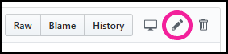
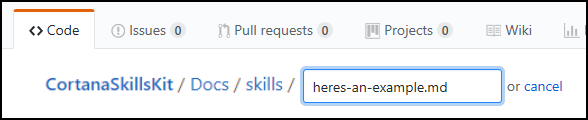
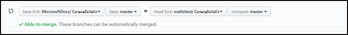
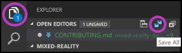

# Contributing to Cortana skills documentation

Welcome to the [public repo for Cortana skills developer documentation](https://github.com/microsoftdocs/cortanaskillskit)! Any articles you create or edit in this repo **will be visible to the public.** The docs.microsoft.com platform uses [GitHub-flavored Markdown with Markdig extensions](https://docs.microsoft.com/contribute/how-to-write-use-markdown). This page covers the basic steps and guidelines for contributing, as well as links to Markdown basics. Thank you for your contribution!

## Before you start

If you don't already have one, you'll need to [create a GitHub account](https://github.com/join).

>[!IMPORTANT]
>If you're a Microsoft employee, link your GitHub account to your Microsoft alias on the [Microsoft Open Source portal](https://repos.opensource.microsoft.com). Join the **"Microsoft"** and **"MicrosoftDocs"** organizations.

When setting up your GitHub account, we recommend these security precautions:
- Create a [strong password for your Github account](https://github.com/settings/admin).
- Enable [two-factor authentication](https://github.com/settings/two_factor_authentication/configure).
- Save your [recovery codes](https://github.com/settings/auth/recovery-codes) in a safe place.
- Update your [public profile settings](https://github.com/settings/profile).
   - Set your name, and consider setting your *Public email* to *Don't show my email address*.
   - We recommend you upload a profile picture, as a thumbnail will be shown on pages to which you contribute.
- If you plan to use a command line workflow, consider setting up [Git Credential Manager for Windows](https://github.com/Microsoft/Git-Credential-Manager-for-Windows/releases/latest) so that you don't have to enter your password each time you make a contribution.

These steps are important. The publishing system is tied to GitHub, and you'll be publicly listed as either an author or contributor to each article using your GitHub alias.

## Editing an existing article

Use this workflow to make updates to the documentation via web browser:

1. Navigate to the article you want to edit.
2. Click the edit button (pencil icon) in the top right. This will automatically fork a disposable branch from the `master` branch.

   
3. Edit the content of the article (see ["Markdown basics"](#markdown-basics) below for guidance).
4. Update metadata as relevant at the top of each article:
   * title: This is the page title that appears in the browser tab when the article is being viewed. As this is used for SEO and indexing, you shouldn't change the title unless necessary (though this is less critical before documentation goes public).
   * description: Write a brief description of the article's content. This aids in SEO and discovery.
   * author: If you are the primary owner of the page, add your GitHub alias here.
   * ms.author: If you are the primary owner of the page, add your Microsoft alias here (you don't need @microsoft.com, just the alias).
   * ms.date: Update the date if you're adding major content to the page, but not for fixes like clarification, formatting, grammar, or spelling.
   * keywords: Keywords aid in SEO. Add keywords, separated by a comma and a space, that are specific to your article (but no punctuation after the last keyword in your list); you don't need to add global keywords that apply to all articles as those are managed elsewhere. 
5. When finished with your page edits, scroll down and click the **Propose file change** button.
6. On the next page, click **Create pull request** to merge your automatically-created branch into `master`.
7. After the pull request is completed, the site admin will delete your branch.
8. If you have another article you want to edit, repeat the steps above.

## Creating a new article

Use the following workflow to create new articles in the documentation via web browser:

1. Create a fork from the MicrosoftDocs/CortanaSkillsKit `master` branch (using the **Fork** button in the top right).

   
2. In the **Docs** folder, click the **Create new file** button in the top right.
3. Create a page name for the article (use hyphens instead of spaces and don't use punctuation or apostrophes) and append ".md"

   
4. At the top of your new page, add the following metadata block:

   ```md
   ---
   title:
   description:
   author:
   ms.author:
   ms.date:
   keywords:
   ---
   ```

5. Fill in the relevant metadata fields per the instructions in the [section above](#editing-an-existing-article).
6. Write article content using [Markdown basics](#markdown-basics).
7. Add a `## See also` section at the bottom of the article with links to other relevant articles.
8. When finished, click **Commit new file**.
9. Click **New pull request** and merge your fork's 'master' branch into MicrosoftDocs/CortanaSkillsKit 'master' (make sure the arrow is pointing the correct way).

   

## Markdown basics

The following resources will help you learn how to edit documentation using the Markdown language:

- [Markdown basics](https://docs.microsoft.com/contribute/how-to-write-use-markdown)
- [Additional resources for writing Markdown for docs.microsoft.com](https://docs.microsoft.com/contribute/markdown-reference)
- [Markdig overview](https://github.com/lunet-io/markdig?branch=master&tabs=dfm) and [Markdig multi-column support](https://review.docs.microsoft.com/curtcu-test/row-and-column?view=contososerver-2.1&branch=master)

### Adding tables

Because of the way docs.microsoft.com styles tables, they won’t have borders or custom styles. Inline CSS may appear to work, but eventually the platform will strip the styling out of the table. Plan ahead and keep your tables simple. [Here’s a site that makes Markdown tables easy](https://www.tablesgenerator.com/markdown_tables).

The [Docs Markdown Extension for Visual Studio Code](https://docs.microsoft.com/teamblog/docs-extension) also makes table generation easy if you're using [Visual Studio Code](#using-visual-studio-code) to edit your document.

### Adding images

You’ll need to upload your images to the /images folder in the repo, and then reference them appropriately in the article. Images will automatically show up at full size, which means if your image is large, it’ll fill the entire width of the article. To prevent this, we recommend pre-sizing your images before uploading them. The recommended width is between 600 and 700 pixels, though you should size up or down if it’s a dense screenshot or a fraction of a screenshot, respectively. [There's more information here.](https://review.docs.microsoft.com/help/style/style-how-to-visuals-static-art-types?branch=master)

>[!IMPORTANT]
>You can only upload images to your forked repo. If you plan on adding images to an article, you'll need to [use Visual Studio Code](#using-visual-studio-code) or make sure you've done the following in a web browser:
>
>1. Forked the MicrosoftDocs/CortanaSkillsKit repo.
>2. Edited the article in your fork.
>3. Uploaded the images you're referencing in your article to the /images folder in your fork.
>4. Created a **pull request** to merge your fork into the MicrosoftDocs/CortanaSkillsKit `master` branch.
>
>To learn how to set up your own forked repo, follow the instructions for [creating a new article](#creating-a-new-article).

## Previewing your work

>[!NOTE]
>Previewing your changes on review.docs.microsoft.com is only available to Microsoft employees.

While editing in the browser, you can click the **Preview** tab near the top of the page to preview your work before committing. 

Once your contributions have been merged into the `master` branch, you can see what the documentation will look like when it goes public at https://review.docs.microsoft.com/cortana/skills/overview?branch=master. Find your article using the table of contents in the left column.

## Editing in the browser vs. editing with a desktop client

Editing in the browser is the easiest way to make quick changes. However, there are a few disadvantages:

- You don't get spell-check.
- You don't get any smart-linking to other articles (you have to manually type the article's filename).
- It can be a hassle to upload and reference images.

If you'd rather not deal with these issues, you may prefer to use a desktop client like [Visual Studio Code](https://code.visualstudio.com) with some [helpful extensions](#useful-extensions) to create your contribution.

## Using Visual Studio Code

If you've decide to use a desktop client to edit documentation instead of a web browser, we recommend using [Visual Studio Code](https://code.visualstudio.com). It's free, and it's available on Windows, macOS, and Linux.

### Setup

1. In a web browser:
    1. Install [Visual Studio Code](https://code.visualstudio.com).
    2. [Fork MicrosoftDocs/CortanaSkillsKit](#creating-a-new-article) if you haven't already.
    3. In your fork, click **Clone or download** and copy the URL.
2. Create a local clone of your fork in Visual Studio Code:
    1. From the **View** menu, select **Command Palette**.
    2. Type "Git:Clone."
    3. Paste the URL you just copied.
    4. Choose where to save the clone on your PC.
    5. Click **Open repo** in the pop-up.

### Editing documentation

Use the following workflow to make changes to the documentation with Visual Studio Code:

>[!NOTE]
>All the guidance for [editing](#editing-an-existing-article) and [creating](#creating-a-new-article) articles, and the [basics of editing Markdown](#markdown-basics), from above applies when using Visual Studio Code as well.

1. Make sure your cloned fork is up-to-date with the official repo.
   1. In a web browser, create a pull request to sync recent changes from other contributors in MicrosoftDocs/CortanaSkillsKit 'master' to your fork (make sure the arrow is pointing the right way).
      
      
   2. In Visual Studio Code, click the sync button to sync your freshly updated fork to the local clone.
      
      
2. Create or edit articles in your cloned repo using Visual Studio Code.
   1. Edit one or more articles (add images to “images” folder if necessary).
   2. **Save** changes in **Explorer**.
      
      
   3. **Commit all** changes in **Source Control** (write commit message when prompted).
      
      
   4. Click the **sync** button to sync your changes back to origin (your fork on GitHub).
      
      
3. In a web browser, create a pull request to sync new changes in your fork back to MicrosoftDocs/CortanaSkillsKit 'master' (make sure the arrow is pointing the correct way).

   

### Useful extensions

The following Visual Studio Code extensions are very useful when editing documentation:

- [Docs Markdown Extension for Visual Studio Code](https://docs.microsoft.com/teamblog/docs-extension) - Use `Alt+M` to bring up a menu of authoring options like:
   - Search and reference images you've uploaded.
   - Add formatting like lists, tables, and docs-specific call-outs like `>[!NOTE]`.
   - Search and reference internal links and bookmarks (links to specific sections within a page).
   - Formatting errors are highlighted (hover your mouse over the error to learn more).
- [Code Spell Checker](https://marketplace.visualstudio.com/items?itemName=streetsidesoftware.code-spell-checker) - misspelled words will be underlined; right-click on a misspelled word to change it or save it to the dictionary.
