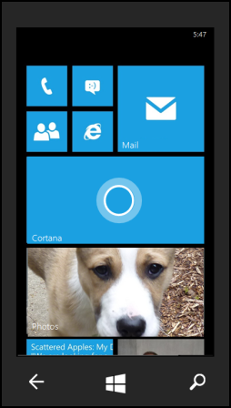
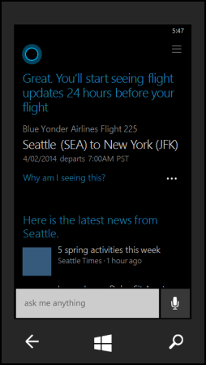

# Cortana and structured data markup
Structured data markup describes the embedding of structured data in e-mail messages and websites for consumption by Cortana. 

The structured data is in the form of schema.org markup in either [schema.org](https://schema.org) [Microdata and JSON-LD](https://schema.org/docs/gs.html) formats. Cortana extracts and interprets the structured data and exposes an skill based on that data.

## <a name="schema.org"></a>Schema.org basics
Schema.org is a standardized vocabulary and data model for machine-readable semantic annotation that uses a combination of classes and properties to describe things. 

### Microdata
Microdata is the preferred option for adding [schema.org](https://schema.org) annotations in-line with the body of content in your email.

Microdata is a set of HTML5 attributes and an associated usage model for adding semantic information to HTML documents, including email. In Microdata, you set the value of an itemtype attribute to a Schema.org class, such as [https://schema.org/Thing](https://schema.org/Thing), and then describe one or more properties of that class by using the **itemprop** attribute with its value set to the name of a [schema.org](https://schema.org) property, such as "description". The **itemscope** attribute associates child elements of an HTML element with a class.  

### JSON-LD 
JSON-LD is a JSON-based syntax that describes the semantics of an HTML document within the scope of a `<script>` tag. In JSON-LD, set the `@context` key to “https://schema.org”, set the `@type` key to the name of a Schema.org class, and then use Schema.org property names as the value of keys describing the properties of your typed objects. JSON-LD is a good option for representing semantics in the scope of a well-defined and consolidated JSON object.

## <a name="flightinfo"></a>Exposing flight information to Cortana

This example shows how to send flight and reservation information in an email, which Cortana can extract and use to expose a related skill (such as track flights).

> Once you receive an initial flight confirmation email that contains the required markup, Cortana can automatically track updates and other changes to the flight from that point forward. No subsequent notifications are required.

### Markup for flight confirmations

The following Schema.org classes and properties are used by Cortana in airline flight reservations. Classes are at the root level of the list, and their relevant properties are indented.

> Cortana uses a combination of proposed and adopted terms, and not all proposed terms are defined on the Schema.org web site.

`FlightReservation` (Proposed)

Defines a flight reservation. This is the parent class for all flight data.

- `reservationNumber` (Proposed)

    A unique identifier for the reservation.

- `reservationStatus` (Proposed)

    A member of the ReservationStatusType enumeration that specifies if the reservation is confirmed, cancelled, on hold, or pending.

- `underName` (Proposed)

    The person for whom the reservation was made.

- `reservationFor` (Proposed)
    
    The flight being reserved.

[`Person`](https://schema.org/Person)

Defines a person.

- [`name`](https://schema.org/name)
    
    The name of the person on the ticket.

`Flight` (Proposed)

Defines the flight that was reserved.

- `departureAirport` (Proposed) 

    The [`Airport`](#airport) from which the flight leaves.

- `arrivalAirport` (Proposed) 

    The [`Airport`](#airport) at which the flight arrives.

- `departureTime` (Proposed) 

    The date and time the flight departs, expressed in ISO 8601 format.

- `arrivalTime` (Proposed) 

    The date and time the flight arrives, expressed in ISO 8601 format.

- [`provider`](https://schema.org/provider) 

    The agency through which the flight was reserved.

<a name="airport"></a>`Airport` 

Defines an airport.

- `name` 

    The full name of the airport.

- `iataCode` (Proposed)

    The IATA three-letter code designation of the airport.

`Airline` (Propsed)

Defines an airline company.

- `name`

    The full name of the airline.

- `iataCode` (Proposed)

    The standard two-letter IATA code designation for the airline.

### Basic flight confirmation
For this example we demonstrate a reservation confirmation email for a one-way, non-stop flight from Seattle to New York City.

#### HTML
```html
<div itemscope itemtype="https://schema.org/FlightReservation">
  <meta itemprop="reservationNumber" content="QWERT0123456789"/>
  <meta itemprop="reservationStatus" content="https://schema.org/Confirmed"/>
  <div itemprop="underName" itemscope itemtype="https://schema.org/Person">
    <meta itemprop="name" content="Estella Gallagher"/>
  </div>
  <div itemprop="reservationFor" itemscope itemtype="https://schema.org/Flight">
    <meta itemprop="flightNumber" content="123"/>
    <div itemprop="departureAirport" itemscope itemtype="https://schema.org/Airport">
      <meta itemprop="name" content="Seattle-Tacoma International Airport"/>
      <meta itemprop="iataCode" content="SEA"/>
    </div>
    <div itemprop="arrivalAirport" itemscope itemtype="https://schema.org/Airport">
      <meta itemprop="name" content="John F. Kennedy International Airport"/>
      <meta itemprop="iataCode" content="JFK"/>
    </div>
    <meta itemprop="departureTime" content="2014-04-02T10:32:00Z"/>
    <meta itemprop="arrivalTime" content="2014-04-02T11:45:00Z"/>
    <div itemprop="airline" itemscope itemtype="https://schema.org/Airline">
      <meta itemprop="name" content="Blue Yonder Airlines"/>
      <meta itemprop="iataCode" content="BY"/>
    </div>
  </div>
</div>
```

#### JSON
```json
<script type="application/ld+json">
{
  "@context": "https://schema.org/",
  "@type": "FlightReservation",
  "reservationNumber": "QWERT0123456789",
  "reservationStatus": "https://schema.org/Confirmed",
  "underName":{
    "@type": "Person", 
    "name": "Estella Gallagher"
  }, 
  "reservationFor": { 
    "@type": "Flight",
    "flightNumber": "123",
    "departureAirport": {
      "@type": "Airport",
      "name": " Seattle-Tacoma International Airport", 
      "iataCode": "SEA"
    }, 
    "arrivalAirport": {
      "@type": "Airport",
      "name": " John F Kennedy International Airport", 
      "iataCode": "JFK"
    }, 
    "departureTime": "2014-04-02T10:32:00Z",
    "arrivalTime": "2014-04-02T11:45:00Z",
    "airline": {
      "@type": "Airline",
      "name": "Blue Yonder Airlines",
      "iataCode": "BY"
    }
  }
}
</script>
```
#### Walkthrough of Cortana flight tracking UI
This example shows one potential path for using Cortana to confirm a flight.

|  |  |
|:---:|:---:|
|  <br />1. Estella books a flight through Blue Yonder Airlines and receives a confirmation email. |  <br />2. She goes to her Start menu and taps the Cortana tile. |
|  <br />3.Cortana offers to track Estella's flight. Estella taps yes. |  <br />4. Cortana informs Estella that she will start receiving updates 24 hours before departure. |
|  <br />5. On the day of the flight, the latest flight status is displayed on the Cortana live tile. |  <br />6. Estella taps the tile and Cortana displays the flight information. |

### Complex flight confirmation
Complex flights include multiple segments and/or multiple passengers.

> For flights with multiple segments, Cortana offers to track each segment as a separate flight. If a customer books the same flight or set of flights for a group of passengers, Cortana tracks only the flights for one member of the group.

This example demonstrate a reservation confirmation email for a one-way trip for two passengers with a layover.

Each `FlightReservation` item describes a single, non-stop flight for a single passenger. A trip from Seattle to New York that changes planes in Chicago counts as two flights. For round trips, trips with multiple stops, or additional passengers, add additional `FlightReservation` objects. 

#### HTML
```html
<div itemscope itemtype="https://schema.org/FlightReservation">
  <meta itemprop="reservationNumber" content="QWERT0123456789"/>
  <meta itemprop="reservationStatus" content="https://schema.org/Confirmed"/>
  <div itemprop="underName" itemscope itemtype="https://schema.org/Person">
    <meta itemprop="name" content="Estella Gallagher"/>
  </div>
  <div itemprop="reservationFor" itemscope itemtype="https://schema.org/Flight">
    <meta itemprop="flightNumber" content="123"/>
    <div itemprop="departureAirport" itemscope itemtype="https://schema.org/Airport">
      <meta itemprop="name" content=" Seattle-Tacoma International Airport"/>
      <meta itemprop="iataCode" content="SEA"/>
    </div>
    <div itemprop="arrivalAirport" itemscope itemtype="https://schema.org/Airport">
      <meta itemprop="name" content="Chicago O'Hare International Airport"/>
      <meta itemprop="iataCode" content="ORD"/>
    </div>
    <meta itemprop="departureTime" content="2014-04-02T02:52:00Z"/>
    <meta itemprop="arrivalTime" content="2014-04-02T06:21:00Z"/>
    <div itemprop="airline" itemscope itemtype="https://schema.org/Airline">
      <meta itemprop="name" content="Blue Yonder Airlines"/>
      <meta itemprop="iataCode" content="BY"/>
    </div>
  </div>
</div>
<div itemscope itemtype="https://schema.org/FlightReservation">
  <meta itemprop="reservationNumber" content="ASDFG0987654321"/>
  <meta itemprop="reservationStatus" content="https://schema.org/Confirmed"/>
  <div itemprop="underName" itemscope itemtype="https://schema.org/Person">
    <meta itemprop="name" content="Estella Gallagher"/>
  </div>
  <div itemprop="reservationFor" itemscope itemtype="https://schema.org/Flight">
    <meta itemprop="flightNumber" content="456"/>
    <div itemprop="departureAirport" itemscope itemtype="https://schema.org/Airport">
      <meta itemprop="name" content="Chicago O'Hare International Airport"/>
      <meta itemprop="iataCode" content="ORD"/>
    </div>
    <div itemprop="arrivalAirport" itemscope itemtype="https://schema.org/Airport">
      <meta itemprop="name" content="John F. Kennedy International Airport"/>
      <meta itemprop="iataCode" content="JFK"/>
    </div>
    <meta itemprop="departureTime" content="2014-04-02T07:19:00Z"/>
    <meta itemprop="arrivalTime" content="2014-04-02T10:45:00Z"/>
    <div itemprop="airline" itemscope itemtype="https://schema.org/Airline">
      <meta itemprop="name" content="Blue Yonder Airlines"/>
      <meta itemprop="iataCode" content="BY"/>
    </div>
  </div>
</div>
<div itemscope itemtype="https://schema.org/FlightReservation">
  <meta itemprop="reservationNumber" content="ZXCVB0123456789"/>
  <meta itemprop="reservationStatus" content="https://schema.org/Confirmed"/>
  <div itemprop="underName" itemscope itemtype="https://schema.org/Person">
    <meta itemprop="name" content="Barney Desimone"/>
  </div>
  <div itemprop="reservationFor" itemscope itemtype="https://schema.org/Flight">
    <meta itemprop="flightNumber" content="123"/>
    <div itemprop="departureAirport" itemscope itemtype="https://schema.org/Airport">
      <meta itemprop="name" content=" Seattle-Tacoma International Airport"/>
      <meta itemprop="iataCode" content="SEA"/>
    </div>
    <div itemprop="arrivalAirport" itemscope itemtype="https://schema.org/Airport">
      <meta itemprop="name" content="Chicago O'Hare International Airport"/>
      <meta itemprop="iataCode" content="ORD"/>
    </div>
    <meta itemprop="departureTime" content="2014-04-02T02:52:00Z"/>
    <meta itemprop="arrivalTime" content="2014-04-02T06:21:00Z"/>
    <div itemprop="airline" itemscope itemtype="https://schema.org/Airline">
      <meta itemprop="name" content="Blue Yonder Airlines"/>
      <meta itemprop="iataCode" content="BY"/>
    </div>
  </div>
</div>
<div itemscope itemtype="https://schema.org/FlightReservation">
  <meta itemprop="reservationNumber" content="YUIOP0987654321"/>
  <meta itemprop="reservationStatus" content="https://schema.org/Confirmed"/>
  <div itemprop="underName" itemscope itemtype="https://schema.org/Person">
    <meta itemprop="name" content="Barney Desimone"/>
  </div>
  <div itemprop="reservationFor" itemscope itemtype="https://schema.org/Flight">
    <meta itemprop="flightNumber" content="456"/>
    <div itemprop="departureAirport" itemscope itemtype="https://schema.org/Airport">
      <meta itemprop="name" content="Chicago O'Hare International Airport"/>
      <meta itemprop="iataCode" content="ORD"/>
    </div>
    <div itemprop="arrivalAirport" itemscope itemtype="https://schema.org/Airport">
      <meta itemprop="name" content="John F. Kennedy International Airport"/>
      <meta itemprop="iataCode" content="JFK"/>
    </div>
    <meta itemprop="departureTime" content="2014-04-02T07:19:00Z"/>
    <meta itemprop="arrivalTime" content="2014-04-02T10:45:00Z"/>
    <div itemprop="airline" itemscope itemtype="https://schema.org/Airline">
      <meta itemprop="name" content="Blue Yonder Airlines"/>
      <meta itemprop="iataCode" content="BY"/>
    </div>
  </div>
</div>
```
#### JSON
```json
<script type="application/ld+json"> 
[{ 
  "@context": "https://schema.org/", 
  "@type": "FlightReservation", 
  "reservationNumber": "QWERT0123456789",
  "reservationStatus": "https://schema.org/Confirmed", 
  "underName":{ 
    "@type": "Person", 
    "name": "Estella Gallagher"
  }, 
  "reservationFor": { 
    "@type": "Flight", 
    "flightNumber": "123",
    "departureAirport": {
      "@type": "Airport", 
      "name": " Seattle-Tacoma International Airport", 
      "iataCode": "SEA" 
    }, 
    "arrivalAirport": {
      "@type": "Airport", 
      "name": "Chicago O'Hare International Airport", 
      "iataCode": "ORD" 
    }, 
    "departureTime": "2014-04-02T02:52:00Z",
    "arrivalTime": "2014-04-02T06:21:00Z", 
    "airline": {
      "@type": "Airline", 
      "name": "Blue Yonder Airlines",
      "iataCode": "BY" 
    } 
  } 
},
{
  "@context": "https://schema.org/", 
  "@type": "FlightReservation", 
  "reservationNumber": "ASDFG0987654321",
  "reservationStatus": "https://schema.org/Confirmed", 
  "underName":{ 
    "@type": "Person", 
    "name": "Estella Gallagher"
  },
  "reservationFor": { 
    "@type": "Flight", 
    "flightNumber": "456",
    "departureAirport": {
      "@type": "Airport", 
      "name": "Chicago O'Hare International Airport", 
      "iataCode": "ORD" 
    }, 
    "arrivalAirport": {
      "@type": "Airport", 
      "name": " John F Kennedy International Airport", 
      "iataCode": "JFK" 
    }, 
    "departureTime": "2014-04-02T07:19:00Z",
    "arrivalTime": "2014-04-02T10:45:00Z", 
    "airline": {
      "@type": "Airline", 
      "name": "Blue Yonder Airlines",
      "iataCode": "BY" 
    } 
  } 
},
{
  "@context": "https://schema.org/", 
  "@type": "FlightReservation", 
  "reservationNumber": "ZXCVB0123456789",
  "reservationStatus": "https://schema.org/Confirmed", 
  "underName":{ 
    "@type": "Person", 
    "name": "Barney Desimone"
  },
  "reservationFor": { 
    "@type": "Flight", 
    "flightNumber": "123",
    "departureAirport": {
      "@type": "Airport", 
      "name": " Seattle-Tacoma International Airport", 
      "iataCode": "SEA" 
    }, 
    "arrivalAirport": {
      "@type": "Airport", 
      "name": "Chicago O'Hare International Airport", 
      "iataCode": "ORD" 
    }, 
    "departureTime": "2014-04-02T02:52:00Z",
    "arrivalTime": "2014-04-02T06:21:00Z", 
    "airline": {
      "@type": "Airline", 
      "name": "Blue Yonder Airlines",
      "iataCode": "BY" 
    } 
  } 
},
{
  "@context": "https://schema.org/", 
  "@type": "FlightReservation", 
  "reservationNumber": "YUIOP0987654321",
  "reservationStatus": "https://schema.org/Confirmed", 
  "underName":{ 
    "@type": "Person", 
    "name": "Barney Desimone"
  },
  "reservationFor": { 
    "@type": "Flight", 
    "flightNumber": "456",
    "departureAirport": {
      "@type": "Airport", 
      "name": "Chicago O'Hare International Airport", 
      "iataCode": "SEA" 
    }, 
    "arrivalAirport": {
      "@type": "Airport", 
      "name": "John F. Kennedy International Airport", 
      "iataCode": "JFK" 
    }, 
    "departureTime": "2014-04-02T07:19:00Z",
    "arrivalTime": "2014-04-02T10:45:00Z", 
    "airline": {
      "@type": "Airline", 
      "name": "Blue Yonder Airlines",
      "iataCode": "BY" 
    } 
  } 
}] 
</script>
```
