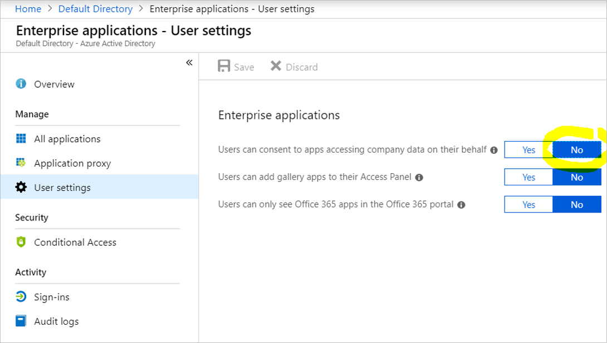
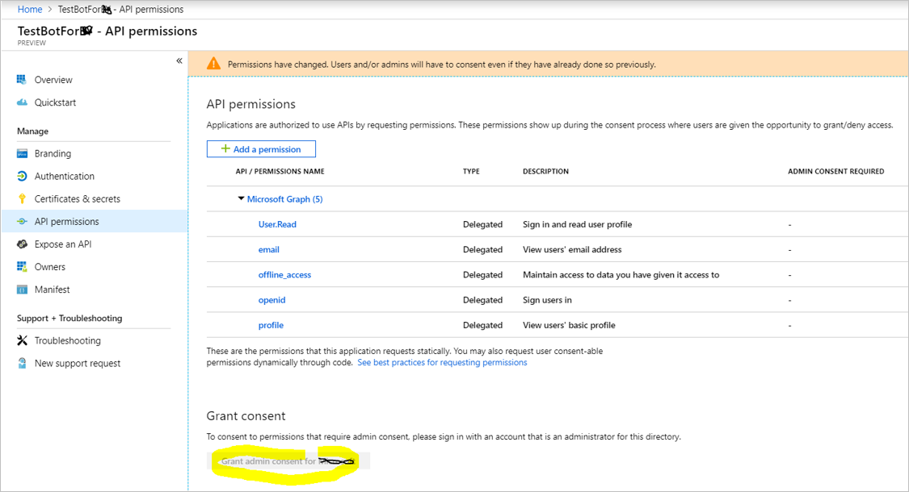

# IT Admin-managed "default" scopes

Most enterprises do not allow users to grant access to corporate data. They may also prevent developers from granting permission to user-allowable scopes. In this example, the administrators have disallowed users from granting access to Enterprise data.

This screen is reached by `Azure Active Directory > Enterprise Applications > User Settings`

In this case, the administrator should grant permission to the scopes added by the developer and click the `Grant` button.

For troubleshooting, please refer to these links
- [Role Permissions](https://docs.microsoft.com/en-us/azure/active-directory/users-groups-roles/directory-assign-admin-roles#role-permissions)
- [Application and service principal objects in Azure Active Directory](https://docs.microsoft.com/en-us/azure/active-directory/develop/app-objects-and-service-principals)
- [Comparing the Azure AD v2.0 endpoint with the v1.0 endpoint](https://docs.microsoft.com/en-us/azure/active-directory/develop/azure-ad-endpoint-comparison)
- [Permissions and consent in the Azure Active Directory v2.0 endpoint](https://docs.microsoft.com/en-us/azure/active-directory/develop/v2-permissions-and-consent)
- [Configure the way end-users consent to an application in Azure Active Directory](https://docs.microsoft.com/en-us/azure/active-directory/manage-apps/configure-user-consent)
