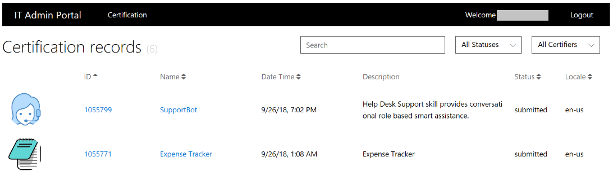
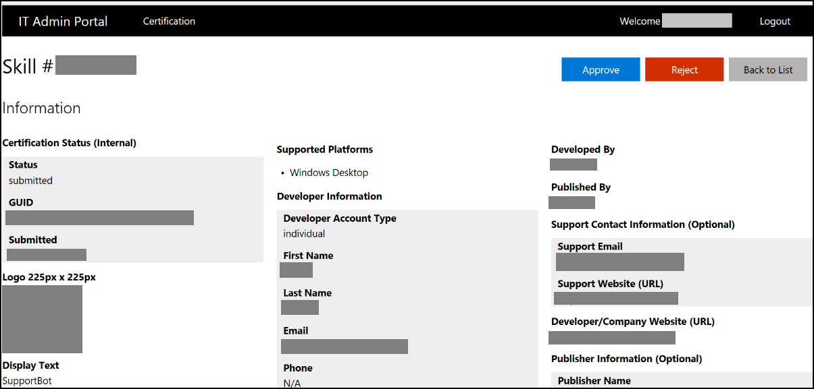
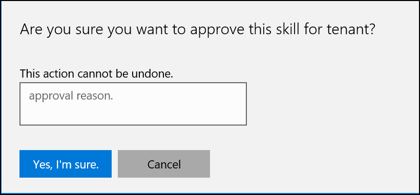
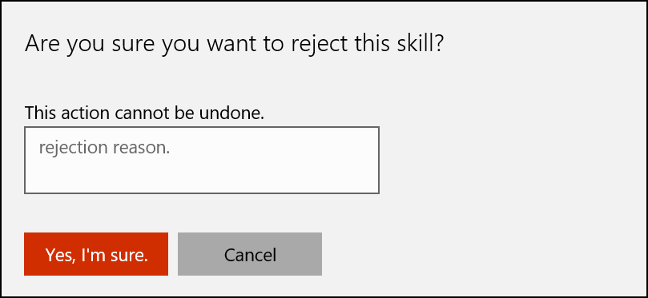

---  
title: Administer Deployment Requests to Cortana Skills for Enterprise | Cortana Skills Kit for Enterprise
description: Administer Deployment Requests to Cortana Skill for Enterprise. 

ms.date: 10/11/2018
ms.topic: article
ms.prod: cortana

keywords: cortana
---  

# Administer Deployment Requests  

IT Admins manage Cortana Skills for your company through the IT Admin Portal.  
IT Admins have control to approve (enable) or reject (withdraw) Cortana Skills for your company.  
1.  Sign into the [IT portal](https://it-admin-portal-prod.azurewebsites.net/certification).  
    
      
    
    1.  Double-click on the Cortana Skill to manage.  
        
          
        
    2.  *   If you click on the **Approve** button, then you must confirm the action with an audit reason. 
            
              
            
        *   If you click on the **Reject** button, then you must confirm the action with an audit reason.  
            
              
            
            >[!NOTE]
            > If your Cortana Skill is already approved, then you may withdraw it.  

>[!NOTE]
> The IT Administrator is responsible for sending notification to the owners on the information page.  

>[!IMPORTANT]
> Currently the IT Administration tool and the deployment process does not support versioning.  
>
> >[!TIP]
> > Deploy a new version of your Cortana Skill.  
> > 1.  Create a new Cortana Skill with a new name and new invocation phrase during development and testing.  
> > 2.  Remove the existing Cortana Skill.  
> > 3.  Rename and change the invocation phrase of the new Cortana Skill when you publish.  

## Next Steps  
