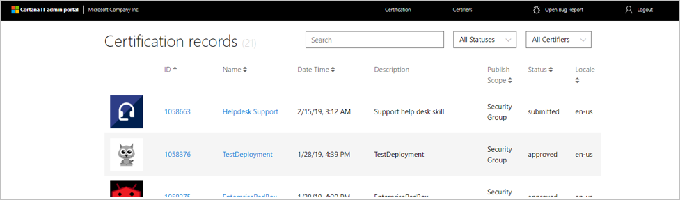
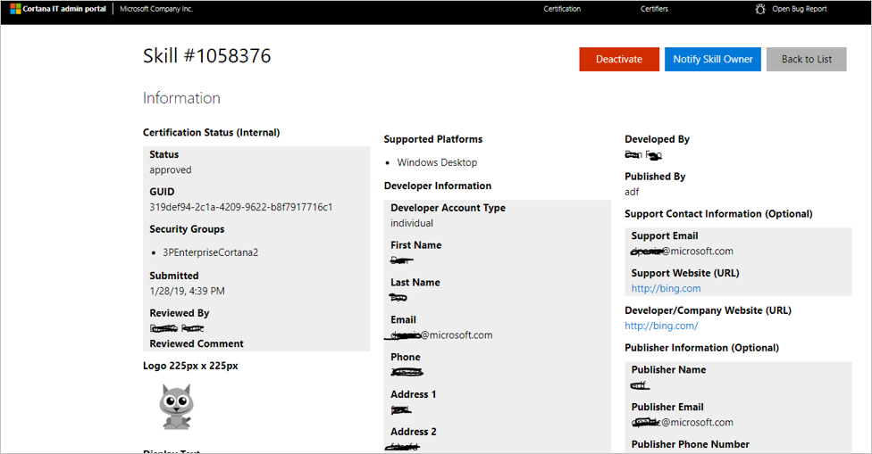
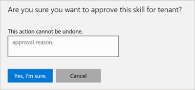
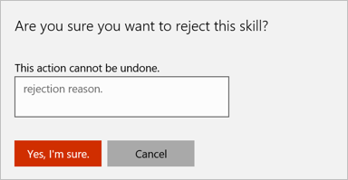

# Administering deployment requests

IT admins can manage Cortana skills for their company through the IT Admin Portal (https://it-admin-portal-prod.azurewebsites.net). IT admins have control to approve (enable) or reject (withdraw) skills for their company.

1. Launch the IT portal.

    

1. Double click on the skill to manage.

    

1. If you click `Approve` you will be asked to confirm the action and enter an audit reason.

    

1. If you click `Reject` you will be asked to confirm the action and enter an audit reason.

    

1. If the skill was previously approved, you may `Withdraw` it.

The IT Administrator is responsible for sending notification to the skill owners on the skill information page.

>[!IMPORTANT]
>Currently the IT Administration tool and the skill deployment process do not support versioning. To deploy a new version of a skill,you will need to create a new version of the skill, with a different name and invocation phrase, that you'll use during development and testing. When it's ready to be deployed, you'll need to
>1. remove the existing skill, and 
>1. change the name and invocation phrase for the new skill so it's the same as the skill you just removed.