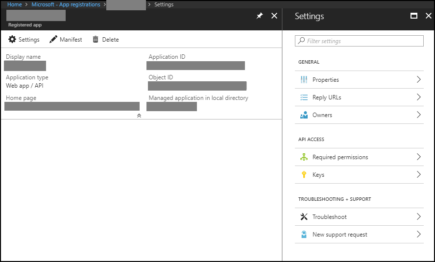
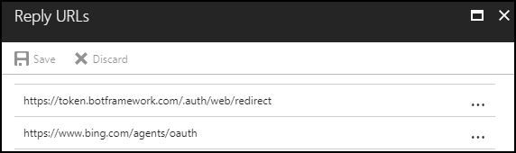

# Authenticate with Resources  

The most exciting thing about building an enterprise bot is accessing Microsoft services like Office 365, Outlook, and more using [Microsoft Graph](https://developer.microsoft.com/graph/docs/concepts/overview).  

If you build your bot using a template and auto-assign the Microsoft App Identifier (ID) and Password, then your bot is registered with the Azure Active Directory (Azure AD) converged endpoint.  

On the Application Registration Portal, the Converged Applications service recognizes your bot.  
To support applications that only use Azure AD, you must complete the following steps.  
1.  Register your bot with Azure AD  
2.  One of the following.  
    *   Grant permissions that you delegate  
    *   Work with your AD administrator to grant permissions  

## Grant Permissions Using Azure AD  

### Configure Azure AD  

1.  Sign into the [Azure](https://ms.portal.azure.com) portal with your enterprise account.  
2.  Click on the **Azure Active Directory** icon.  
3.  On the *Default Directory - Overview* blade.  
    1.  Under the *Manage* section, click on the **Properties** icon.
    2.  On the *Default Directory - Properties* blade.
        1.  Next to the `Directory ID` text-box, click on the **Click to copy** icon.  
            
            >[!IMPORTANT]
            > Record the value as your `tenant_id`.  
            
    3.  Under the *Manage* section, click on the **App registrations** icon.  
    4.  On the *Default Directory - App Registrations* blade.  
        1.  Click the **Endpoints** icon.  
        2.  On the *Endpoints* blade.  
            *   Next to the `WS-Federation Sign-On Endpoint` text-box, click on the **Click to copy** icon.   
                
                >[!IMPORTANT]
                > Record the value.  
                
            *   Next to the `SAML-P Sign-On Endpoint` text-box, click on the **Click to copy** icon.   
                
                >[!IMPORTANT]
                > Record the value.  
                
            *   Next to the `SAML-P Sign-Out Endpoint` text-box, click on the **Click to copy** icon.   
                
                >[!IMPORTANT]
                > Record the value.  
                
            *   Next to the `Microsoft Azure AD Graph API Endpoint` text-box, click on the **Click to copy** icon.  
            *   Next to the `OAuth 2.0 Token Endpoint` text-box, click on the **Click to copy** icon.   
                
                >[!IMPORTANT]
                > Record the value.  
                
            *   Next to the `OAuth 2.0 Authorization Endpoint` text-box, click on the **Click to copy** icon.   
                
                >[!IMPORTANT]
                > Record the value.  
                
                >[!IMPORTANT]
                > All of the endpoints include your `tenant_id`.  
                > 
                > >[!IMPORTANT]
                > > The default endpoint uses Azure AD v1.  
                > > To use Azure AD v2 (converged), insert `/v2.0/` into your endpoint. 
                > > 
                > > ```url
                > > https://login.microsoftonline.com/{tenant_id}/oauth2/v2.0/authorize
                > > ```
                > >
                > > ```url
                > > https://login.microsoftonline.com/{tenant_id}/oauth2/v2.0/token
                > > ```  
                
    5.  On the *Default Directory - App Registrations* blade.  
        1.  Click on the **New application registration** icon.  
        2.  On the *Create* blade.  
            1.  Complete the following fields.  
                *   `Name`
                    *   Enter the name of your app.  
                *   `Application type`  
                    *   `Web app /API`  
                *   `Sign-on URL`  
                    * Your bot framework skill endpoint.  
                    
                      
                    
            2.  Click on the **Create** button.  
        3.  On the *Registered app* blade.  
            1.  Click on the **Settings** icon.  
            1.  On the *Settings* blade.  
                1.  Next to the `Application ID` text-box, click on the **Click to copy** icon.  
                    
                    >[!IMPORTANT]
                    > Record the value as your `client_id`.  
                    
                2.  Under the *General* section, click on the **Properties** icon.  
                3.  On the *Properties* blade.  
                    1.  Complete the following.  
                        *   Any empty fields  that are required for publishing, such as `TOS and Privacy statements`.  
            3.  On the *Settings* blade.  
                1.  Under the *General* section, click on the **Reply URLs** icon.  
                2.  On the *Replay URLs* blade.  
                    1.  Enter the Cortana and bot framework URLs. The bot framework URL is optional.  
                        
                        >[!NOTE]
                        > To white-list and register that the URLs are able to send requests from the client Reply URLs.  
                        
                          
                        
            4.  On the *Settings* blade.  
                1.  Under the *General* section, click on the **Owners** icon.  
                2.  On the *Owners* blade.  
                    1.  Add your domain account.  
                    2.  Add any additional owners.  
                3.  Under the *API Access* section, click on the **Required permissions** icon.  
                4.  On the *Required permissions* blade.  
                    1.  Add any common permissions for your services.  
                        
                        >[!IMPORTANT]
                        > Record the values.  
                        
                        >[!IMPORTANT]
                        > Many enterprise resources require an administrator to grant permissions. Please coordinate with your Azure AD administrator.  
                        > 
                        > >[!TIP]
                        > > If you add "Windows Azure Active Directory" as the service, then grant "Sign in and read user profile" (`Read.All`) to test your sign-in.  
                        > > If you want to share your Exchange profile, then add "Office 365 Exchange Online" and grant "read all users basic profiles" (`User.ReadBasic.All`).  
                        
                    2.  Click the **Grant permissions** button.  
                5.  Under the *API Access* section, click on the **Keys** icon.  
                6.  On the *Keys* blade.  
                    1.  Under the *Passwords* section, complete the following fields.  
                        1.  `DESCRIPTION`  
                            *   `BotLogin`  
                        2.  `EXPIRES`  
                            *   Select a duration from the drop-down menu.  
                    2.  Click on the **Save** icon.  
                    1.  Under the *Passwords* section.  
                        1.  `VALUE`  
                            
                            >[!IMPORTANT]
                            > Record the value.  
                            > >[!WARNING]
                            > > This value only appears once.  
                            
### Access Configure Cortana Channel  

[!INCLUDE [enterprise-open-configure-cortana](../../includes/enterprise-open-configure-cortana.md)]  

### Update Configure Cortana Channel  
3.  Under the *Manage user identity through Connected Services* section.  
    1.  `Cortana should manage my user's identity`  
        1.  Activate. 
    2.  Complete the fields.  
        *   `When should Cortana prompt for a user to sign in?`
            *   `Sign in at invocation`  
                *   Get an Authorization key the first time the user uses your Cortana Skill.  
            *   `Sign in when required`  
                *   Send an OAuthCard before accessing each resource.  
            
            >[!Note]
            > If you have an Authorization key, then Cortana ignores the OAuthCard attachment.  
            
        *   `Account name` | required  
            *   The name of your organization or organizational unit.  
        *   `Client Id` | required  
            *   The application ID you created and mentioned in the previous AD configuration.  
        *   `Space-seperated list of scopes`  
            *   The required permission from the previous Azure AD configuration and should match exactly.  
        *   `Authorization URL` | required  
            *    `https://login.microsoftonline.com/{tenant_id}/oauth2/v2.0/authorize`  
        *   `Token Options` | required  
            *    `POST`  
        *   `Grant Type` | required  
            *    The Authorization Code unless you intent to use the more sophisticated implicit flow [OAuth 2.0](https://oauth.net/2) page.  
        *   `Token URL` | required  
            *    `https://login.microsoftonline.com/{tenant_id}/oauth2/v2.0/token`  
        *   `Client secret` | required  
            *   The secret generated from the previous Azure AD configuration.  
        *   `Client authorization scheme`  
            *   `Credentials in request body`  
                If `Token Options` is set to `POST`.  
        *   `This skill's Connected Service requires intranet access to authenticate users`  
            *   If your Cortana Skill requires authentication to use your intranet, then check this option.  
                
                >[!Note]
                > If your Cortana Skill fails during the OAuth flow with the http status code 401 and an error, then try changing the option.  
                
4.  Click on the **Deploy on Cortana** button.  

Your bot and Azure AD should be configured to send requests to secured resources.  

>[!TIP]
> The following example captures the contact information of `myboss@contoso.com` in JSON.  

```csharp
var bot = new builder.UniversalBot(connector, function (session) {
        var tokenEntity = session.message.entities.find((e) => {
            return e.type === 'AuthorizationToken';
        });
        
        request.get('https://graph.microsoft.com/v1.0/users/myboss@contoso.com', (err, response, body) => {
                console.log(body);
        }).setHeader('Authorization', 'Bearer '+ tokenEntity.token )
}).set('storage', tableStorage);
```  

## Next Steps  
