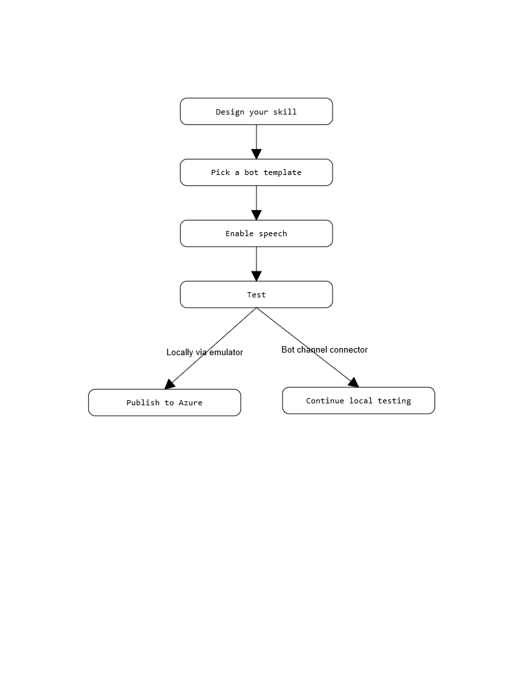
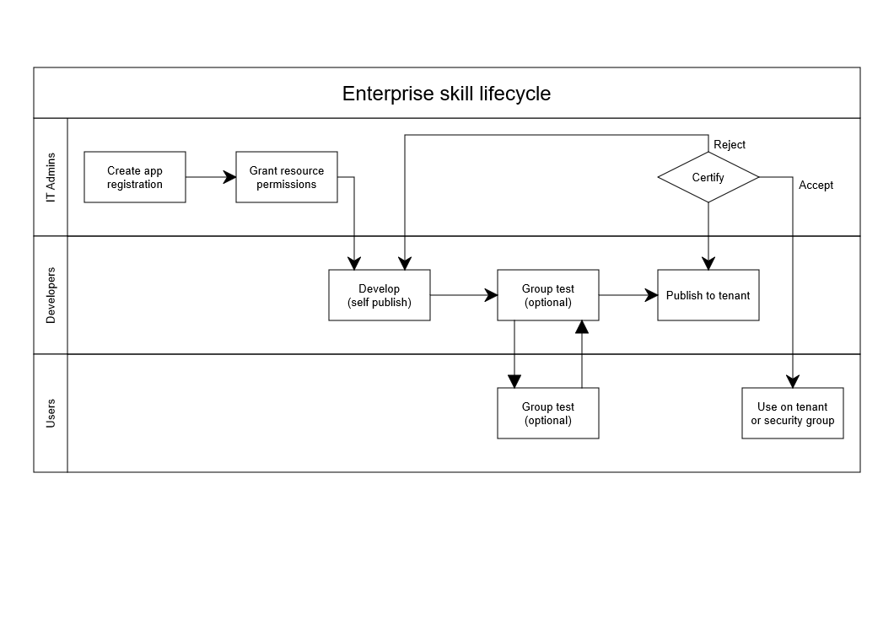
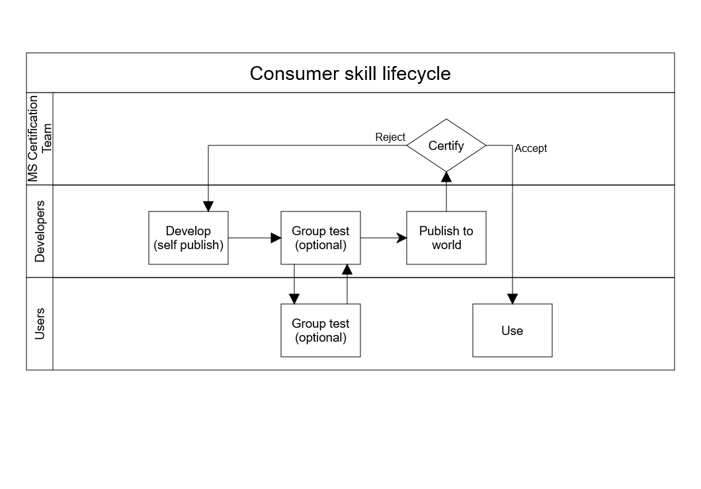

# Before you start

Designing for Cortana skills is different from most other software because of the unique interface. Cortana is designed to be driven by voice commands, and many devices that support Cortana have very small screens. It's important to keep these things in mind when designing your skill.

As an example, instead of trying to provide a list of a dozen choices on the screen, remember that your skill can receive choices verbally from the user. For example: for a travel skill, instead of listing possible destination cities on the screen, have your skill listen for a known destination city, and request more information if it doesn't hear one.

## Development workflow

You're free to use whatever workflow suits you best, but we've found that this one works well for creating Cortana skills.

   

## App lifecycle

The development lifecycle shown above applies to both enterprise and consumer skills. Here's a more detailed look at the enterprise and consumer app lifecycles.

# [Enterprise](#tab/e)

# [Consumer](#tab/c)

---

## Next steps

[Principles of Cortana skills design](../skills/design-principles.md)