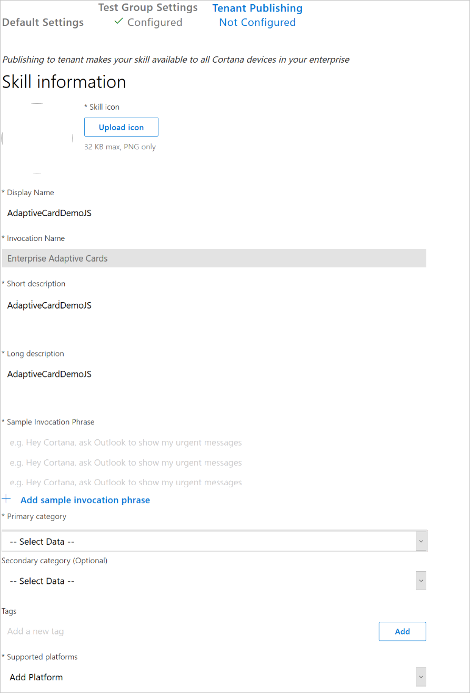
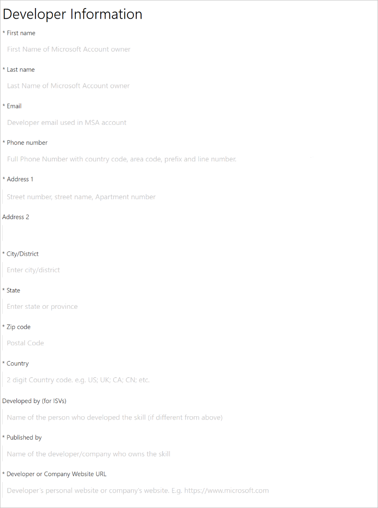
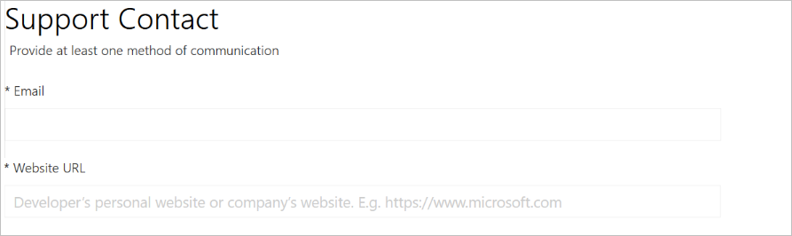
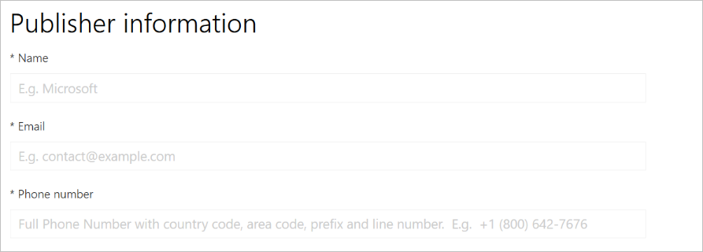
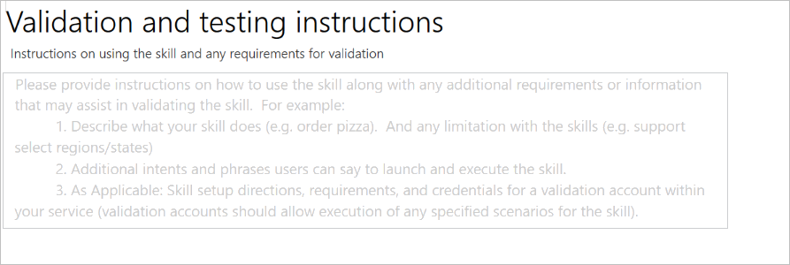
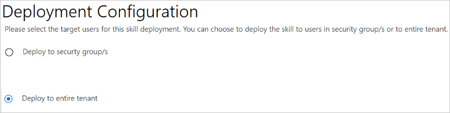

# Configure tenant publishing

## Skill information

## Developer Account

Though there will be descriptions here.

## Developer Information

## Support Contact

## Publisher information

## Privacy policy and terms of use

## Validation and testing instructions

## Deployment Configuration

You can save your current progress at any point and come back to it. When you're done, the `Submit for Review` button will be active. Press that to send the request to your IT admins.

