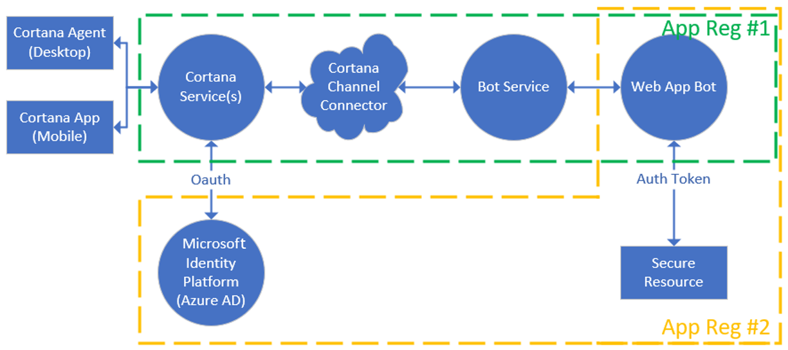
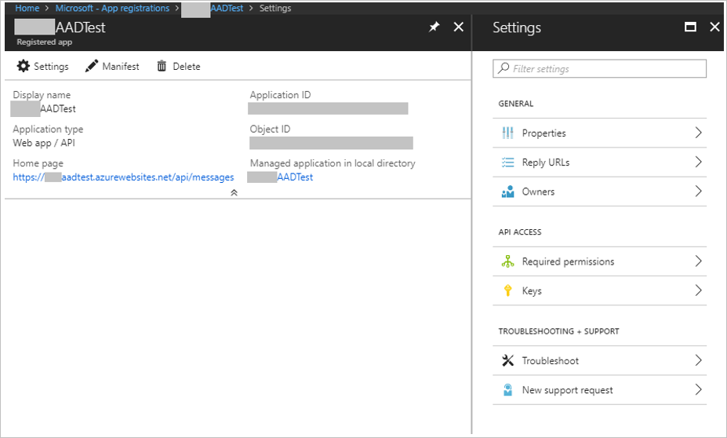

# Configuring authentication with connected services

The most exciting thing about building enterprise skills is accessing Microsoft services (like Office 365, Outlook, and more) through [Microsoft Graph](https://developer.microsoft.com/en-us/graph/docs/concepts/overview)! When you set up a bot from the template and auto-assign the Microsoft App ID and Password, your bot is registered with the Azure Active Directory (AAD) converged endpoint. Visit the Application Registration Portal and you will see that `Converged Applications` knows about your bot.

With Cortana, you need two app registrations when building an AAD connected app. The first registration occurs when you, or your administrator (see `Enterprise Applications`), creates a Microsoft App ID and Secret. This allows Cortana to talk to the bot. You need a second registration to allow your bot to talk to the resource provider.



The settings from `App Reg #2` are what would be entered in the Cortana Channel Configuration under `Cortana will manage my identity`.

You need to register your skill with Azure Active Directory and grant permissions that you're allowed to delegate. (Your enterprise may require you to work with your Azure AD administrator to grant the permissions you need.) You will have *two* app registrations: one for your bot, and one for Cortana to talk to the identity platform.

1. Directly log into the Azure portal via https://ms.portal.azure.com with your enterprise account and click the “Azure Active Directory” blade
1. Using the Azure Active Directory -> Properties blade, click the copy button beside the directory Id and save it as this will be your tenant_id used later
1. Click the `App Registrations` blade
1. Click the endpoints menu tab and copy down the login, logout, oauth, and graph end points that conveniently include your tenant id that you can copy into Cortana’s `Manage user identity through Connected Services`. Note, the default endpoint with be AAD v1. To use AAD v2 (converged), add /v2.0/ to your path. For example, https://login.microsoftonline.com/{tenant_id}/oauth2/v2.0/authorize or https://login.microsoftonline.com/{tenant_id}/oauth2/v2.0/token 
1. Click `+ New application registration` tab, enter your App name, `Web app /API` as the application type, and your bot service skill endpoint as the sign-on URL.



1. Click the settings button settings and note your Application ID (as your Client Id).
1. Click the properties blade and fill in any empty fields for publishing. (For example, TOS and Privacy statements are required to publish.)
1. Click on the Reply URLs blade and enter the Cortana redirect URL for login confirmation https://www.bing.com/agents/oauth
1. Click the `Owners` blade and add your domain account and any additional owners you want to change the app registration
1. Click on the `Required permissions` blade and grant any common permissions for selected services. Remember these. At a minimum, add `offline_access` and `openid` scopes.
   Many enterprise resources will require an administrator to grant permissions, so coordinate with your AAD administrator. As an example, you can add `Windows Azure Active Directory` as the service and delegate `Sign in and read user profile` (Read.All) to test your own login. If you want to share your Exchange profile, select `Office 365 Exchange Online` and grant `Read all users basic profiles` (User.Read Basic.All). Remember to click the `Grant permissions` button.
1. Click on the Keys blade and create a new Client Secret. Use `BotLogin` as the description and copy down the secret immediately (as you will not be able to recover it.) Anything in the value field is ignored on entry.

Return to the Cortana channel configuration and turn on `Cortana should manage my user’s identity`. Fill in the form and click Deploy on Cortana.

- Select `Sign in at invocation` if you want OAuth to get an Authorization key the first time the user uses your skill. Select `Sign in when required` if you plan to send an OAuthCard before each resource access. Note: if you have an Authorization key, Cortana will ignore the OAuthCard attachment.
- Account name (required) can be the name of your organization or organizational unit
- Client Id (required) is the Application Id you created and noted in the previous AD configuration
- Space-separated list of scopes are the required permission from the previous AD configuration and they should match exactly (note offline_access is required for OAuth refresh tokens to be send and openid for basic login.)
- Authorization URL (required) is https://login.microsoftonline.com/{tenant_id}/oauth2/v2.0/authorize
- Token Options (required) should be POST
- Grant Type (required) should be Authorization Code unless you intent to use the more sophisticated implicit flow (https://oauth.net/2 )
- Token URL (required) is https://login.microsoftonline.com/{tenant_id}/oauth2/v2.0/token
- Client secret (required) is the secret generated from the previous AD configuration
- Client authorization scheme should be `Credentials in request body` because we selected POST above
- If you require authentication to use your intranet, check `This skill's Connected Service requires intranet access` to authenticate users.

>[!Note]
>If your skill fails in the OAuth flow with a 401 error, try changing this setting.

Your bot and Active Directory should now be configured to make calls to secured resources!

```nodejs
// get the token (V3)
var tokenEntity = session.message.entities.find((e) => {
   return e.type === 'AuthorizationToken';
   });
// send request with auth header    
request.get('https://graph.microsoft.com/v1.0/users/myboss@contoso.com', (err, response, body) => {
   // do something with body
   }).setHeader('Authorization', 'Bearer '+ tokenEntity.token )
```

```c#
// get the token (V3)
string authAccessToken = String.Empty;
if (activity.Entities != null)
{
foreach (var entity in activity.Entities)
{
if (entity.Type == "AuthorizationToken")
{
dynamic authResult = entity.Properties;
authAccessToken = authResult.token;
}
}
}
// send request with auth header
var url = "https://graph.microsoft.com/v1.0/me/contacts?select=birthday,nickName,surname,givenName";
using (var client = new HttpClient())
{
client.DefaultRequestHeaders.Add("Authorization", "Bearer " + authAccessToken);
var response = await client.GetAsync(url);
```
