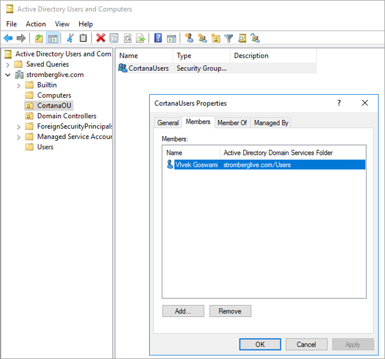
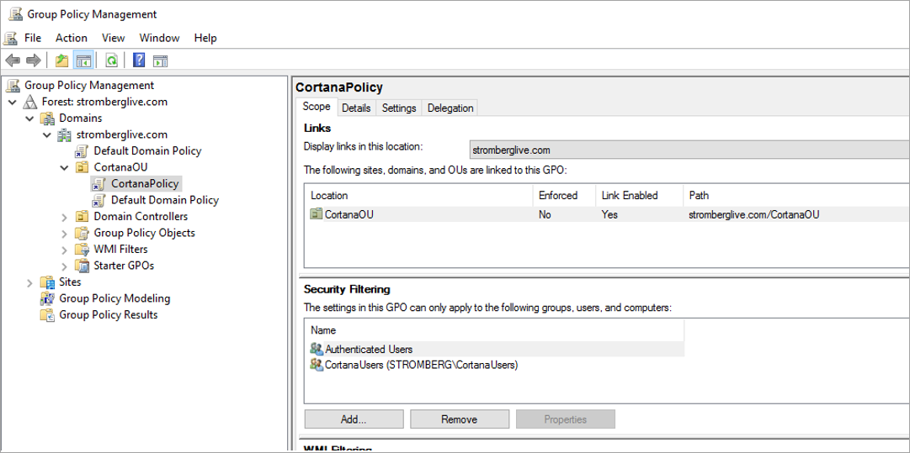

---
title: Create a User Security Group
description: Extend your Cortana capabilities to help your employees be more productive.

ms.date: 03/08/2019
ms.topic: article
ms.prod: cortana
ms.author: v-daturc

keywords: cortana
---  

# Create a User Security Group  

After you’ve created the Organization Unit (OU), you need to attach security group(s) to the OU. These will contain the users to which the new policy applies.

1. Open the Active Directory Users and Computers configuration tool.
1. Right click on the CortanaOU and create a new Security Group called CortanaUsers.
1. Navigate to the Users or Computers under the domain and drag them to the new group. Alternatively, you can open the CortanaUsers properties, click the Members tab, and use the `Add…` button to add users or computers by typing their names.

1. Open the Group Policy Management tool. <**Not entirely sure what we're accomplishing here.**>
1. Open the CortanaOU and click the CortanaPolicy GPO you created.
1. Click `Add…` under security filtering to add the CortanaUsers group.

Once added, now you need to apply the policy on the user’s computer. Note: Authenticated Users should never be removed from an OU under Policy Management. You can change its permission to allow  Read Only.