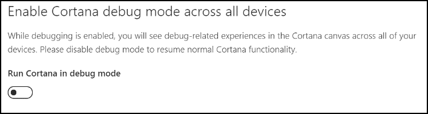
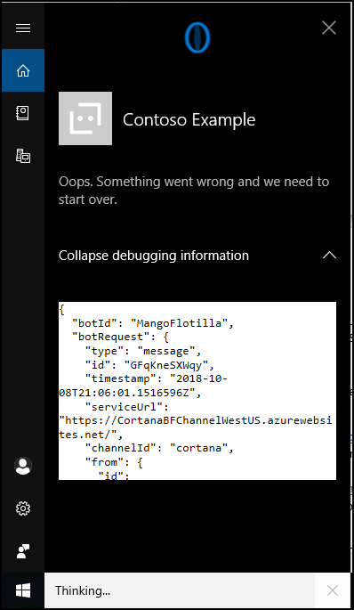
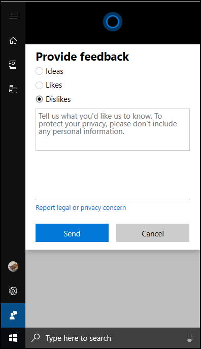

---  
title: Debug Cortana Skills Kit for Enterprise | Cortana Skills Kit for Enterprise
description: Debug your Cortana Skill for Enterprise. 

ms.date: 10/11/2018
ms.topic: article
ms.prod: cortana

keywords: cortana
---  

## Debug Your Cortana Skill  

When deployed to the Cortana Channel, you trigger your Cortana Skill by saying `Hey Cortana, Ask <invocation_name>`.  
Debug issues by enabling the `Run Cortana in Debug Mode` option on the Configure Cortana Channel page.  

  
 
Click on the expander icon named *Expand/Collapse debugging information* to display the JSON channel data and message payload.  

  
 
The following resources should help while you testing locally including source level debugging using your IDE.  
*   For more information about setting up the bot emulator for testing, visit the [Debug with the emulator](https://docs.microsoft.com/azure/bot-service/bot-service-debug-emulator?view=azure-bot-service-3.0) page.  
    
    >[!NOTE]
    > The content is not Cortana specific.  
    
*   For more information about using `ngrok` to forward traffic to your local machine by changing the Messaging endpoint, visit the [Debug any Channel locally using ngrok](https://blog.botframework.com/2017/10/19/debug-channel-locally-using-ngrok) page.  

If you find an issue with Cortana or the Cortana Skills Kit for Enterprise, then click on the **feedback** icon and send feedback.  

  

## Next Steps  
