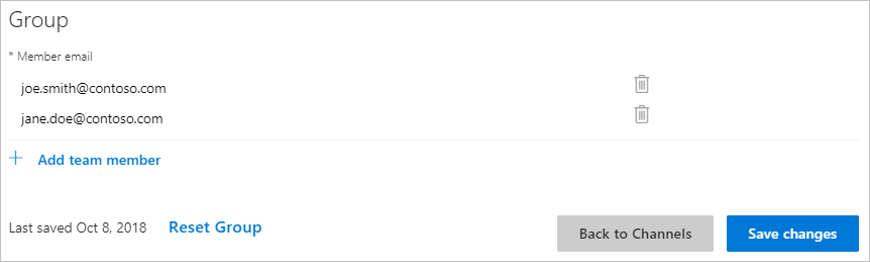

# Testing by group

Once your skill is ready for testing, you can opt to have a group of people in the same tenant (Azure AD organization) test it. You might, for example, want a particular team or department in your enterprise to test the skill before you release it to everyone in the organization.

You can invite others to test your skill under `Test Group Settings` on the Cortana channel configuration page.

    

- Add the user accounts by clicking `+ Add Team Member` and `Create Group` (or `Save changes` if you're editing). The team members and your new enterprise skill must both be on the same Azure AD (AAD) tenant. Typing a name in the box will auto-complete the contact’s email address from your corporate directory.

    

- Click `Save Changes` (or `Create Group`) and the users will be able to access the skill.
- Team members can use the skill by logging into their AAD account, launching Cortana on Windows 10, and saying "Hey Cortana, ask [invocation name]".
- You'll need to notify the members of your group about their access to the new skill, and ask for feedback with an email.

    Here's a suggested format:

    *Dear [user]: I’d like you to test my Cortana skill, [name], and have granted you access. You can invoke the skill on Windows 10 by saying “Hey Cortana, ask [invocation phrase].” (Note that enterprise skills run on Windows 10 devices only. Cortana on a mobile device won't work.)*

    *Please try these phrases:*

    - *[things to test]*
    - *[things to test]*

    *Please send me any feedback you may have. Thanks!*