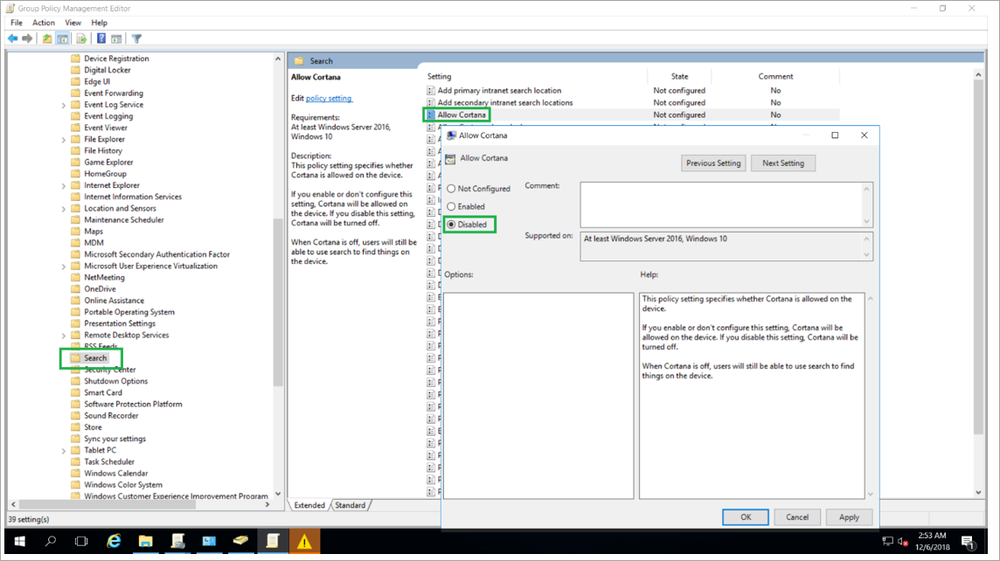

---
title: Modify the default domain policy
description: Setting up domain policy to allow Cortana to run.

ms.date: 03/07/2019
ms.topic: article
ms.prod: cortana
ms.author: v-daturc

keywords: cortana enterprise
---  

# Modify the default domain policy

As an Active Directory Domain (AAD) Services administrator, the key computer policy setting that you need to be aware of is the policy named “Allow Cortana”. To check this setting:

1. Make sure that you are connected to the forest and domain where the Cortana skills will be deployed.
1. Launch the Group Policy Management Editor.
1. Select `Default Domain Policy`.
1. Select `Computer Configuration`.
1. Select `Policies`.
1. Select `Administrative Templates`.
1. Select `Windows Components`.
1. Select `Search`
1. Scroll to `Allow Cortana`.

You should see this screen:

Cortana is disabled by default, so you'll need to select either `Enabled` or `Not Configured` in order to allow Cortana to run. Selecting `Enabled` will enable Cortana for the entire domain.

There's more information in [Cortana at Work Policy Settings](https://docs.microsoft.com/en-us/windows/configuration/cortana-at-work/cortana-at-work-policy-settings). Check there if you want to fully enable, or tune, what your organization can do with Cortana.