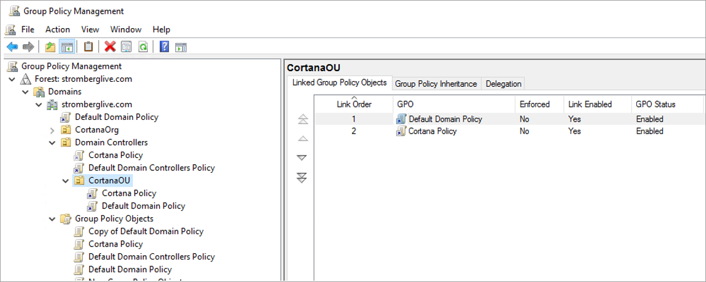

---
title: Create a new group policy object
description: Describes how to set up a group policy object for Cortana.

ms.date: 03/07/2019
ms.topic: article
ms.prod: cortana
ms.author: v-daturc

keywords: cortana enterprise
---  

# Create a new group policy object

You may wish to allow only a certain number of computers to use Cortana, whether as part of a staged deployment ring, or some other reason.

There are two ways you can do this. Both require that you create a custom Group Policy Object (GPO). The preferred way to apply GPOs is to create a new one, and then configure only Cortana-related settings in it. Any unconfigured settings in this object will not be applied.

To use this method, create a Cortana OU under your default and move the computers that should run Cortana into it. You can then link this Cortana-specific GPO to the Cortana OU and make sure its link order is last (as you probably remember, there is no GP inheritance, so the last policy applied wins). Your OU in this case should have the Default Domain Policy as first in its Link Order.

An alternative method is to clone a GPO.

1. Launch the Group Policy Management tool (GPMC). <**Why is it GPMC?**>
1. Open your forest and domain.
1. Open your Group Policy Objects.
1. Copy the Default Domain Policy.
1. Paste the copy, and rename it to Cortana Ring Policy. <**Why this particular name? Can't they use anything (though of course they should put Cortana in it somewhere.**>
1. Follow the steps in the first section to Enable Cortana. <**First section of what? This doc, or the page they're on?**>

 For managed computers (and users) under an Active Directory Domain Controller, efer to [Administer Group Policy on an Azure AD Domain Services managed domain](https://docs.microsoft.com/en-us/azure/active-directory-domain-services/active-directory-ds-admin-guide-administer-group-policy).
