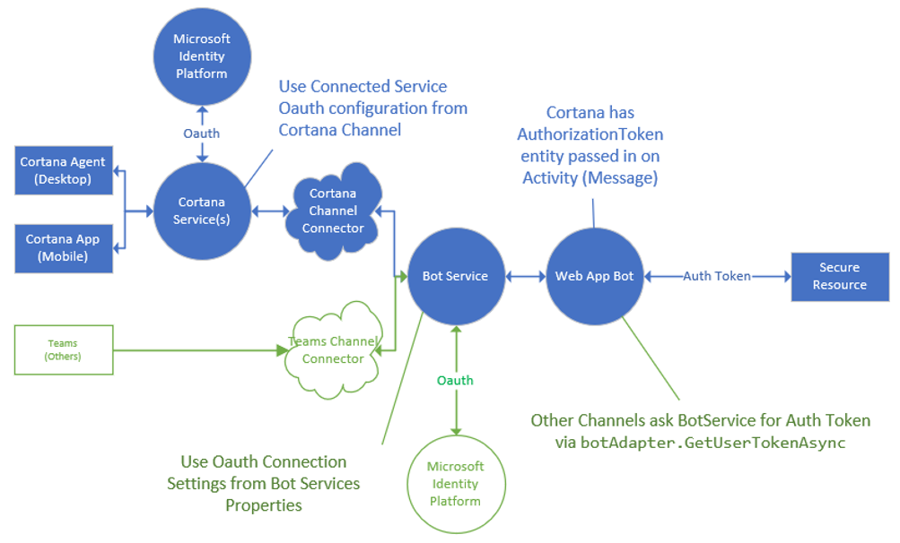

---
title: Supporting multiple channel OAuth
description: Supporting multiple channel OAuth

ms.date: 03/07/2019
ms.topic: article
ms.prod: cortana
ms.author: v-daturc

keywords: cortana enterprise
---  

# Supporting multiple channel OAuth

If you intend to support OAuth to a connected service for a single bot, but want to support multiple channel connectors, you'll need more than one app registration. You'll also need to differentiate in your code how and when to send OAuthCards.
Cortana allows you to `Authenticate on Invocation`, which means Cortana automatically prompts for sign in, without the need to send an OAuthCard through the conversation.



Each app registration can have one redirect URL, and they should be on the same domain. For example, bot service and Cortana have different redirect URLs.

The redirect URL for bot service OAuth:
```HTML
https://token.botframework.com/.auth/web/redirect
```

The redirect URL for Cortana OAuth:
``` HTML
https://www.bing.com/agents/oauth
```