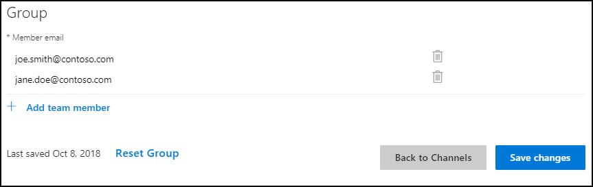

---  
title: Test Cortana Skills for Enterprise | Cortana Skills Kit for Enterprise
description: Test your Cortana Skill for Enterprise. 

ms.date: 10/11/2018
ms.topic: article
ms.prod: cortana

keywords: cortana
---  

# Test Your Cortana Skill  

When your Cortana Skill is ready for testing, you may create a small test group. Invite people to test your Cortana Skill using the *Test Group Settings* section on the Configure Cortana Channel page.  

  

*   Complete the following steps to add user accounts.
    1.  Click on the **Add Team Member** icon.  
        
    2.  >[!NOTE]
        > Typing a name should auto-complete the email address from your corporate directory.  
        
          
        
        >[!IMPORTANT]
        > For enterprise, the team members and your Cortana Skill must use the same tenant (domain). 
        
    3.  *   If you are creating a new group, then click on the **Create Group** button.  
        *   If you are editing, then click on the **Save changes** button.  
        
*   After you click on the **Save changes** or **Create Group** button, your users are able to access your Cortana Skill.  
*   Team members use your Cortana Skill by launching Cortana on Windows 10 and saying `Hey Cortana, ask <invocation_name>`.  
*   Send an email message to your group to notify them of their access and ask for feedback.  
    
    > Dear Jane,  
    > I'd like you to test my `<name>` Cortana Skill and have granted you access.  
    > You may invoke the Cortana Skill on Windows 10 by saying `Hey Cortana, ask <invocation_phrase>`.  
    > Try these phrases `<list_of_things_to_test>` and please send me feedback.  
    > Thank you  
    
## Next Steps  
