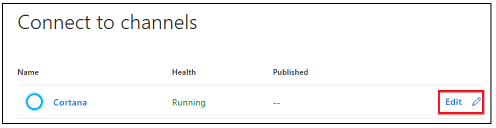
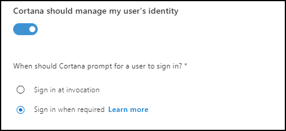

# Adding Authentication to Your Cortana Skill  

>[!IMPORTANT]
> Cortana skills handle authentication differently than Microsoft Bot Framework.

## Link a Connected Account to a Cortana Skill  

If your skill uses a service that requires users to authenticate using OAuth 2.0, then you should use the Connected Account feature in Cortana. The Connected Account feature in Cortana is used to get an access token for use with the service. All you need to do is provide Cortana with OAuth 2.0 settings, and Cortana manages the rest for you.  

You decide whether Cortana signs in the user when they invoke your skill, or only when they activate a feature of your skill that requires authentication. Cortana initiates the sign-in process on your identity server. The user is prompted to sign in. If you use the code grant flow and have set a scope of `offline_access`, then Cortana automatically re-authenticates your user using a refresh token. Your user is re-authenticated until one of the following situations occurs.

* User disconnects the skill in Cortana Notebook. Disconnecting a skill in the Cortana Notebook clears the authentication state.  

* Refresh token expires.
* User changes password.

Cortana skills supports both code grant flow and implicit grant flow for OAuth 2.0. For information about adding a connected account to your skill, visit the  [Manage user identity in the channel configuration for Cortana](https://docs.microsoft.com/azure/bot-service/bot-service-channel-connect-cortana?view=azure-bot-service-3.0#manage-user-identity) section.  

The Connected Account feature supports using a single identity service. If your skill requests different services that use different identity services, then you may use Connected Account with one of those services. You may use Connected Account with another service, but you must use a different mechanism to authenticate your user with the service.  

## Get Your Cached Access Token  

If you configure the channel for connected accounts in Cortana, then Cortana sends the authentication token to your skill as entity data. From the point you ask Cortana to authenticate your user, the `entities` property for each message includes an `AuthorizationToken` object.  

The `AuthorizationToken` object includes the following properties.  

| Name     | Type     | Description              |  
|:---------|:---------|:-------------------------|  
| `type` | string | The type of the object. The only acceptable value is `AuthorizationToken`. 
| `token`    | string   | The access token. The value is `null` under the following conditions. <ul> <li>User cancels the sign-in process</li> <li>User does not give consent</li> </ul> |  
| `status`   | string   | The status of the access token. The following are the possible values. <ul> <li><code>0</code> : The `token` field is set to valid access token.</li> <li><code>1</code> : Sign in succeeded. This value is set on the first message following user sign in. The `token` field is set to valid access token.</li> <li><code>2</code> : Sign in canceled by user. The `token` field is set to `null`.</li> </ul>  |  

### Example of AuthorizationToken Object  

```json
{
    "type": "AuthorizationToken",  
    "token": string,
    "status": string
}
```  

## Create an OAuth Enabled Cortana Skill  

Create an OAuth 2.0-enabled Cortana skill using the following steps.  
**Example:** Creates a bot in Azure Bot Service using the Basic C# bot template.  

>[!NOTE]
> If you have not created a bot, and are looking for more information on how to get started, then visit the [Create a bot with Bot Service](https://docs.microsoft.com/azure/bot-service/bot-service-quickstart?view=azure-bot-service-3.0) page.

1. Sign into the [Microsoft Azure Portal](https://ms.portal.azure.com).  
1. In the *portal*, click the name of your bot. 
1. Under *BOT MANAGEMENT*, click on the **Channels** icon.
1. To create the Cortana channel, click the Cortana icon.

      

    >[!NOTE]
    > If your bot is already connected to the Cortana channel, then click **Edit** to access the **Default settings**.
    > 
    >   

1. Scroll down the **Configure Cortana** page, under **Cortana should manage my user's identity**, click on the toggle.  

      

1. Fill in the OAuth configuration field values.  

    

    1. **Sign in at invocation** | radiobox  
        If you select `at invocation` then Cortana manages the log in when the user first invokes the skill. Otherwise you can send an OAuthCard attachment before a resource call.
    2. **Account Name**  
        The account name for your Cortana skill.  
    3. **Client ID**
        The identifier for your client.  

        >[!NOTE]
        > If you use Microsoft services, then use your `MicrosoftAppId`, assigned when you created your bot. If you use another OAuth 2.0 service provider, then use the client ID provided to you.  

    4. **Scopes**  
        The resources you are accessing. Your resource provider informs you about the resources which you are requesting.
  
        **Example:** For Microsoft Graph, you might set `User.Read.All`.

        If you enter more than one scope, the list must be space delimited.

        If you use a third-party service, you must get valid entries from them.  

    5. **Authorization URL**  
        Your Microsoft OAuth Authorization URL:

        ```url
        https://login.microsoftonline.com/common/oauth2/v2.0/authorize
        ```  

        Replace `common` with your Azure AD tenant ID if you are restricting the resources to an organization.

    6. **Token options**  
        Response method. The HTTP verb for the response should be `POST`.

    7. **Grant type**  
        Response type. The OAuth flow (code or token) for the response.  
        `Authorization code`

        In general, code flow is easier than token flow. For more information, visit the [OAuth 2.0 Authorization Framework](https://tools.ietf.org/html/rfc6749) page.  

    8. **Token URL**  

        For Microsoft services:

        ```url
        https://login.microsoftonline.com/common/oauth2/v2.0/token
        ```

        If you are restricting the resources to an organization, then replace `common` with your Azure AD tenant ID.  

    9. **Client secret**  

        If you use Microsoft services, then use your `MicrosoftAppPassword` from when you created your bot. Note that Microsoft client secrets expire. See the [FAQ](./faq.md#does-my-client-secret-ever-expire) for details.

        If you use another OAuth 2.0 service provider, then the client secret will be provided to you. Your provider may use different terminology, like *consumer secret*.  

    10. **Client authorization scheme**  

        `Credentials in request body`

        The `Credentials in request body` scheme is the most common way to send the identity payload.  

    11. **Intranet authentication** | checkbox  
        If your Cortana skill requires access to or through an intranet, then select this option.  

1. Click on the `Connect to Cortana` link.

    Visit your service provider site to grant access to the resources.  
    * For Microsoft: Visit the [My applications](https://apps.dev.microsoft.com) portal and select your Cortana skill.  

    * Click **Add Platform**, click **Web**, verify that you registered your redirect URL for Cortana, and then save your changes. You do not need a sign-out URL.  

             

    * For other service providers: Refer to the documentation from your service provider about allowing the redirect callback.  

1. Cortana should open a dialog window so the user can sign in before opening your Cortana skill. Microsoft recommends that you verify that your Cortana skill has an access token.  

    Each message includes an entity that includes an access token. If the access token is not present or is empty, then it means the user has not been authenticated. The access token may also be empty if the access token has expired.

    When the access token expires, the correct solution is to display an OAuthCard to reacquire a token.

    **Example:** How to get an access token using C# or Node.js.

    # [C#](#tab/cs1)

    ```csharp
    // Get the auth access token
    string authAccessToken = String.Empty;
    var AuthEntity = turnContext.Activity.Entities?.FirstOrDefault(entity => entity.Type.Equals("AuthorizationToken", StringComparison.Ordinal));
    if (AuthEntity != null) 
      authAccessToken = AuthEntity.Properties["token"]?.ToString();
    // check authAccessToken not empty
    ```

    # [JavaScript](#tab/js1)

    ```javascript
    // Get the auth access token
    let authAccessToken = '';
    if ( turnContext.activity.entities ) {
       let authEntity = turnContext.activity.entities.find((e) => {
         return e.type === 'AuthorizationToken';
         });
       if(authEntity && authEntity.token)
         authAccessToken = authEntity.token;
       }
     // check authAccessToken not empty 
    ```

    ---

    If the token is empty, or if you selected the *auth on demand* option, then you may construct an OAuthCard for Cortana to request a sign-in.  _Do not send an OAuth card if you've enabled authentication on invocation._
  
    >[!NOTE]
    > You should check for an auth token first, and if there is one present, don't send a new card. Cortana will _skip_
    > any subsequent OAuth login if a token is already present. Because Cortana doesn't currently support OAuth logout, 
    > you can clear any cached token by disconnecting the skill from the Cortana Notebook.

    **Example:** Request a sign-in with an OAuthCard for Cortana using C# or Node.js.
  
    # [C#](#tab/cs2)

    ```csharp
        Activity message = activity.CreateReply();
        if (message.Attachments == null) {
            message.Attachments = new List<Attachment>();
        }

        // Create the attachment.
        Attachment attachment = new Attachment {
            ContentType = OAuthCard.ContentType
        };

        message.Attachments.Add(attachment);
        await turnContext.SendActivityAsync(message, cancellationToken);
    ```

    # [JavaScript](#tab/js2)

    ```javascript
    let card = CardFactory.oauthCard('', '', ''); // Cortana ignores any parameters
    let message = MessageFactory.attachment( card );
    await turnContext.sendActivity(msg);
    ```

    ---

    You use your access token by attaching it to the HTTP request header.

    **Example:** How to add your access token to your resource request using C# or Node.js.  

    # [C#](#tab/cs3)

    ```csharp
    var url = "https://graph.microsoft.com/v1.0/users/myboss@contoso.com";
    using (var client = new HttpClient()) {
        client.DefaultRequestHeaders.Add("Authorization", "Bearer " + authAccessToken); 
        var response = await client.GetAsync(url);
    ```  

    # [JavaScript](#tab/js3)

    ```javascript
    var url = 'https://graph.microsoft.com/v1.0/users/myboss@contoso.com';
    request.get(url, (err, response, body) => {
    … }).setHeader('Authorization', 'Bearer ' + authAccessToken); // sets the auth token
    ```

    ---

    Make sure you check for errors and HTTP status codes on the OAuth card, such as `401 unauthorized`.

## Next Steps

If you use a Microsoft service that requires users to have Microsoft accounts, and are looking for more information about configuring Connected Account channel settings for Microsoft identity server, visit the [Configure authentication for Microsoft identity server](./configure-connected-account.md) page.
