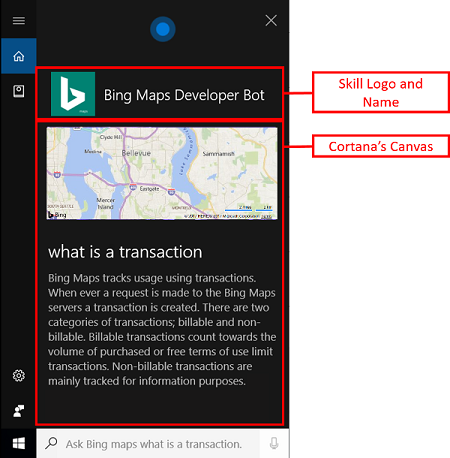

# Principles of Cortana Skills design

Cortana Skills Kit enables developers to create compelling experiences that provide productivity solutions for home or work. But does it make sense to create a skill in all cases? Probably not.

The following are the cases when it makes sense to create a skill.

- **When the user's hands are busy**  
  If the user is cooking, they can ask, "Was that 1 tablespoon or 1 teaspoon of salt?"

- **When using voice is an easier and more natural way to interact**  
  If the user needs to share content or set a reminder, it's easier to say, "Share that with John" or "Remind me to pick up Jessie".  

  If the user is laying down, it's easier to use your voice than a keyboard.  
  
- **When using voice is a more efficient experience**  
  If using voice reduces the number of steps required to do something. For example, saying "Play the latest House of Cards" is much easier than opening up an app, searching for "House of Cards", finding the latest episode, and pressing play.  
  
- **When using voice assists with multitasking**  
  If you can use your voice to do things like read and reply to incoming messages or control music while you're writing a document.  
  
- **When using voice is easier than typing**  
  If the user is on a device that's hard to type on, such as a phone, tablet, or Xbox, it can be easier to use voice.  
  
- **When the user is driving, walking, or is otherwise distracted**  
  If the user is driving or walking, it is easier to use voice than to navigate the world safely while using a device.


<!--
### Cases when it doesn't make sense to create a skill

**When precise control is required or hard to express**
  * There are some tasks that are easier to complete with a mouse or keyboard than with voice. For instance, typing a complex URL is easier than speaking it. 

**When getting private/secure information**
  * There are some things that users generally shouldn't or don't want to say out loud. For example, passwords, social security numbers, and credit card information should all require the user to type them. Note that if your skill requires users to say this type of information, your skill will fail the review process when publishing.

  
**When the social setting is not appropriate**
  * There are situations when the user won't want to use voice, or it isn't polite to use voice. For example, if a user is on a crowded bus, they may not want to use voice.


**When the environment doesn't suit using voice**
  * There are situations where it's easier to type or view information than to use voice. For example, a noisy room.

**When voice isn't simpler than using a mouse or keyboard**
  * There are cases where using voice is not any easier than using a keyboard or mouse. For example, there's not much value using voice to perform simple tasks like scrolling a browser, when a mouse our touch can be used just as quickly and easily. 
-->

<!-- this belongs with voice guidelines -->

<!-- 
**When the skill forces the user to speak unnaturally or with great effort**
  * Requiring the user to say phrases that are unnatural, such as "play genre jazz", are not well designed. Consider more natural alternatives, such as "play some jazz".
  * Requiring the user to memorize a lot of things so they can complete a task can be difficult.
  * Ensure that your Cortana skill isn't too brittle. Consider the different ways a user may say something and handle them in your language model. For instance, saying "play jazz" and "play some jazz" should trigger the same task in your skill.


**Challenging speech tasks**
  * Certain words or phrases are challenging to say such as a gamer tag, while others may be difficult for the speech engine to get correctly such as homophones (words that sound the same but have different spelling). For example, weight and wait, or light and lite. These words sound the same, but have completely different meanings. Be sure that if your Cortana skill does require users to use these types of words that your skill is able to handle homophones. 

-->


If you decided that building a skill makes sense, consider the following throughout the design process.

* Will the design solve the user’s problem with the minimum number of steps?
* Will the design solve the user’s problem better, easier, or faster than any of the alternative experiences?
* Is the design intuitive; will users naturally know what to do when using it?
* Does the design avoid complexity?
* Does the design use default values when the user is not specific?

A great user experience does not require users to talk too much, repeat themselves, or explain things that the skill should automatically know.


## Design for the most common scenario

Define the key scenarios you want your skill to target. 
* What are the high value scenarios and metrics?

Of these scenarios, which work well with voice? 
* Which scenarios don't rely heavily on visual elements?
* Which scenarios are relatively quick to complete with minimal steps? 

Select the scenarios that meet the above criteria.


## Design the conversation

Next, design a conversation that sounds natural and is intuitive. Start out thinking about:

* What are the most essential questions that the skill must ask to complete the task? 
* What questions the user might ask? 
* How will the skill reply to the user's questions? 
* What information is absolutely required and which is optional? 
* Is there anything we can infer or remember from prior interactions?
* Which answers should you confirm before taking the action, and the type of confirmation you should use?
* What actions the conversation might trigger on your backend service?
* Whether the skill needs a directed dialog
* How will the skill handle help questions and errors?
* How the skill reacts if it reaches a dead end? For example, the task doesn't complete or gets it wrong.
* What environments could the skill be used in and how potential touch interactions might impact your design.


Roleplay the conversation to make sure it's natural and intuitive. Just like in real life, conversations with users vary depending on the user. Your skill should be adept in handling conversations with different users. 


## Identify the intents, entities, and utterances

The conversational design process should identify intents, entities, and utterances. Intents are the actions that the user wants to perform and entities are the data required to perform the action. For example, if the user says, "Hey Cortana, tell My Travel Agent I want to fly to New York at 6:00 PM," the intent is to book a flight, and New York and 6:00 PM are the entities.


When building your skill, you're encouraged to use Microsoft's [Language Understanding Intelligent Services](https://www.luis.ai) (**LUIS.ai**) to model your intents and entities. For information about modeling intents and entities in LUIS, see [intents](https://www.microsoft.com/cognitive-services/en-us/LUIS-api/documentation/Add-intents) and [entities](https://www.microsoft.com/cognitive-services/en-us/LUIS-api/documentation/Add-entities). For a list of built-in entities in LUIS, see [Prebuilt entities](https://docs.microsoft.com/azure/cognitive-services/luis/pre-builtentities). 


Intents fall into the following categories:

* [Full intent](#Full-intent)
* [Partial intent](#Partial-intent)
* [No intent](#No-intent)


<a name="Full-intent"></a>
### Full intents

**Full intent** is when the user fully expresses what they want to do in a single utterance. When the user provides a complete request in their first utterance, you should respond directly to their request and either propose further interaction, if required, or end the conversation.


For example:

```
User: Hey Cortana, ask Mileage Wizard if I have miles to travel.
Mileage Wizard: You currently have 30,000 miles. This is enough to travel domestically but not internationally. Would you like to purchase additional miles or book a domestic trip?
```

Because there are many ways to express the same intent, you need to develop as many variations of the intent as possible when you model your intents.

If you display interaction examples in a card on Cortana's canvas (for example, if they ask for help), try to show full intent examples. This helps train the users on the most effective way to communicate with your skill.


<a name="Partial-intent"></a>
### Partial intents

**Partial intent** is when a user partially expresses what they want but the utterance is missing a required entity. Your skill should detect the missing element and automatically provide a follow-up prompt that asks for the missing entity. 

For example:

```
User: Hey Cortana, ask Mileage Wizard if I have miles.
Mileage Wizard: Miles to travel?
```

<a name="No-intent"></a>
### No intents

**No intent** is when a user uses a skill for the first time and they only give the minimum information which is not sufficient to engage in the conversation. When this happens, you need to tell the user how to interact with your skill.

It is critical that the skill consider the first-time user interaction and help them to get started. You should present a list of three potential options to choose from. If you present more than three options, the user might be overwhelmed and frustrated, which leads to a rejection of the voice experience.

For example:

```
User: Hey Cortana, ask Mileage Wizard.
Mileage Wizard: Do you want available miles, used miles, or discounts?
```

In LUIS, the language models have the predefined "None" intent. 


<!--
## Designing an entity

Because entities describe information that's relevant to the intent, it's important to design your entities well. Consider the following suggestions when training your intent model:

* How will the task or app complete the utterance?
* Are permissions required?
* Will the tasks available to you be able to support the entities?
* Be careful about revealing private information.

-->


## Asking users questions

All interactions with the user should use a conversational tone whether spoken or written.

* **Be conversational.** Interact how people speak. Don’t emphasize grammatical accuracy over sounding natural. For example, ear-friendly verbal shortcuts like "wanna" or "gotta" are fine for text-to-speech (TTS).  
  
  * Use the implied first-person tense where possible and natural. For example, "Looking for your next Adventure Works trip" implies that someone is doing the looking, but does not use the word "I" to specify.   
    
  * Use contractions for more natural interactions and to save space on Cortana's canvas. For example, "I can’t find that movie" instead of "I was unable to find that movie." Write for the ear, not the eye.  

* **Use variations.** Use variation to help make the app sound more natural. When repeating a question, ask it differently the second time. For example, a variation of "What movie do you wanna see?" might be "What movie would you like to watch?"  
   
* **Use phrases like "OK" and "Alright" in responses with restraint.** While they provide acknowledgment and a sense of progress, they can also get repetitive if used too often and without variation. Use acknowledgment phrases in TTS only. Given the limited space on Cortana's canvas, don't write acknowledgments to the canvas.  

<!--
If you add this one, you need the list of what she understands.

* **Use language that Cortana understands.** 
-->

Your interactions should be: 

| Principle | Good example | Bad example 
|-|-|-
| **Efficient** <br/> Use as few words as possible and put the most important information up front. | Sure, what movie do you want to watch? | Sure can do, what movie would you like to search for today? We have a large collection. 
| **Relevant** <br/> Provide information pertinent to the task, content, and context. | I’ve added it to your playlist. | I’ve added it to your playlist. Just so you know, your battery is getting low. 
| **Clear** <br/> Avoid ambiguity. Use everyday language instead of technical jargon. | I couldn’t find any trips to Las Vegas. | No results for query "Trips to Las Vegas".
| **Trustworthy** <br/> Be as accurate as possible. Be transparent about what’s going on in the background. If a task hasn’t finished yet, don’t say that it has. Respect privacy, don’t read private information aloud. | I couldn’t find that movie in our catalog. | I couldn’t find that movie, it must not have been released yet. 


### Presenting options

Your design needs to make sure that the user clearly understands what you are asking and that a response is expected. Just presenting the options is not sufficient. Follow a list of options with a question so the user knows that they are expected to say something.

```
Cortana: The shirt comes in three colors; red, blue, green. Which color would you like?
```

When presenting options to the user, ask in a way that makes it clear to the user that it is an either/or question. Limit the list of options to three entries, and state all options clearly.

```
Cortana: What type of directions would you like, walking or driving?
```
Because users can't quickly scan and skip content like they can in a visual interface, it is important to keep your questions simple and concise.


### Asking questions using a directed prompt or open prompt

You can ask users questions using either a directed prompt or an open prompt. A **directed prompt** lists specific choices for the user. For example, "Please select cheese, pepperoni, or sausage." Directed prompts often minimize user confusion. An **open prompt** lets the user provide their own choice. For example, "Which movie would you like?" If users are familiar with the choices, open prompts are fine. 

When choosing between directed and open prompts, also consider the number of options that you present to the user and how likely it is that the options will change. 

Good uses of a directed prompt are when:

* A wide variety of users use the skill, or they use it on an infrequent basis. For example, a call center application is best suited to use directed prompts.  
  
* There are never more than three options. 

For directed prompts, use the form, "Please select X, Y, or Z." Don't use the form, "Would you like X or do you want Y or Z," because it may lead to Yes or No response instead of an X or Y or Z response.  

If the list of options is long (for example, a list of stock investments) or variable (for example, movie titles), using a directed prompt is impractical. In this case, use an open prompt. For example:

```
Cortana: Please say a stock's name.
User: Help.
Cortana: Please say a stock's name. For example, say Microsoft.
```


## Confirming a user's answer

A confirmation is an acknowledgement that your skill heard the user's response. For example:

```
Cortana: Where do you want to fly to?
User: Paris
Cortana: Which date do you want to leave Paris?
```

Think about where in the conversation flow the users need confirmations. Recognizing speech from a telephone is not perfect, particularly under noisy conditions. In addition, when skills are used in a standalone speaker, you only have one channel of communication with the user. An effective confirmation and correction strategy alleviates issues.

A good voice-based skill uses a variety of techniques for confirmation and correction. The techniques depend on the style of the skill, the importance of the action being performed, the cost of misunderstanding, and the need for a natural dialog.

For example, a dialog that follows each question with a confirmation, such as "Did you say X?", is slow and potentially very frustrating. Conversely, a dialog that employs no confirmation and, based on a misrecognized command, deletes data without first checking with the user, is equally frustrating. A developer must strike a balance between efficient interaction with the skill and protection from wasted time or lost data. 

In many cases, the cost of misrecognition is so low that confirmation is not warranted. In other cases, explicit confirmation is always required, regardless of the skill's confidence in the user's utterance.

The following are different confirmation strategies you can use.

* [Explicit confirmation](#Explicit-Confirmation)
* [Implicit confirmation](#Implicit-Confirmation)

### Explicit confirmation

Explicit confirmation is the most basic form of confirmation. It also slows the conversation flow because it introduces an extra prompt to explicitly confirm information that the user provided. Use explicit confirmation for situations where the cost of a misunderstanding is high. For example, in a flight booking application, the application must understand the cities that the user wishes to fly between. The following shows an explicit confirmation interaction.

```
Cortana: Where are you flying from?
User: Seattle
Cortana: Did you say Seattle?
User: Yes
Cortana: Which date do you want to leave?
```

### Implicit confirmation

Implicit confirmation combines the confirmation with your next question. This method uses fewer prompts than explicit confirmation. Consider a flight booking scenario where the skill obtains the city that the user is flying from, followed by the date. The following shows an implicit confirmation interaction.

```
Cortana: Where are you flying from?
User: Seattle
Cortana: Flying from Seattle. Which date?
```

If the user answers this question with a date, then the answer implies that Seattle is correct, thereby confirming Seattle as the departure city. The grammar for implicit confirmation interaction is subtly different from the grammar for explicit confirmation. The grammar for implicit confirmation combines acceptance or denial of the previous prompt (in this case, the city) with supplying information for the next prompt.

```
Cortana: Flying from Seattle. Which date?
User: No
Cortana: Where are you flying from?
User: Vancouver
Cortana: Flying from Boston. Which date?
User: No, Vancouver
Cortana: Flying from Vancouver. Which date?
```

Answering with a simple yes does not answer this kind of question. 


<!--
Removed per Dorrene

* [Short time-out confirmation](#Short-Time-out-Confirmation)

### Short time-out confirmation

Short time-out confirmations echo the user's answer and waits a short period of time for a user's utterance. The lack of an utterance by the user within the time-out period implies acceptance. The skill does not expect a response. Instead, the skill makes a statement of its understanding to the user and invites a correction. Assuming that the skill is correct most of the time, the conversation flows quickly and smoothly.


```
Cortana: Which city do you want to fly to?
User: Seattle.
Cortana: Seattle.
User: "" 
Cortana: "What time do you want to fly?
```

Because the user did not correct the skill when it repeated the value, the skill accepts the value, *Seattle*. 

If the user utters anything during the time-out period (for example, mumbling, asking for Help, or saying Repeat), it's a good idea to revert to an explicit confirmation state.

```
Cortana: Which city do you want to fly to?
User: Seattle.
Cortana: Seattle.
User: ~Mumble~
Cortana: Am I right with Seattle?
```
-->

## Other design considerations


### Presenting help

Your design should include help prompts, especially for critical areas of your skill. If the user asks for help, you should list the skill's capabilities and options for that specific area. 

```
User: Book me a hotel in Seattle
Cortana: Which date do you want to check-in in Seattle?
User: April 1st
Cortana: What amenities would you like?
User: Help
Cortana: You can say things like 'pool', 'parking', or 'breakfast'
User: pool and parking
```


### Using default values

Use default values when the user is not specific. For example, if the user says, "Make my room warmer," Cortana should say, "I’ve raised your room temperature to 72 degrees" instead of "Sure, what temperature?" 


### Identifying the skill when invoked

If the user invokes your skill without including an utterance, you should identify your skill and display your help content or ask them what they want to do with leading questions.

```
Good: Welcome to My Travel Agent. To book a trip say, "Book a trip," or to get the status of your miles say, "Available miles" or "Used miles."
Bad: What can I do for you?
```


### Break lists into manageable pieces

For most people, the human brain can only remember a small amount of information when listening to instructions. Limit voice interactions to only what is absolutely required. For example, present only three items of a list at a time. 

```
Good: I've found 10 concerts near you. Number 1. Spring Fling. Number 2. Hot Summer Night. Number 3. Falls a coming. Would you like to hear more? 
Bad: I've found 10 concerts near you. Number 1. Spring Fling. Number 2. Hot Summer Night. Number 3. Falls a coming. Number 4. ....
```

### Abbreviations and symbols

Cortana's text-to-speech translator handles most text such as abbreviations and special characters automatically. 

For example:

  * "Dr. Smith" is spoken as "Doctor Smith"
  * "Microsoft.com" is spoken as "microsoft dot com"
  * "Shopping Ctr." is spoken as "shopping center"
  * "Lake Shore Dr." is spoken as "Lake Shore Drive"


<!--
If you're porting a text-based app to voice, you likely need to change the design to use voice-based design principles since the purpose of using voice is to get to a result faster.
-->


<a name="visualelements" />

## Design your skill's visual elements 

Although the goal is to design your skill for voice only, for some skills that's not practical. There are times when displaying visual elements to support the information that your skill speaks is required. For example, if the user asks for recipes, displaying pictures of the prepared food with links to the recipe can be a better experience than trying to describe each recipe with voice only. Visual elements should not be required to communicate the intent, they should only support the intent.

Things to consider when designing the visual elements: 

* How can the visual elements enhance the voice experience and assist the user?  
  
* Don’t overload the card experience with unnecessary information. For example, too many images, unnecessary text, or too many cards.  
   
* Keep tasks glanceable. The skill must allow users to multi-task with minimal visual attention. Consider every piece of information on the canvas and eliminate anything that is not required.


### Adding visual elements to your skill

Cortana supports Bot Framework cards, which are rich, graphical controls that contain text, images, and interactive buttons. Skills may include the following cards:

| Card Type | Description | Supported layout |
|-----------|-------------|-----------------|
| Adaptive Card | A user-designed card that contains the elements you specify | Single or Carousel |
| Hero Card | A card with one big image | Single or Carousel |
| Thumbnail Card | A card with a single small image | Single or Carousel |
| Receipt Card | A card that lets the user deliver an invoice or receipt | Single |
| Sign-In Card | A card that lets the skill initiate a sign-in procedure | Single |


The following image shows a card displayed on Cortana's canvas.

<!-- There are two main components of the card; 

1. The skill information which consists of the logo and name specified when registering your Cortana skill. The name of the skill is limited to 30 characters. The logo is a png or jpeg that is 60 by 60 pixels and can be up to 30kb in size.
2. The second is the canvas area of Cortana where the content of each response is displayed. The layout of the content varies. Bot Framework based skills support a number of different card layouts. 

???? Is the 30 character limit a Cortana limit (bot framework's limit is 35 characters)?
Bot framework supports only PNG format and not JPEG.
Is the 60x60 limit a Cortana limit (bot framework's limit applies to size only, not shape.)?

-->

<!-- //TODO: AITSkills that have been imported from Alexa are limited an image, title and text based content in a predefined layout as shown in the [Imported Alexa Skill Card Designs](#Imported-Alexa-Skill-Card-Designs) section below.-->



To add cards to your skill, see [Add cards to your skill using Node.js](https://docs.microsoft.com/bot-framework/nodejs/bot-builder-nodejs-send-rich-cards) or [Add cards to your skill using .NET](https://docs.microsoft.com/bot-framework/dotnet/bot-builder-dotnet-add-rich-card-attachments).  

In addition to cards, Node.js users can use a set of [built-in prompts](https://docs.microsoft.com/bot-framework/nodejs/bot-builder-nodejs-dialog-prompt) to simplify collecting inputs from a user. For example, you can use the `choice` prompt to present a list of choices that the user can pick from, or you can use the `confirm` prompt to confirm an action. For a list of prompts, see [Prompt types](https://docs.microsoft.com/bot-framework/nodejs/bot-builder-nodejs-dialog-prompt#prompt-types).


### Card design tips


**Limit the card's title to 84 characters or less**

Limiting the title to 84 characters keeps the title to two lines or less. Having longer titles doesn't look good and pushes the rest of the content down in the card.  

**Create brief but meaningful responses**

When possible, create brief but meaningful responses with a bias towards text-based answers that are glanceable. Make cards crisp, clear, and actionable.

**Try to fit your content within the height of Cortana's canvas**

Limiting the content to the size of Cortana's canvas makes it easy for the user to see the content without scrolling. 

<!--
If your card does extend beyond the height of the canvas, ensure that buttons are in the initial view. Having to scroll for buttons is not user friendly and also likely to be missed.
-->

<!-- I thought they didn't have control over the placement of the buttons - they just define the card's components and the framework builds the cards in a consistent format. A. Adaptive cards supports this in the future, but listed cards don't support placing buttons.-->


**Use cards to provide details**

Cards are meant to provide additional information beyond what the skill speaks. If a user has to listen to Cortana read all the details that are on the card, it often won't be the best user experience. Provide a summary of the card using voice and use the card for the details. For example, if the card shows shirt choices, the skill might say, "Select the shirt's color."

**Direct users to a screen only when needed**

Some users use Cortana on speaker-only devices and can't see a card. If the user needs to see a card, direct them to Cortana's companion app. However, try and do this sparingly. Ideally, a user should be able to use your skill on any supported device regardless of whether it has a screen without having to use a secondary device. The exception being when the user has to sign-in to your skill or provide private information. Note that other than the sign-in card, cards are read-only on speaker devices.

The following scenario shows a cooking skill that provides a list of ingredients.

```
Good: This recipe has 5 ingredients. Here are the first 3. 2 eggs. A cup of flour and a half a cup of water. Say next for the rest of the ingredients.
Bad: Open the companion app to see the list of ingredients.
```

Note that the time between user utterances is limited. On a speaker-only device, if a timeout occurs, the skill ends. On Windows, the skill is still active but the microphone turns off. For cases like this, it may also be a good to ask the user if they would like the instructions emailed to them.


**Tailor the experience**

Tailor the experience based on the device the user is using. If they are using a standalone speaker device, rely on speech to convey the message to the user. If they have a screen, share a quick summary using voice and add additional information in the card. For example, if a user is shopping for a gift, the following are ideas on how to present the information to the user.
    
* Speaker-only device:  
  * Voice: The Contoso shirt is a custom-made shirt available in three colors; red, blue, and orange. Sizes include small, medium and large. It retails for $30.  

* Device with screen: 
  * Voice: The Contoso shirt is a custom-made shirt that retails for $30.
  * Card: Show an image and additional details such as sizes/dimensions and color options. The Bot Framework's Hero card is a good option for this case. If presenting several items to the user, a carousel of Hero cards works well.


**Use horizontal lists**

A card's attachment layout specifies how to display multiple card attachments. The framework supports vertical list layout and horizontal carousel layout. Use carousels, if possible.

<!--

Need to add a section like this:

## Using other Bot Framework UI elements

In addition to cards, Bot Framework provides the following UI elements that your skill may use. 

Node.js users can use a set of [built-in prompts](https://docs.microsoft.com/bot-framework/nodejs/bot-builder-nodejs-dialog-prompt) to simplify collecting inputs from a user. For example, you can use the `choice` prompt to present a list of choices that the user can pick from, or you can use the `confirm` prompt to confirm an action. For a list of prompts, see [Prompt types](https://docs.microsoft.com/bot-framework/nodejs/bot-builder-nodejs-dialog-prompt#prompt-types).

.NET users can use [FormFlow](https://docs.microsoft.com/bot-framework/dotnet/bot-builder-dotnet-formflow).

What design rules apply to Node.js prompts?
What design rules apply to .NET FormFlows?

-->


## Next steps

Cortana's persona has been well crafted and it's very important that you maintain her character in all interactions with users. For information about maintaining her persona in your skill, see [Cortana's persona](cortanas-persona.md).

For performance design considerations, including Azure services, see [Performance guidelines](performance-guidelines.md).

For do's and don'ts with your invocation name, see [Invocation name guidelines](cortana-invocation-guidelines.md).


When you publish your skill to the world, the Cortana team reviews your skill to make sure it's compliant with the design principles in addition to a few other requirements. As part of your design process, be sure to read the list of review requirements that your skill must comply with before you can publish you skill (see [Cortana skills certification requirements](skill-review-guidelines.md)).

<!-- Think about include bot framework's design principles 

Checkout Bot Framework's [Principles of bot design](https://docs.microsoft.com/bot-framework/bot-design-principles).
-->
