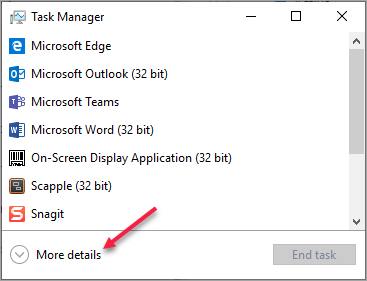
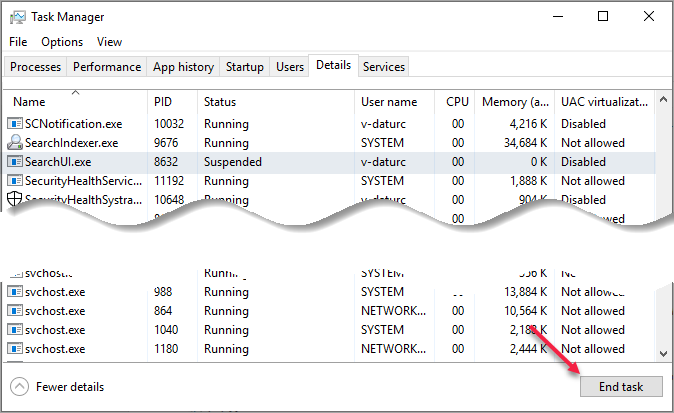

# Known Issues

Cortana Skills Kit is currently in preview. This document lists known issues, and if available, workarounds and solutions.

### Cortana skills only work when language is set to English (United States)

The public preview for Cortana is available for the U.S. English (en-US) market only.

### Cortana does not display all cards when using ```SendActivitiesAsync``` in the v4 bot framework

In the v3 bot framework, it's possible to use ```SendActivitiesAsync``` to show multiple cards in Cortana. However, in v4, this will not work. Cortana will display the first card, but none of the others on the list will be shown.

As a workaround, you should use ```SendActivityAsync``` with a list of cards, as shown in the sample code below.

``` C#
var cardAttachmentl = CreateAdaptiveCardAttachment(_cards[0]);
var cardAttachment2 = CreateAdaptiveCardAttachment(_cards[l]);

var activity = MessageFactory.Text("Testing a list of adaptive cards.");
activity.AttachmentLayout = AttachmentLayoutTypes.List;
activity.Attachments = new List<Attachment>();

activity.Attachments.Add(cardAttachmentl);
activity.Attachments.Add(cardAttachment2);

await stepContext.Context.SendActivityAsync(activity, cancellationToken);
break;
```

### Cortana stops talking after 15 seconds, or displays the message, "Unfortunately this skill won't work on this version of Windows"

Cortana in the Windows 10 Anniversary update (version 1607) limits speech to 15 seconds. This limit has been removed in the Windows 10 Creators update (version 1703). A workaround is to break your speech text into multiple responses. You can send multiple replies to a single user invocation, as long as the input hint of the first N-1 replies is `IgnoringInput`. The last reply must set the input hint to `ExpectingInput` (which automatically turns the microphone on), or `AcceptingInput` (which doesn't).

### Long repetitive sentences without appropriate punctuation become garbled when spoken in the Windows 10 Creators Update (version 1703)

If you have long text that is repetitive, the speech output from Cortana may be garbled. For example:

> This is a very long sentence this is a very long sentence this is a very long sentence this is a very long sentence this is a very long sentence this is a very long sentence this is a very long sentence this is a very long sentence this is a very long sentence this is a very long sentence this is a very long sentence this is a very long sentence. 

Windows 10 Fall Creators Update (Version 1709) resolves this issue. To work around it, ensure your SSML contains proper punctuation, such as commas and periods.

### Privacy policy and terms of use links don't work in permission card when deployed to self or group

When a skill is deployed to self or group, the privacy and terms of use links in the permission card don't work. The reason for this is that you are not required to specify these links until you publish your skill to world.

### Spoken utterances sometimes have punctuation appended

Cortana will sometimes append punctuation, such as a period, to the end of a user's utterance. The speech recognition engine is capable of understanding multiple sentences in a single speech request. The engine may add a period to an utterance depending on how the utterance is spoken. Make sure that your language model is designed to handle this.

### Unable to interrupt Cortana

<!-- //TODO Test as this should be fixed soon -->

Currently Cortana does not support user's interrupting her when she is speaking. She also ignores clicking on her canvas while she is speaking.  

<!-- Bug 737656: resolved 26-Jan-18

### User email address not available on iOS and Android

Currently, the user's email address from the user's profile information is not available on iOS and Android. -->

### Windows Phone does not support login

<!-- Bug 750050: closed 26-Jan-18. An error message will be displayed on the phone, but no fix will be made. -->

Currently, Cortana does not support logging into skills on Windows Phone. Log in using any other supported device first before using the skill on Windows Phone.

### Cortana doesn't return to the previous volume level

In Windows, iOS, and Android versions, if your message includes speech along with the audio attachment, Cortana plays the audio stream at a reduced volume in the background until she finishes speaking. The audio volume does not reset to normal levels.

### Cortana commands to control streaming don't work

Users may try to control streaming by using Cortana commands, such as *pause*, *resume*, *next*, or *previous*. This is not supported on Windows, iOS, or Android.

<!--
### Known Bot Framework issues affecting skills

See the [Bot Build SDK Issues tab on GitHub](https://github.com/Microsoft/BotBuilder/issues).
-->

<!-- if this isn't getting fixed, this should be in a LUIS how-to topic. -->

### LuisDialog fails on skill launch

When Cortana launches a skill without an utterance (for example, "Open \<invocation name\>" or "Ask \<invocation name\>"), the `activity.Text` value is null. Passing the null text to LuisDialog throws an error. To work around this issue, override the `MessageReceived` method and add a null check as shown in the following example:

```csharp
// V3
protected override async Task MessageReceived(IDialogContext context, IAwaitable<IMessageActivity> item)
{
    // Check for empty query
    var message = await item;
    if (string.isNullOrEmpty(message.Text))
    {
        // Return the Help/Welcome
        await Help(context, null);
    }
    else
    {
        await base.MessageReceived(context, item);
    }
}
```

For `javascript`, you can create a [customer recognizer](https://docs.microsoft.com/azure/bot-service/nodejs/bot-builder-nodejs-recognize-intent-messages?view=azure-bot-service-3.0) that maps an empty string to a help intent.

### Bot created from the QnA (V3) template fails when invoked without an intent

When you create a QnA V3 bot from the template, an invocation without intent (for example, "Open MySkill") will cause the default BasicQnA dialog to do nothing. This results in Cortana timing out. This issue can be fixed using the code from [LuisDialog fails on skill launch](#luisdialog-fails-on-skill-launch).

Also, the default behavior is not just single turn but single shot, which means the conversation is closed after the bot returns a result.

### Skill invocation name is not recognized when changing between accounts

There's a bug in switching between Microsoft (personal) Accounts (MSAs) and Azure Active Directory (AAD) Accounts due to cached credentials. Invocation grammars are tied to the user identity. Some identity information is cached by Cortana's agent and doesn't get cleared when you switch between MSA and AAD accounts. This information is *not* cleared by rebooting if `fast start` is enabled.

Until this is fixed, there is a workaround.

1. Start Microsoft Task Manager.
1. Click on `More details`.  
     

1. Click the details tab.  
     
1. Find the `SearchUI.exe` process (which is the Cortana agent), click on it, and kill the process with the `End task` button.

The next invocation to Cortana will restart the agent with a clear identity cache, and load the correct grammars to recognize unique invocation names. Subsequent invocations to Cortana should work as expected.

<!-- //TODO: AIT
### Known Issues for Skills Imported from Alexa

*Third-party trademarks used herein are the property of their respective owners.  Use of such marks does not imply any affiliation, sponsorship, or endorsement.*

The following known issues are specific to skills that have been imported to Cortana from Alexa.

### Flash Briefing Skills

Cortana does not currently does not provide a Flash Briefing Skill API.

### Implict Auth not supported
<!-- Bug: 666796 -->
<!--
Implicit Auth is not currently supported, but is a planned feature.

### Smart Home Skills

Cortana Skills currently does not provide a Smart Home Skill API. However, a custom Cortana skill can be created that connects to a home automation service. Here is an [example](https://www.codeproject.com/Articles/1117146/Creating-a-Smart-Home-Chat-Bot).

<a name="SSML-Alexa-Cortana-differences"></a>

### Not all SSML that works in Alexa works in Cortana

The likely causes are as follows:

* Cortana supports [SSML v1.0](https://www.w3.org/TR/speech-synthesis) while Alexa supports some [SSML v1.1](https://www.w3.org/TR/speech-synthesis11) tags, primarily the [w](https://www.w3.org/TR/speech-synthesis11/#edef_word) tag.
* Alexa and Cortana support different phonetic alphabets for the phoneme tag:
  * Alexa: 
    * International Phonetic Alphabet (IPA)
    * Extended Speech Assessment Methods Phonetic Alphabet (X-SAMPA).
  * Cortana: 
    * International Phonetic Alphabet (IPA)
    * Speech API (SAPI) Phone Set
    * Universal Phone Set (UPS)
* Differences in support for the **interpret-as** property of the **say-as** tag. 
  * **unit**, **interjection** and **expletive** are not supported by Cortana.
  * **time** - both platforms support a *time* option however, Alexa interprets this for durations while Cortana interprets this as 12 or 24 hour times. 
  * **date** - both platforms support a *date* option however, Alexa allows dates to consist of simply a number (e.g. `<say-as interpret-as=”date”>121</say-as>`) while Cortana requires the date parameters to be seperated by a "-" or "." (e.g. `<say-as interpret-as=”date”>1.21</say-as>`) as this removes the potential ambiguity as `121` could mean "December 1st" or "January 21st".
* Alexa has a custom SSML tag `<amazon:effect name="whispered">` which is not supported by Cortana, however a similar effect can be achieved using the [prosody tag](../reference/ssml.md#prosody-Element).

### Not all built-in intents and entities supported by Alexa are available in Cortana

See the [Built-in Intent and Entity Support](../tutorials/alexa-skill-import.md#Built-in-Intent-and-Entity-Support) section of the [Import your custom Alea skill to Cortana guide](../tutorial/alexa-skill-import.md) for details.

### Not all audio streaming features are supported

Cortana does support audio streaming via the AudioPlayer and embedded MP3s in the SSML audio tag. However, not all Alexa features are supported. See the [Audio Support](../tutorials/alexa-skill-import.md#audio-support) section of the Alexa import guide for more information.

### No SessionEndedRequest sent when user closes Cortana in Windows
<!-- //TODO: should be fixed in RS3 Bug# 697923 -->
<!--
When a user closes Cortana in Windows while using your skill, a SessionEndedRequest is not sent to your skill. This will be addressed in a future Windows update.

### All built-in intents and entities used by all skills

Currently, all built-in intents and entities are used by all skills, even if not defined in your skills interaction model. 
-->
