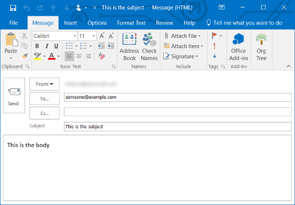

# Launching apps or websites from a Cortana skill

With Cortana, it is possible for your skill to launch an app or website. To launch an app or website, include the `channelData` property in the message that you send Cortana. Set the `channelData` property to an [Action](#Action-object) object that defines the action that you want Cortana to perform. For examples that show how to launch apps and websites, see:

- [Launch a website](#launch-a-website)
- [Launching and deep linking an app](#launching-and-deep-linking-an-app)
- [Start a Skype call or IM](#start-a-skype-call-or-im)
- [Create an email](#create-an-email)


## Launch a website

The following example shows how to specify the channel data used to launch the Bing website.

```csharp
var message = context.MakeMessage() as IMessageActivity;
reply.ChannelData = JObject.FromObject(new {
     action = new { type = "LaunchUri", uri = "https://bing.com"}
});
await context.PostAsync(message);
```

## Launching and deep linking an app

To launch an app, use the app's protocol activation URL. In Windows 10, the built-in Maps app supports launching and deep linking. For information about the Maps app and different ways to launch it, see [Launch the Windows Map app](https://docs.microsoft.com/windows/uwp/launch-resume/launch-maps-app). 

The following example shows how to specify the channel data used to launch the Maps app and center the map over Paris.

```csharp
var message = context.MakeMessage() as IMessageActivity;
message.ChannelData = JObject.FromObject(new {
     action = new { type = "LaunchUri", uri = "bingmaps:?where=Paris"}
});
await context.PostAsync(message);
```

The following image shows the launched Map app.


## Start a Skype call or IM

If the user has Skype installed, they can launch it to to start a call or instant message conversation in [Skype for Business](https://technet.microsoft.com/library/gg398376(v=ocs.15).aspx) or the home version of [Skype](https://msdn.microsoft.com/library/office/dn745878.aspx) on Windows, Android, and iOS.

**Skype for Business**

If the user is signed into Skype for Business, the following code opens an instant message conversation window with "someone@example.com".

```csharp
var message = context.MakeMessage() as IMessageActivity;
message.ChannelData = JObject.FromObject(new
{
    action = new { type = "LaunchUri", uri = "sip:someone@example.com" }
});
await context.PostAsync(message);
```

If the user is signed into Skype for Business, the following code opens a window and readies a phone call to "123123123123".

```csharp
var message = context.MakeMessage() as IMessageActivity;
message.ChannelData = JObject.FromObject(new
{
    action = new { type = "LaunchUri", uri = "tel:123123123123" }
});
await context.PostAsync(message);
```

The following image shows the launched Skype for Business window.


**Skype**

If the user is signed in to the standard version of Skype, the following code shows how to start a call with Skype user, echo123.

```csharp
var message = context.MakeMessage() as IMessageActivity;
message.ChannelData = JObject.FromObject(new
{
    action = new { type = "LaunchUri", uri = "skype:echo123?call" }
});
await context.PostAsync(message);
```

## Create an email

To send an email to a user, use the [mailto URI protocol](https://msdn.microsoft.com/library/jj710215(v=vs.85).aspx). The following example shows how to create an email in the user's email client that's ready for them to send. The example creates and email addressed to "someone@example.com", with a subject line of "This is the subject", and a body of "This is the body".

```csharp
var message = context.MakeMessage() as IMessageActivity;
message.ChannelData = JObject.FromObject(new
{
    action = new { type = "LaunchUri", uri = "mailto:someone@example.com?subject=This%20is%20the%20subject&body=This%20is%20the%20body" }
});
await context.PostAsync(message);
```

The following image shows the crafted email.




## Cortana channel data objects used to launch apps and websites

The following are the objects that you use to specify the channel data that you send Cortana.

### Action object

Defines a Cortana action.

| Property | Type | Description 
|-|-|-
| action | [CortanaAction](#cortanaaction-object) | The action to perform. 

### CortanaAction object

Defines the action to perform.

| Property | Type | Description 
|----------|------|-------------|
| type | string | The type of action to perform. The possible values are:<ul><li>LaunchUri</li></ul>
| uri | string | The URI of the app or website to launch.  
