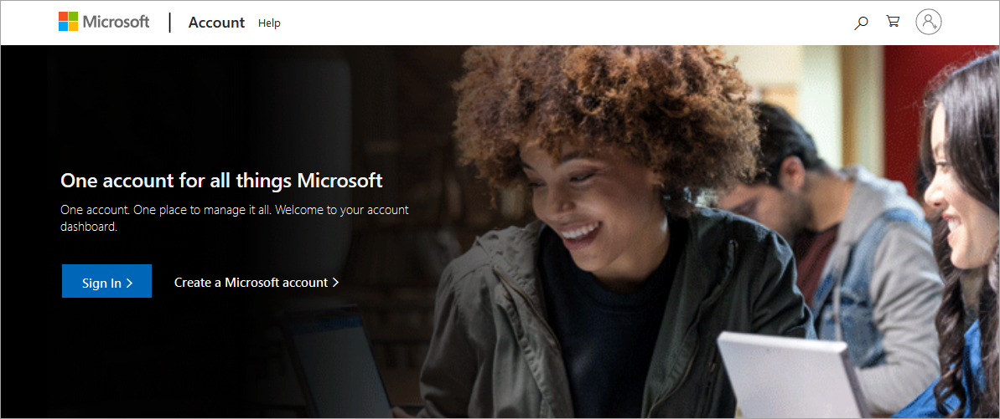
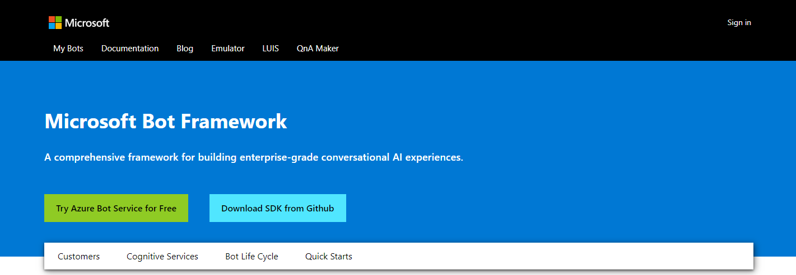
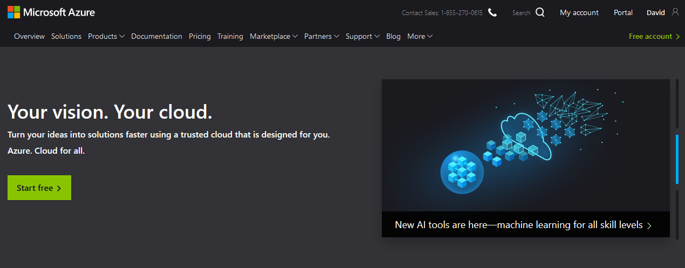

# Set up your development environment

Before you can build your first skill, you need to set up your development environment. Here are a few things you may need to do:

* Set up access to cloud resources, as listed below.
* Make sure your PC or Mac has the necessary development tools and operating system version.

>[!IMPORTANT]
>Cortana currently supports only one locale: U.S. English (en-US).

* Set up Cortana on your machine.
* Optionally, set up your Android or iOS mobile device, or Harman Kardon Invoke speaker, to work with Cortana.

## Step 1 - Set up cloud resources

Developing a Cortana skill requires a variety of cloud resources. For example, you need a Microsoft account in order to register your skill and connect it to Cortana. If you don't already have a Microsoft account, go to the [Microsoft Account](https://account.microsoft.com/account) website to sign up for one.

>[!NOTE]
> To develop a Cortana skill, you must use a [Microsoft account](https://account.microsoft.com/account) rather than an Azure Active Directory (Azure AD) organizational account, such as an account associated with Office 365.

Other resources include:

* **Bot Framework**. To create a Cortana skill, you must first create a bot. Once the bot is working, sign into the [Bot Framework Developer Portal](https://dev.botframework.com) using your Microsoft account, register the bot, and connect it to the Cortana channel to make it a Cortana skill.
<!-- 
For information on creating your first Cortana skill, see [Create your first Cortana skill](./mva22-hello-world.md).
-->

* **LUIS (Language Understanding Intelligent Service)**. Sign into [LUIS.ai](https://www.luis.ai) using your Microsoft account. This will allow you to create and manage LUIS applications that let you use language understanding technology in your Cortana skill.

* **A cloud hosting service**. Optionally, you can use a cloud hosting service such as [Microsoft Azure](https://azure.microsoft.com). This is required if you want to want the skill to be available to Cortana using a web address.

## Step 2 - Set up your PC, Mac, or Cortana device

You can develop a Cortana skill on either a Mac or a PC running Windows 10 Anniversary Update (build 1607), using your choice of development tools. The only requirement is that you have installed the [Microsoft Bot Framework SDK](https://github.com/microsoft/botframework-sdk).

Although you can use any development environment, Microsoft Visual Studio offers a variety of useful tools and features, including Bot Application, Bot Controller, and Bot Dialog templates. For information about installing Visual Studio, see [Install Visual Studio 2019](/visualstudio/install/install-visual-studio).

>[!NOTE]
> The Bot Builder SDK for .NET currently supports C#. Visual Studio for Mac is not supported.

For either a Mac or PC environment, install the [Bot Framework Emulator](/azure/bot-service/bot-service-debug-emulator?view=azure-bot-service-4.0) to be able to view and test your bot in action before registering it and connecting it to the Cortana channel.

If you are developing your skill on a Mac, or developing for an iOS, Android, or Harman Kardon Invoke device, you also need to set up the device where Cortana invokes the skill. Since Cortana is not available in a Mac environment, skills developed in a Mac environment must be invoked on a mobile device or in a virtual machine environment running Windows.

## Step 3 - Set up Cortana

Make sure Cortana is set up to work with your skill:

* You must be signed into Cortana on your computer or device with your Microsoft account.
* Make sure the microphone on your computer or device is working and turned on so that you can speak to Cortana.
* Optionally, set debug mode under Cortana channel configuration through Azure Portal. When you invoke a Cortana skill in debug mode, Cortana gives you [additional information](./test-debug.md#enable-debugging-in-cortana) that you can use fine-tune the skill.

## Step 4 - Set up your Cortana device (optional)

Cortana is installed automatically on Windows devices, but if you want to use your skill on iOS or Android devices, you'll need to download the Cortana app from the device's app store. Sign into Cortana using the same Microsoft account that you used to register the skill.  

Since Cortana is built into the Harman Kardon Invoke, you only need to sign into Cortana using the Microsoft account used to register the skill.