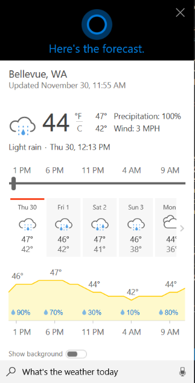
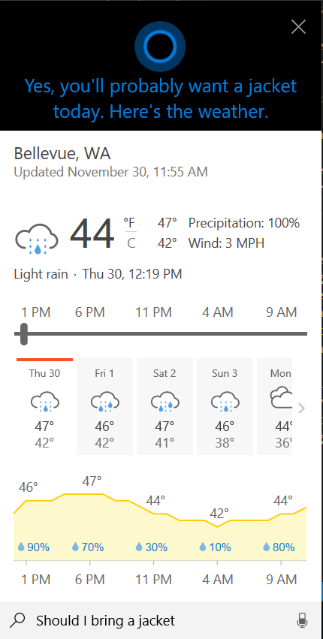

---
title: Understanding types of conversations
description: Explains the different types of Cortana conversations.

ms.date: 10/03/2018
ms.topic: article

keywords: cortana
--- 

# Understanding types of conversations
 
Underlying what makes Cortana invoke a skill is a simple concept: Cortana responds to input it receives from a user. It is a conversation. 

A Cortana conversation can be as simple as asking a specific question and getting an answer, or it could be a dialog with a series of interactions.

The most basic Cortana conversation is a *single-turn* conversation. For example:

    User: Hey Cortana, what's the weather today?
    Cortana: The forecast shows light rain with a high of 47 and a low of 42.

You can also have a *multi-turn* conversation, in which there a dialog between Cortana and the user:

    User: Hey Cortana, what's the weather today?
    Cortana: The forecast shows light rain with a high of 47 and a low of 42.
    User: Should I bring a jacket?
    Cortana: Yes, you'll probably want a jacket today.

    User: Thanks!
    Cortana: My pleasure!

For many situations, a Cortana skill that relies on a single-turn conversation is perfectly fine. The user quickly gets the information they need. However, a skill that handles multi-turn conversations makes it possible to provide users a richer experience. For example, you could create a skill that checks the status of an order, tells the user the details of the order, and lets the user make changes to the order. In order to do this, a multi-turn Cortana skill requires that your skill have the ability to:

* Understand what the user is saying.
* Understand the intent of the conversation through a natural language understanding tool such as LUIS.AI.

As you design your Cortana skill, keep in mind the following guidelines for conversations:

* **Vary the output**. By varying the wording of the output, the user experience will seem natural rather than repetitive or tedious.
* **Write for the ear**. Focus on how the output sounds rather than how it looks so that it sounds more spontaneous.
* **Make sure the output is in context**. The output should accurately reflect what is going on in the conversation, either to confirm what the user has said or to give an appropriate response.

Here are some additional things to consider when designing a conversation for a Cortana skill:

* What are the most essential questions that the skill must ask to complete the task? 
* What questions might the user might ask? 
* How will the skill reply to the user's questions? 
* What information is absolutely required and what is optional? 
* Is there anything that can be inferred or remembered from the prior interactions?
* Which answers should be confirmed before taking an action, and what type of confirmation should be used?
* What actions might the conversation trigger on a backend service?
* Does the skill need a directed dialog?
* How does the skill handle help questions and errors?
* How does the skill react if it reaches a dead end; for example, if the task doesn't complete or gets something wrong?
* What environments could the skill be used in?

For more information on designing skills, see [Principles of Cortana Skills design](./design-principles.md).
