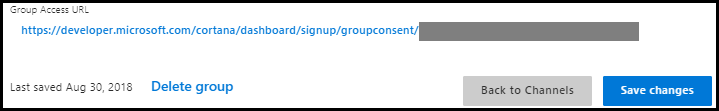

# Sharing your Cortana skill to a group

|   |   |
| - | - |
|  | [Watch a video](https://mva.microsoft.com/en-US/training-courses/getting-started-with-cortana-skills-18241?l=IjcRvxeoE_1611787171) about sharing your Cortana skill to a group. |

In [Using profile data in your Cortana skill](./mva52-using-profile-data.md), you learned how to make user profile data available to your Cortana skill by updating the skill's channel configuration settings. 

That module described using **Publish to self** option, which is the best publishing option to use when you are developing and testing a skill. **Publish to self** makes the skill available only to you. You must be logged in to your Microsoft account to use and test the skill.

When you are done testing your skill and ready to share it with other users, you have the following additional publishing options:

* **Publish to group**, which lets you deploy the skill to a specified group of users.
* **Publish to world**, which makes your completed skill available to all Cortana users after it has passed certification.

In this module, you'll learn how to publish the **Mixtape** skill developed in previous modules to a group. In [Publishing your Cortana skill](./mva72-publish-skill.md), you'll learn how to publish your completed skill.

For more information on Cortana publishing options, [Publishing Cortana Skills](./publish-skill.md)

## Step 1 - Create a group

To create a group of users who can use and test your Cortana skill, update the Group Settings channel configuration settings.  

<!-- new -->
  

  

Under the Group section, under the Member email list, click on the Add team member link to add the member emails to the group.  
The Member email list displays the email address associated with a Microsoft account for each user.  

>[!NOTE]
> The email account does not have to be a Microsoft account, but must be associated with a registered Microsoft account.  

  

Each Member email may be deleted by clicking on the trash button.  

 

To create the group, click on the Save changes button.  
<!-- new -->

## Step 2 - Invite users to join the group

Users in the group can access the skill using the group access URL. Invite them to join the group by send them the URL.

Opening the URL in a browser displays a prompt asking if the user wants to join the group.

Click **Accept** to accept the invitation and recieve a confirmation.

Each user in the group who has accepted the invitation should now have access to the skill in Cortana.

To leave the group, a user can open the group access URL and click **Leave**.

## Step 3 - Test your published skill

Once you have published your skill to the group, any group member can invoke the skill. For example, any group member can direct Cortana to invoke the Mixtape skill:

*Ask Mixtape to make me a mixtape.* 

Cortana prompts for credentials, if necessary, and launches the Mixtape skill:

