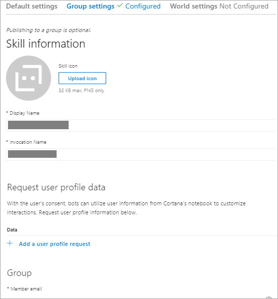
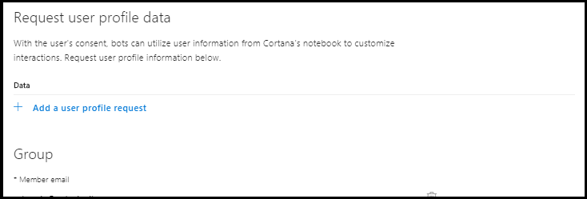
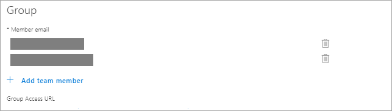
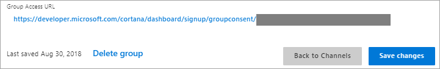
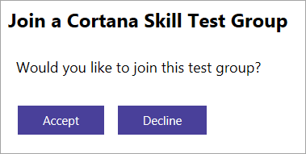
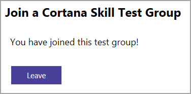

> [!IMPORTANT]
> This page has been deprecated as we update our documentation to Azure Bot Service v4.

# Sharing your Cortana skill to a group

In [Using profile data in your Cortana skill](./mva52-using-profile-data.md), you learned how to make user profile data available to your Cortana skill by updating the skill's channel configuration settings.

That module described using the `Publish to self` option, which is the best publishing option to use when you are developing and testing a skill. `Publish to self` makes the skill available only to you. You must be logged in to your Microsoft account to use and test the skill.

When you are done testing your skill and are ready to share it with other users, you have additional publishing options:

- `Publish to group`, which lets you deploy the skill to a specified group of users.

- `Publish to world`, which makes your completed skill available to all Cortana users after it has passed certification.

In this module, you'll learn how to publish <!-- the **Mixtape** --> your skill, developed in the previous modules, to a group. In the next page [Publishing your Cortana skill](./mva72-publish-skill.md), you'll learn how to publish your completed skill to **World**, so that anyone can use it.

For more information on Cortana publishing options, see [Publishing Cortana Skills](./publish-skill.md).

## Step 1 - Create a group

To create a group of users who can use and test your Cortana skill, update the **Group Settings** channel configuration settings.  

<!--  -->

Under the **Group** section, under the Member email list, click on the `Add team member` link to add the member emails to the group.  
The Member email list displays the email address associated with the Microsoft account for each user. 

>[!NOTE]
> The email account doesn't have to be a Microsoft account, but it must be associated with a registered Microsoft account.  

Any member email address may be deleted by clicking on the trash icon next to it.

To create the group, click on the `Save changes` button.

## Step 2 - Invite users to join the group

Users in the group can access the skill using the group access URL. Invite them to join the group by sending them the URL.

Opening the URL in a browser displays a prompt asking if the user wants to join the group.

Click `Accept` to accept the invitation and receive a confirmation.

Each user in the group who has accepted the invitation should now have access to the skill in Cortana.

<!--  -->

>[!NOTE]
>To leave the group later, including after testing is complete, users can open the group access URL and click `Leave`.

## Step 3 - Test your published skill

Once you have published your skill to the group, any group member can invoke the skill. Cortana prompts for credentials, if necessary, and launches <!-- the Mixtape --> your skill.

You might want to ask members of your group to use different invocation phrases during their testing. Check out [Invocation phrases](./cortana-invocation-guidelines.md#invocation-phrases) on the [Invocation name guidelines](cortana-invocation-guidelines.md) for more details. <!-- *Ask Mixtape to make me a mixtape.*  -->

<!-- For example, any group member can direct Cortana to invoke the Mixtape your skill. -->

<!--  -->