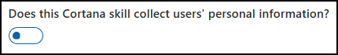

# Publishing Your Cortana Skill  

In previous modules, you use the **Default settings** option to publish your Cortana Skill when you are developing and testing the skill, and the **Test Group settings** option to make your Cortana Skill available to a group of users.  
In this module, you use the **World settings** option to make your Cortana Skill public after testing and make-ready for availability to any Cortana user.  

>[!TIP]
> For more information on making your skill available to a group of users, visit the [Sharing your Cortana skill to a group](./mva71-share-skill.md) page.  
> For more information on Cortana publishing options, visit the  [Publishing Cortana Skills](./publish-skill.md) page.  

## Verify Your Cortana Skill Meets Certification Requirements  

Unlike the **Default settings** and **Test Group settings** options, the **World settings** option requires that you submit your skill to the Cortana team for certification.  

>[!IMPORTANT]
> Your Cortana Skill must meet certification requirements before being published to the world.  
> *   Must work on devices without a screen such as the Invoke speaker (*headless devices*), as well as devices with a screen such as a PC or mobile device.  
> *   Any user profile data requested by you Cortana Skill must be used appropriately.  
>     
>     > [!WARNING]
>     > Your Cortana Skill must use all of the user data that you request.  
>     > If your Cortana Skill is not using any data, then disable access to the data.  
>     
> *   Must work as intended based on the submission information you specify.  
> *   Must follow specified design, performance, and personality guidelines.  
>
> >[!TIP]
> > For more information about certification requirements, visit the [Cortana skills certification requirements](./skill-review-guidelines.md) page.  

## Submit for Review  

The Cortana team must review and certify your Cortana Skills prior to publication to the world. To start this process, update the **World settings** channel configuration settings for your Cortana Skill.  

Like the **Default settings** and **Test Group settings** channel configurations, the World settings channel configuration requires you to provide basic information for your Cortana Skill. Basic information includes the display text and invocation name. In addition, you must provide information required for certification.  Certification information may include skill invocation phrases and a category that indicates how the skill might be organized when it is displayed with other skills.  

1.  On the *Configure Cortana* page, under the *World Settings* section, enter the following information.  
    
      
    
    1.  Skill information section  
        
          
        
        *   `Skill icon`  
        *   `Display name`  
        *   `Invocation name`  
        *   `Short description`  
        *   `Long description`  
        *   `Sample Invocation Phrase`  
        *   `Primary category`  
        *   `Secondary category (Optional)`  
        *   `Tags`  
        *   `Supported platforms`  

    2.  `Does this Cortana skill collect users' personal information?`  
         
          
        
        *   Request user profile data
            
              
            
            *   `User data`  
                *     
                    
            *   `Additional User Data`  

    3.  Developer Account section  
        
            
        
        *   `Developer Account Type`  
                  
    4.  Developer Information section  
        
        
        
        *   `First name`              
        *   `Last name`              
        *   `Email`             
        *   `Phone number`  
        *   `Address 1` and `Address 2`  
        *   `City/District`  
        *   `State`  
        *   `Zip code`  
        *   `Country`  
        *   `Developed by (for ISVs)`  
        *   `Published by`  
        *   `Developer or Company Website URL`  
    5.  Support Contact section  
        
        
        
        *   `Email`  
        *   `Website URL`  
    6.  Publisher Information section  
        
        
        
        *   `Name`  
        *   `Email`  
        *   `Phone number`  
    7.  Privacy policy and terms of use section  
        
        
          
        *   `Privacy policy (URL)`  
        *   `Terms of Use (URL)`  
        *   `Notices`  
    8.  Validation and testing instructions section  
        
          
        
2.  Click **Submit for review**.  
    
    

The Cortana team informs you when your Cortana Skill passes certification and is published.  
The Cortana team contacts you if additional information for certification is needed.  

## Test Your Published Cortana Skill

After you have published to the **world**, any Cortana user may invoke your Cortana Skill.  
