# Publishing your Cortana skill

|   |   |
| - | - |
|  | [Watch a video](https://mva.microsoft.com/en-US/training-courses/getting-started-with-cortana-skills-18241?l=75bH5yeoE_9811787171) about publishing your Cortana skill. |

In previous modules, you learned how to use the **Publish to self** option to publish your Cortana skill when you are developing and testing the skill, and the **Publish to group** option to make your skill available to a group of users. In this module, you'll learn about the **Publish to world** option to make your skill public when it is fully tested and ready to be made available to any Cortana user.

For more information on making your skill available to a group of users, see [Sharing your Cortana skill to a group](./mva71-share-skill.md). For more information on Cortana publishing options, see [Publishing Cortana Skills](./publish-skill.md).

## Step 1 - Make sure your skill meets certification requirements

Unlike the **Publish to self** and **Publish to group** options, the **Publish to world** option requires that you submit your skill to the Cortana team for certification. The skill must meet certain requirements before it can be released to the world. For example:

* The skill must work on devices without a screen such as the Invoke speaker (*headless devices*), as well as devices with a screen such as a PC or mobile device.
* Any user profile data requested by the skill must be used appropriately and fully.
* The skill must work as intended based on the submission information you specify.
* The skill must follow specified design, performance, and personality guidelines.

For more information on certification requirements, see [Cortana skills certification requirements](./skill-review-guidelines.md).

## Step 2 - Submit your skill for review  

<!-- new -->
The Cortana team must review and certify your Cortana Skills prior to publication to the world. To start this process, update the World settings channel configuration settings for your Cortana Skill.  

Like the Default settings and Group settings channel configurations, the World settings channel configuration requires you to provide basic information for your Cortana Skill. Basic information may include the display text and invocation name. In addition, you must provide information required for certification. Certification information may include skill invocation phrases and a category that indicates how the skill might be organized when it is displayed with other skills.  

<!-- new -->  
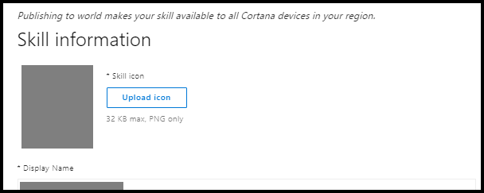  

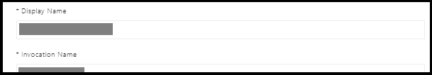  

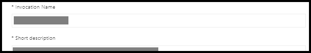  

  

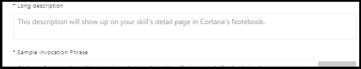  

  

  

  

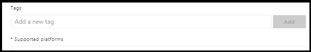  

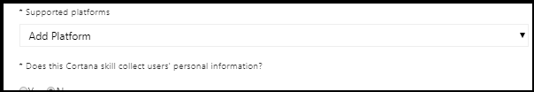  

 

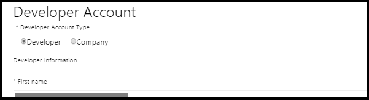  

  

  

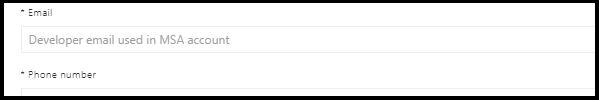  

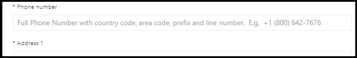  

  

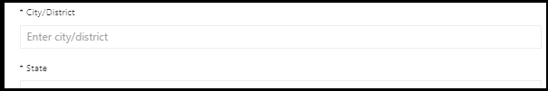  

  

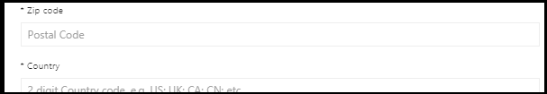  

  

  

  

  

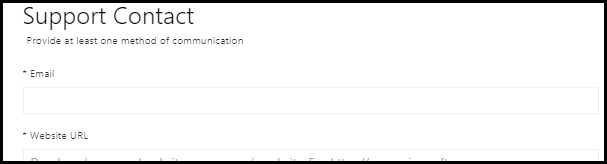  

  

  

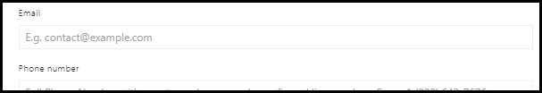  

  

  

  

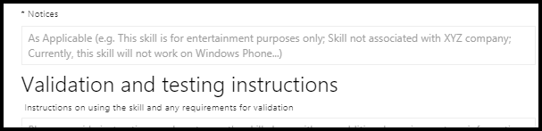  

After you have specified the **World settings** channel configuration information for your skill, click **Preview** to see a summary of the status of the submission.

If you provided all the required information, then click on the Submit for Review button to complete the submission process. 

  

The Cortana team informs you when your Cortana Skill passes certification and is published.  
The Cortana team contacts you if additional information for certification is needed.  
<!-- new --> 

## Step 3 - Test your published skill

Once you have published your skill to the world, any Cortana user can invoke the skill. For example, any user can direct Cortana to invoke the Mixtape skill:

*Ask Mixtape to make me a mixtape.* 

Cortana prompts for credentials, if necessary, and launches the Mixtape skill:

