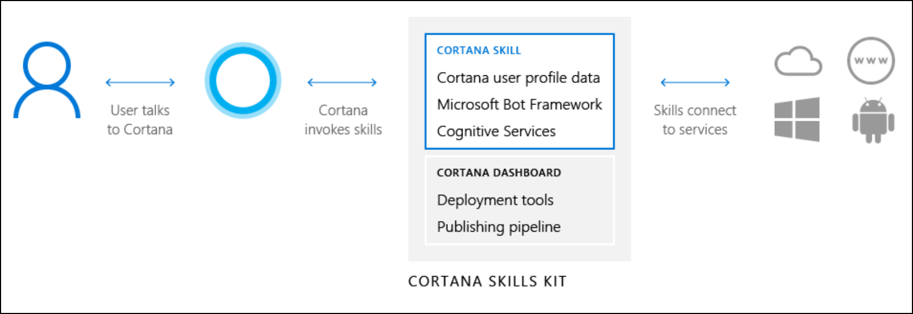

# Cortana Skills Kit

Cortana is a personal digital assistant that keeps users informed and productive, helping them get things done across devices and platforms. Skills define the tasks that Cortana can accomplish. You can extend Cortana by adding your own skills that let your users interact with your service via Cortana. Cortana invokes the skills based on input from the user, either spoken or typed.

The Cortana Skills Kit enables you to develop skills for Cortana. The kit is a suite of tools that will help you build skills that connect users to your custom services and solutions. To get started, go to [Getting started with Cortana skills](./get-started.md).

Because Cortana is available on many different devices, some may have a screen, while others may have a speaker, and some may have both. You should ensure that your bot is capable of handling any of these devices. The bot framework provides device information to your skill.

This image shows how users interact with Cortana and your skill. No matter which platform the user chooses for Cortana, your skill runs in the cloud, not on the actual device.

  

## How do users invoke skills?  
 
Users invoke skills simply by speaking to Cortana. Users don't install or activate skills. New skills that the user may be interested in using can be found on the [Cortana Skills page](https://www.microsoft.com/windows/cortana/cortana-skills/). They can also manage and control skills that they've already connected to in the Cortana Notebook.

>[!NOTE]
> Cortana will respond with speech when queried with speech. Queries by text will have a text-only response.

Users can invoke skills on any platform that includes Cortana.

| Platform | Requirements |  
|:--- |:--- |  
| Windows | Windows 10 or newer. |  
|Android | Android phone running Android 4.4 or newer, with app version 2.1.6.1547 or newer. |  
| iOS | iPhone, iPad, or iPod Touch running iOS 9.0 or newer, with app version 1.9.15 or newer. |  

>[!IMPORTANT]
> Cortana supports skills in the **US** region and with the **en-US** language locale only.

When invoking skills by speaking (or typing) to Cortana, the user can optionally provide an **invocation phrase**. The invocation phrase includes an **invocation name**, which uniquely identifies the skill to invoke. For example, if an invocation name is `Contoso Photo`, the user might say `Ask Contoso Photo to...` or `Tell Contoso Photo that...`. You specify the name when you configure the Cortana channel for your skill.  

If an invocation name is not provided, then Cortana may suggest a skill that she thinks can fulfill the user request.

For more information about invocation phrases, visit the [Invocation Name Guidelines](./cortana-invocation-guidelines.md) page.

## How do users interact with skills?  

When a user invokes your Cortana skill, Cortana sends a structured request to the service that powers your Cortana skill, and waits for a response. There are two ways that Cortana listens for voice requests. The first is when the user presses the microphone button in the Cortana app or in the `Ask me anything` search box in Windows. The second is when the user enables Cortana to respond to `Hey Cortana`. The following are examples of how users might interact with Cortana.  

### EXAMPLE 1
If a user asks Cortana about the weather, then Cortana triggers the built-in weather skill.

Sample dialogue:

>**User:** "What's the weather like?"
>
>**Cortana:** "It's currently 58 degrees and mostly cloudy."

### EXAMPLE 2
If the user invokes a Cortana skill on a device with a screen, then a card with additional information will be displayed onscreen. For example, this card might be displayed when Cortana answers the previous weather question:

>   

### EXAMPLE 3
If a user is trying to invoke your Cortana skill by voice input, they speak an invocation phrase using the invocation name. For example, if a user invokes the Cortana skill `Contoso Photo` to check on the status of an order and make a change, then the conversation that follows might go like this.  
>
> **User:** "Ask Contoso Photo what the status of my photo order is."
>
> **Cortana:** "Your photo order will be ready in an hour."  
>
> **Cortana:** "Can I help you with anything else?"
>
> **User:** "What did I order?"
>
> **Cortana:** "Three copies of prints on glossy paper. Would you like to make a change?"
>
> **User:** "Make it matte paper."
>
> **Cortana:** "You would like to change the paper to matte. Is this correct?"
>
> **User:** "Yes."
>
> **Cortana:** "Your order has been updated."

There are design guides available to help you create an engaging user experience.

* [Skill design principles](./design-principles.md)  
* [Invocation name guidelines](./cortana-invocation-guidelines.md)  
* [Performance guidelines](./performance-guidelines.md)  
* [Publishing review guidelines](./skill-review-guidelines.md) 
<!-- * [Maintaining Your Cortana persona](./cortanas-persona.md)  This file was archived on 20-May-19 -->

## Personalize the user experience with user insights  

If the user gives permission, Cortana will provide the user profile and contextual information when invoking your skill, which you can use to personalize their user experience. User profile information is data that Cortana knows about the user, such as their name or email address. Contextual information is data that may change more frequently, such as the user's current location.

For more information about how Cortana passes user data to your skill, visit the [Get user profile and contextual information](./get-user-profile-context.md) page.  

## Add intelligence to your skill using Microsoft Cognitive Services  

Microsoft Cognitive Services taps into a growing collection of powerful AI algorithms developed by experts in the fields of computer vision, speech, natural language processing, knowledge extraction, and web search. The services simplify a variety of AI-based tasks, providing you a quick way to add state-of-the-art intelligence technologies to your bot with just a few lines of code.  

A well-designed Cortana skill that uses these technologies will respond like a person who sees the world as people see it. Your Cortana skill will discover information and extract knowledge from different sources to provide useful answers. Best of all, your Cortana skill will learn by experience, and will continuously improve its capabilities.  

For the full list of Microsoft Cognitive Services that you may integrate, visit the [Add intelligence to bots with Cognitive Services](/azure/bot-service/bot-service-concept-intelligence?view=azure-bot-service-4.0) page.  

## Natural language understanding

Interactions between a user and your Cortana skill are mostly free-form, so Cortana must understand language naturally and in context. Your Cortana skill determines what a user wants to do by identifying the user intent from spoken or textual input (an utterance). The intent maps utterances to actions that your Cortana skill can take, such as invoking a dialog. Your Cortana skill may also extract entities, which are important words in utterances.

You could use a simple method such as using regular expressions to inspect the content of a message and determine intent, but we encourage you to use [Language Understanding Intelligent Service (LUIS)](https://www.luis.ai). LUIS is a powerful natural language processing tool that uses pre-built or custom-trained language models to evaluate user input. LUIS can determine what users want (intent) and identify concepts and entities in a given sentence. Ultimately, this allows your Cortana skill to respond with the appropriate action.

For information about recognizing intents and entities with LUIS, visit the  [Using LUIS with the Node.js SDK](/azure/bot-service/nodejs/bot-builder-nodejs-recognize-intent-luis?view=azure-bot-service-4.0) or [Using LUIS with the .NET SDK](/azure/bot-service/dotnet/bot-builder-dotnet-luis-dialogs?view=azure-bot-service-4.0) page, depending on the Bot Framework SDK that you use.

## Next steps  

Get ready to create your Cortana skill! Visit the [Getting started with Cortana skills](./get-started.md) page.  

## FAQ
For answers to commonly asked questions, visit the [Cortana Skills Kit FAQ](./faq.md) page.