# Publishing Cortana Skills

> [!NOTE]
> This article describes Cortana’s three deployment groups and how to publish a skill.  It is assumed that you have already created a skill.  If you’ve never created a skill and need information on where to get started, see [Create your first skill](https://docs.microsoft.com/en-us/cortana/skills/get-started). 

Cortana provides three deployment groups that you can deploy your skill to: [Publish to self](#publish-to-self), [Publish to group](#publish-to-group), and [Publish to world](#publish-to-world).

Each deployment group contains the same instance of your skill. 

Cortana assigns two IDs to your skill, `skillId` and `skillProductId`. Cortana passes the IDs in the message's channel data. The skill's ID is unique per deployment group. If your skill checks the ID, be aware that the IDs are different for each group. You might use the skill's ID if you want to turn on more logging in the group environment.

The skill's product ID is unique across deployment groups.

## Cortana Configuration Fields

The required and optional Cortana Configuration fields and how to edit them are described below.

1. Sign in to the [BotFramework](https://dev.botframework.com) portal and click **My bots**.

2. In the **My bots** page, click the name of the bot that is connected to the Cortana channel.

3. In the **Connect to channels** page, click **Edit**. 

    

4. (**Optional**) Modify the **Display name**, **Invocation name**, and **Description** fields.

   **Note**: The Display name is limited to 30 characters. 

   For more information about the bot configuration fields, see [Connect a bot to Cortana](https://docs.microsoft.com/en-us/azure/bot-service/bot-service-channel-connect-cortana). 

5. (**Required**) In the **Primary category** field, click the drop-down list and select a category that your skill belongs to (e.g., developer tools, entertainment, or health & fitness).

   **Note**: Categories enable your skill to be searched and discovered by users of your skill.

6. (**Optional**) In the **Secondary category** field, click the drop-down list to select a secondary category.

7. (**Optional**) In the **Tags** field, type a unique word like "florist" and click **Add**. 

   **Note**: You may create several more tags by repeating this step. Tags are like categories because they can enhance your skill's searchability and discoverability.

8. (**Optional**) Under the section Request user profile data, click the drop-down list
to select the user profile information (i.e., user.info.email). Repeat this step to select more user profile data.

   **Note**: You are not allowed to collect user profile data unless your skill actually uses it. 

    
      
9. (**Optional**) Under the section **Manage user identity through Connected Services**, click the toggle switch to allow Cortana to manage a user's identity through a connected service. 

   

   To add OAuth2 configurations on your Cortana skill, you must complete all the required fields that are marked with an asterisk (*). All the required and optional fields are described below the image. 

   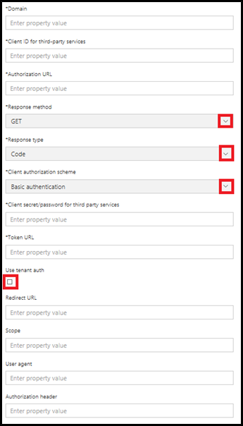

   **Domain**

   The **Domain** is a required field for the internal identifier of your OAuth2 provider. For example, if Microsoft is your OAuth2 provider, enter www.microsoft.com in to this field.

   **Client ID for third-party services**

   The **Client ID** is a required field that gets populated with your bot's **application ID**. For a skill that uses a Microsoft service, you can find your application ID by going to the [Microsoft Application Registration Portal](https://apps.dev.microsoft.com/#/appList). Click the name of your BotFramework bot listed under the section **My Applications**.

   **Authorization URL**

    The Authorization URL is a required field that gets populated with the Authorization URL field of your OAuth2 provider. If you are using a Microsoft service, ensure that the Authorization URL is set to:

    https://login.microsoftonline.com/common/oauth2/v2.0/authorize

    **Response Method**

    The **Request Method** is a required field used for selecting the token options (i.e., GET or POST). If you are using a Microsoft Service, set this field to **POST**.

   **Client authorization scheme**

   The **Client authorization scheme** is a required field for selecting **Basic Authentication** or **Auth in Body**. If you are not sure of the Client Auth Scheme, use **Basic Authentication** as the default option.

   **Client Secret/password for third-party services**

   The **Client Secret** is a required field that gets mapped to the bot's password. If you are using a Microsoft Identity Service, this is the password that is generated when you had registered your bot in the Microsoft Application Registration portal.

   **Note**: The Client Secret gets displayed only once under the Application Secrets section of the [Microsoft Application Registration Portal](https://apps.dev.microsoft.com/#/appList) page. If you need to recreate or reveal your application's secret password, click **Generate New password**.

   **Token URL**

   The Token URL is a required field that gets populated with the Token URL field of your OAuth2 provider.

   If you are using a Microsoft service, ensure that the Token URL is set to:

   https://login.microsoftonline.com/common/oauth2/v2.0/token

   **User tenant auth**

   Select this option if you want your bot to authenticate with your own service that is hosted in Microsoft Azure and uses the Azure Active Directory (AAD). For more details on authorizing access to web applications using OAuth 2.0 and AAD, see [OAuth2 and Microsoft Azure Active Directory Protocol](https://docs.microsoft.com/en-us/azure/active-directory/develop/active-directory-protocols-oauth-code).

   **Redirect URL (URI)**

   The Redirect URL is an optional field that you had registered with your OAuth2 provider.

   If you are using a Microsoft service, ensure that the Redirect URL is set to:

   https://www.bing.com/agents/oauth

   **Scope**

   The Scope is an optional field that specifies the level of access for the application that is being requested of the OAuth flow.

   **User agent**

   This is an optional user-agent value that is included in HTTP calls to the OAuth provider from Cortana. This value will be added in the user-agent header of the HTTP call.

   **Authorization header**

   This is an optional authorization value that is include in HTTP calls to the OAuth provider from Cortana. This value will be added in the authorization header of the HTTP call.

10.	Click **Save**.

    **Note**: The Save button will not be enabled if all the required fields are not completed.  

## Discovery and Management

Clicking the Manage button under the Discovery and Management section enables a developer to publish their Cortana skill to the [Publish to self](#publish-to-self), [Publish to group](#publish-to-group), and [Publish to world](#publish-to-world) deployment options.

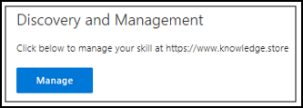

To access the **Publish to self**, **Publish to group**, and **Publish to world** deployment options, click the **Publish** menu tab listed in the **Control Panel**. 

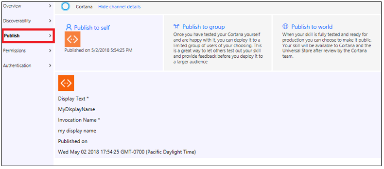

## Publish to self

Deploying to **Publish to self** makes the skill available to you only, so you can thoroughly test your skill before deploying it to one of the other environments. After configuring the Cortana channel for your skill (see [Configure Cortana Channel](https://docs.microsoft.com/en-us/bot-framework/channel-connect-cortana)), it's automatically deployed to **Publish to self**. 

To edit the **Publish to self** property fields, refer to the steps below.

1. Sign in to the [BotFramework](https://dev.botframework.com/) portal and click **My bots**.

2. In the **My bots** page, click the name of the bot that is connected to the Cortana channel.

3. In the **Connect to channels** page, click **Edit**.

4. In the **Configure Cortana** page, scroll down to the **Discovery and Management** section and click **Manage**.

5. In the **Control Panel**, click the **Publish** menu tab.

6. Hover your mouse over the **Publish to self** panel, and then click **Edit**. 

   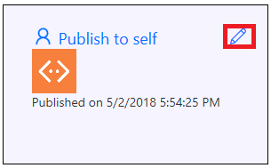

7.	Edit the fields or click **Upload new skill image** to replace the default skill image.

    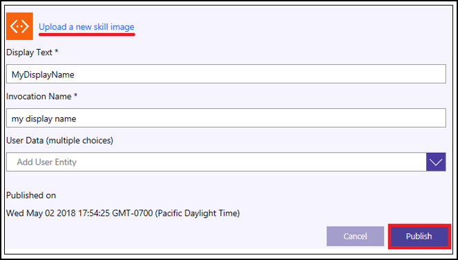

 8.	Click **Publish** to save your changes.

    Another way to confirm that your skill was deployed, log in to the [Cortana dashboard](https://developer.microsoft.com/en-us/cortana/dashboard#!/home) using the same Microsoft account (MSA) that you used to register it in Bot Frameworks.

    For information about testing your skill, see [Testing and debugging Cortana Skills](https://docs.microsoft.com/en-us/cortana/skills/test-debug).

      

## Publish to group

Publishing to **group** makes the skill available to a group of users that you specify using their MSA e-mail address. Typically, you use this deployment to have others test your skill and provide feedback, so you can improve it before making it generally available.

The following are the steps to publish your skill to **group**.

1. Sign in to the [BotFramework](https://dev.botframework.com/) portal and click **My bots**.

2. In the **My bots** page, click the name of the bot that is connected to the Cortana channel.

3. In the **Connect to channels** page, click **Edit**.

4. In the **Configure Cortana** page, scroll down to the **Discovery and Management** section and click **Manage**.

5. In the **Control Panel**, click the **Publish** menu tab.

6. Click the **Publish to group** panel.

   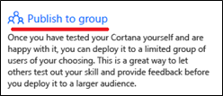 

7. (**Optional**) Click **Upload a new skill image** to replace the default skill image.

   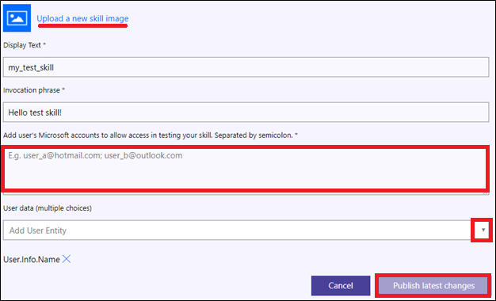 

8.	(**Optional**) Modify the display text for the skill along with the invocation name.

    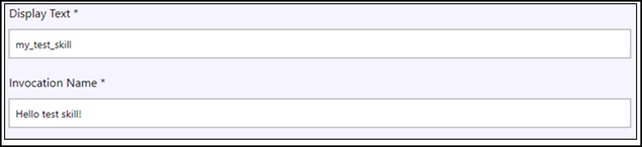

9. Enter an MSA e-mail address, and then click Add. 
**Note**: Use semicolons to separate multiple MSA e-mail addresses (e.g., abc@hotmail.com;test123@outlook.com). 

   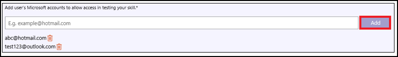

10.	(**Optional**) Click the drop-down list to add **User data** entity choices.

    **Note**: If you selected some of the **User data** entity choices in the **Publish to self** deployment option, they will automatically get carried over to the publishing options **group** and **world**.

11. Click **Publish** to save the changes and to deploy the Cortana skill to the group.
The result of the skill published to the group is shown in the image below.

     

**Group Access URL**

**Notes**: The skill developer must manually e-mail the **Group Access URL** to the list of designated users with MSA accounts.

When an MSA user receives the **Group Access URL** from the developer, they have the option to **Accept** or **Decline** joining the skill test group. If the MSA user accepts joining the skill test group, they can test the skill in Cortana. If they decline joining the test group, they will not be able to test the skill in Cortana.

## Publish to world

This section describes the remaining required fields that must be completed before your skill can be submitted to the Cortana team for review.

If you complete some of the required fields but need to stop what you are doing, don't worry about having to re-enter the fields all over again. Just click the **Save and Close** button located at the bottom of the **Publish to world** window. This feature enables you to preserve the fields that you've already populated. You can then go back and resume populating the rest of the required fields.

Publishing your Cortana skill to **world** makes it available in all markets that you specified when you registered your bot. Before publishing your skill to **world**, ensure that you read and comply with the [Cortana skills certification requirements](https://docs.microsoft.com/en-us/cortana/skills/skill-review-guidelines).

1. Sign in to the [BotFramework](https://dev.botframework.com/) portal and click **My bots**.

2. In the **My bots** page, click the name of the bot that is connected to the Cortana channel.

3. In the **Connect to channels** page, click **Edit**.

4. In the **Configure Cortana** page, scroll down to the **Discovery and Management** section and click **Manage**.

5. In the **Control Panel**, click the **Publish** menu tab.

6. Click the **Publish to world** panel.

   

7.	Click **Upload a new skill image**.

    **Note**: An image is required for your skill to be published to **world**. If you do not include an image, then the **Preview** button will be inactive.

8. (**Optional**) You may modify the display text for the skill along with the invocation name.

9. Click **Choose a category**.

10.	Enter a 1 or 2 sentence **Short Description**. Enter a full description of the skill for the **Long Description**.

11.	Click to select **Supported Platforms** from the drop-down list.

     **Notes**: If you do not include all the support platforms in this step, then you must enter a disclaimer as noted in step 19. If you include all the supported platforms in this step, then the disclaimer noted in step 19 is optional. You may also delete a supported platform by clicking **Delete**.

    

12.	Click **Yes** if this Cortana skill collects personal information or click **No** if the skill does not collect personal information.

    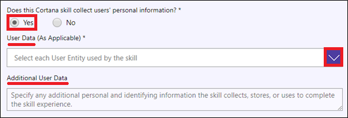

    **Note**: By clicking **Yes** proceed to step 13 if you want to add or remove any of the User Data entities. If you click No, then proceed to step 14 for adding a canvas to your skill.

13. (**Optional**) You may add more **User Data** entities, or you may delete User Data entities. In the text field **Additional User Data**, specify any additional personal and identifying information the skill collects, stores, or uses to complete the skill experience.

14.	Select a **Canvas Screenshot**, and then click **Choose file**.

    

    **Notes**: To select a canvas for a mobile device, click **Mobile**, and then click **Choose file**. Select the image to upload and click **Done**. Repeat the same steps to select a canvas for a **Desktop** computer.

15.	For the **Developer account type**, click **Developer** or click **Company**, and then complete all the required fields.

    **Note**: Select **Developer** if the skill is being represented by a developer. Select **Company** if the skill is being represented by a company.

16.	For **Support Contact Information**, enter an **E-mail** address and a **URL** to your website.

17.	(**Optional**) Enter **Publisher Information**.

     **Note**: Enter a name, e-mail address, and phone number if the publisher information is different than the developer account information.

18.	Enter **URLs** to your **Privacy Policy** and to your **Terms of Use**.

19.	Enter a **Disclaimer**.

20.	Enter **Debug instructions**.

21.	Click **Preview**.

    The image below displays the status of the skill.

    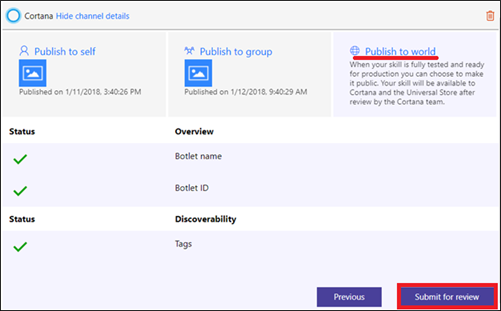

22.	Click **Submit for review**.

    **Note**: Once a skill is submitted for review, you will not be able to edit its properties or delete it.

    **Additional Information**

    A review status message will display in the Publish to World panel indicating that your skill is being reviewed by the Cortana team. If the Cortana team has any concerns or questions during the review process, they will contact you by e-mail. You can use this location to verify if your skill has been accepted or rejected. If a skill has been rejected, details about the reasons why it has been rejected will be provided. If all skill requirements are met, your Cortana skill will be approved and then deployed.  In the **Publish to world** panel, the **Review Status** will display the word **Approved**.

    

    **Support Information**

     If you encounter a technical issue and you require assistance, please send an e-mail message to Cortana Skills Kit Support:

     skillsup@microsoft.com

     To read or post Cortana skills kit questions, visit [Stackoverflow - Cortana Skills Kit Questions](https://stackoverflow.com/questions/tagged/cortana-skills-kit).

### Withdraw your submission

Because the skill is locked while it's under review, you may not make changes to it. If you want to make changes to your skill,  click **Withdraw your submission**. 

 

You may withdraw your skill only while it's being reviewed or has been approved but not published to the **world**. All the properties entered in **Publish to world** will still be saved. You can go back and make changes to your skill's publishing properties and then resubmit your skill back for review and certification. 

### Common reasons why skills don't pass the review

If you read the [review requirements](skill-review-guidelines.md) and made sure that you followed them, you shouldn't have too much problem passing the review. There are some common reasons why a skill will fail the review.

* The invocation name does not meet policy requirements. 
* Your submission did not provide sample invocation phrases. Provide at least three sample invocation phrases that demonstrate how your skill works. Ensure that the invocation phrases actually work with your skill. You should provide enough samples that demonstrate all the key features of your skill.
* You provide sample phrases but:  
  * Forget to include a launch word (Ask, Tell, ...) or invocation name. For example, for a skill called, My Events:  
    * "My Events update" - missing the launch word.  
    * "ask for an update" - missing the invocation name.  
  * The samples do not work ask expected or described. For example, if the invocation phrase is, "Ask My Events to find a nearby event," it should return nearby event information, or ask for more information if needed.
* The skill does not provide support for Help. Most first-time users will ask the skill for help (say Help). If a user asks for help, your skill should tell the user how to use the skill. For example, "Do you want available miles, used miles, or discounts?" or "Please say a stock's name. For example, say Microsoft." 
* Your skill infringes on the intellectual property (IP) of another company. Your skill's name and invocation name should not consist of any trademarked or copyrighted words unless you have permission to do so from the owner. Ensure that you have the right to share the content that your skill provides. For example, your skill shouldn't make use of any unlicensed or pirated audio content.

### Delete Channel

The steps that follow describe how to delete a Cortana skill.  Deleting a Cortana skill involves deleting the channel inside the BotFramework portal. To be able to delete the Cortana channel on a bot, the skill must not be published to **world**.  

If you need to delete a skill that is published to **world**, you must contact the Cortana Certification team. If a skill is under review by the Cortana Certification team, you must first withdraw your submission before you can follow the steps below for deleting the Cortana channel.

1. Sign in to the [BotFramework](https://dev.botframework.com/) portal and click **My bots**.

2. In the **My bots** page, click the name of the bot that is connected to the Cortana channel.

3. In the **Connect to channels** page, click **Edit**.

4. In the **Configure Cortana** page, scroll down the page  section and click **Delete Channel**.

5.	Click **Yes, delete it**.

     
