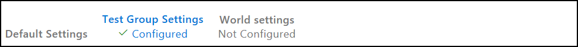
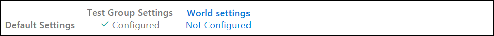
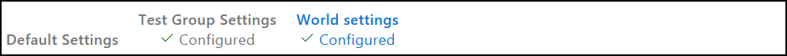
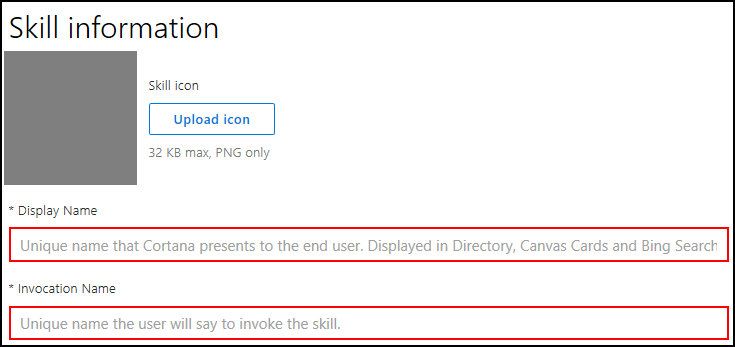
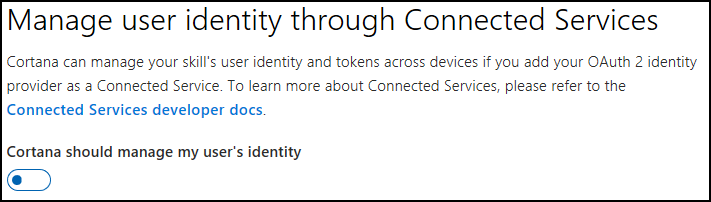
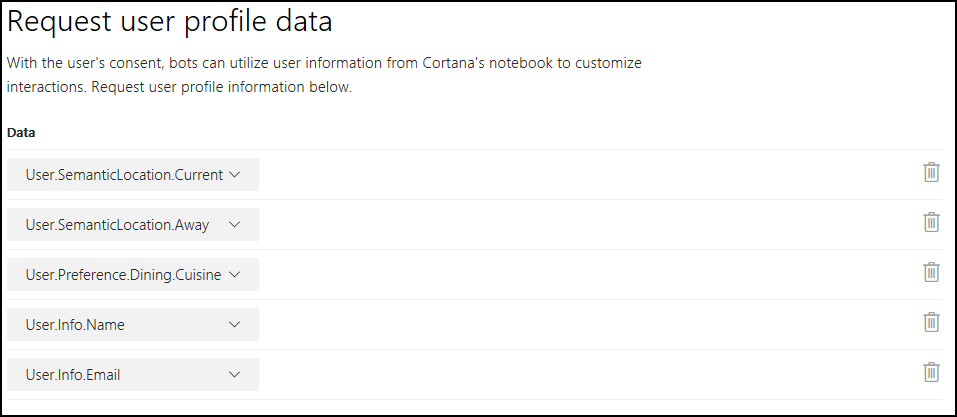
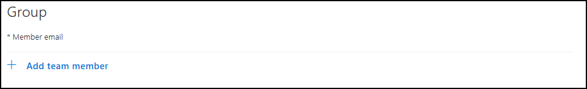
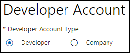
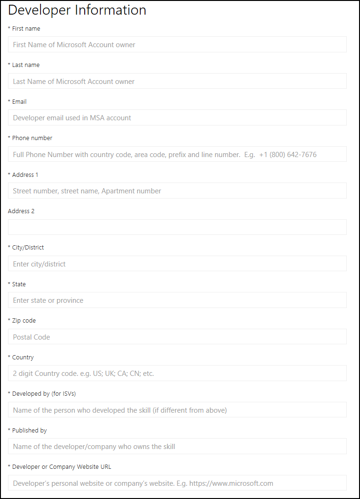
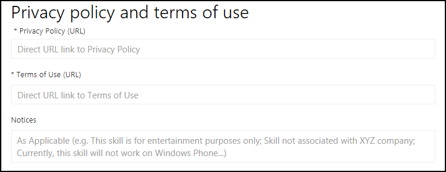

# Publishing Cortana Skills  

>[!NOTE]
> This article describes the three deployment groups in Cortana and how to publish a Cortana Skill. You should create a Cortana Skill before proceeding. 
> *   If you have never created a Cortana Skill and need to get started, visit the [Create your first skill](./get-started.md) page.  

Deploy your Cortana Skill to each of the three deployment groups.  
*   [Default Settings](#default-settings)  
*   [Test Group Settings](#test-group-settings) : Not Configured / Configured  
*   [World Settings](#world-settings) : Not Configured / Configured  

All of deployment groups contain the same instance of your Cortana Skill.  
Two identifiers are assigned to your Cortana Skill.  
*   `skillId`  
    *   The identifier (ID) of your Cortana Skill is unique per deployment group. If your skill checks the ID, then verify the IDs are different for each group. You should use the ID of your Cortana Skill if you want to turn on more logging in the group environment.  
*   `skillProductId`  
    *   The product ID of your Cortana Skill is unique across deployment groups.  

Cortana passes the IDs in the channel information of the message. 


## Cortana Configuration Fields  

[!INCLUDE [open-configure-cortana](../../includes/open-configure-cortana.md)]  

:::row:::
    :::column span="1":::
        
    :::column-end:::
:::row-end:::
:::row:::
    :::column span="1":::
        
    :::column-end:::
:::row-end:::
:::row:::
    :::column span="1":::
        
    :::column-end:::
:::row-end:::
:::row:::
    :::column span="1":::
        
    :::column-end:::
:::row-end:::
:::row:::
    :::column span="1":::
        
    :::column-end:::
:::row-end:::

## Default Settings  

Deploying to **Default Settings** makes the skill available to you only, so you can thoroughly test your skill before deploying it to one of the other environments. After configuring the Cortana channel for your skill, it is automatically deployed to **Default Settings**.  

>[!TIP]
> For more information about configuring the Cortana channel, visit the [Configure Cortana Channel](https://docs.microsoft.com/bot-framework/channel-connect-cortana) page.  
    
1.  On the *Configure Cortana* page, under the *Default Settings* section, enter the following information.  
    
      
    
    You must complete the required fields that are marked with an asterisk (`*`).
    
    >[!TIP]
    > For more information about the bot configuration fields, visit the [Connect a bot to Cortana](https://docs.microsoft.com/azure/bot-service/bot-service-channel-connect-cortana) page.  
    
    1.  Skill information section  
        
          
        
        *   `Skill icon`  
            *   Click on the **Upload icon** button and select an icon for your Cortana Skill.  
        *   `Display name`  
            *   >[!WARNING]
                > The value is limited to 30 characters.  
        *   `Invocation name`  
            *  The name used to invoke your Cortana Skill.  
    2.  Manage user identity through Connected Services  
        
        
        
        *   `Cortana should manage my user's identity`  
            *   >[!IMPORTANT]
                > If you select this option, then you must complete the following fields.  
                
                  
                
            *   `When should Cortana prompt for a user to sign in?`  
                *   Possible values are `Sign in at invocation` or `Sign in when required`  
            *   `Account name`  
                *   The name of the your Account.  
            *   `Client ID for third-party services`  
                *   The application ID of your bot.  
                    
                    >[!TIP]
                    > If you use a Microsoft service, the you get your application ID on the [Microsoft Application Registration Portal](https://apps.dev.microsoft.com/#/appList) page. Click the name of your BotFramework bot listed under the My Applications section.    
            *   `Space-seperated list of scopes`  
                *   The list of scopes. The list must be space-separated.  
            *   `Authorization URL`  
                *   The authorization URL of your OAuth 2.0 provider.  
                    
                    >[!TIP]
                    > If you use a Microsoft service, then set to the following value.  
                    
                    ```url
                    https://login.microsoftonline.com/common/oauth2/v2.0/authorize
                    ```  
                    
            *   `Token options`  
                *   Possible values are `GET` or `POST`.  
            *   `Grant type`  
                *   Possible values are `Authorization code` or `Implicit`.  
            *   `Token URL`  
                *   The token URL of your OAuth 2.0 provider.  
                    
                    >[!TIP]
                    > If you are using a Microsoft service, then set to the following value.  
                    
                    ```url
                    https://login.microsoftonline.com/common/oauth2/v2.0/token
                    ```  
                    
            *   `Client secret/password for third party services`  
                *   The password of your bot.  
                    
                    >[!TIP]
                    > If you are using a Microsoft Identity Service, then the password is generated when you registered your bot in the *Microsoft Application Registration* portal.  
                    >
                    > >[!NOTE]
                    > > The Client Secret is displayed only once under the *Application Secrets* section of the [Microsoft Application Registration](https://apps.dev.microsoft.com/#/appList) portal. 
                    > > To recreate or reveal the secret password of your application, click on the **Generate New password** button.  
                    
            *   `Client authorization scheme`  
                *   The client authorization scheme.  
                    Possible values are `HTTP Basic (Recommended)` or `Credentials in request body`  
                    
                    >[!TIP]
                    > If you do not know your client authorization scheme, then set `HTTP Basic (Recommended)` as the default option.  
                    
            *   `This skill's Connected Service requires intranet access to authenticate users (leave this unchecked if you are unsure).`  
                *   Your app requires access to an intranet.  
    3.  Request user profile data  
        
        
        
        *   `Data`  
            *   Click on the **Add a user profile request** link and select the user profile information from the drop-down menu.  
                Possible values are `user.info.email`  
                
                >[!TIP]
                > Repeat this step to select additional user profile data.  
                
                >[!IMPORTANT]
                > You are allowed to collect user profile data only to add to your Cortana Skill functionality.  
                
                
                
    >[!TIP]
    > For more information about the bot configuration fields, visit the  [Connect a bot to Cortana](https://docs.microsoft.com/azure/bot-service/bot-service-channel-connect-cortana) page.  
    
6.  Click on the **Deploy on Cortana** button.  
    
    >[!IMPORTANT]
    > The **Deploy on Cortana** button is enabled only after all of the required fields are completed.  
    > 
    >  

      

>[!NOTE]
> You may also confirm your Cortana Skill is deployed on the *Cortana dashboard* page using the same Microsoft account (MSA) that you registered in *Bot Framework* portal.  
> 
> >[!TIP]
> >To access the Cortana dashboard, visit the [Cortana dashboard](https://developer.microsoft.com/cortana/dashboard#!/home) page.  

>[!TIP]
> For more information about testing your skill, visit the [Testing and Debugging Cortana Skills](./test-debug.md) page.  


## Test Group Settings  

Deploying to **Test Group** makes your Cortana Skill available to a group of users that you specify using individual MSA email addresses. Typically, you create a test group to have others test your Cortana Skill and provide feedback. This is done so you are able to update your Cortana Skill before making generally available.  

1.  On the *Configure Cortana* page, under the *Test Group Settings* section, enter the following information.  
    
      
    
    You must complete the required fields that are marked with an asterisk (`*`).
    
    >[!NOTE]
    > For more information about the bot configuration fields, visit the [Connect a bot to Cortana](https://docs.microsoft.com/azure/bot-service/bot-service-channel-connect-cortana) page.  
    
    1.  Skill information section  
        
          
        
        *   `Skill icon`  
            *   Click on the **Upload icon** button and select an icon for your Cortana Skill.  
        *   `Display name`  
            *   >[!WARNING]
                > The value is limited to 30 characters.  
        *   `Invocation name`  
            *   >[!WARNING]
                > The value is not editable. 

    2.  Request user profile data  
        
        
        
        *   `Data`  
            *   Click on the **Add a user profile request** link and select the user profile information from the drop-down menu.  
                Possible values are `user.info.email`  
                
                >[!TIP]
                > Repeat this step to select additional user profile data.  
                
                >[!IMPORTANT]
                > You are allowed to collect user profile data only to add to your Cortana Skill functionality.  
                
                

    3.  Group  
          
        *   `Member email`
            *   Enter an MSA e-mail address, and then click Add.  
                
                >[!NOTE]
                > Use semicolons to separate multiple MSA e-mail addresses.  
                
                
                
2.  Click on the **Create Group** button.  
    
    >[!IMPORTANT]
    > The **Create Group** button is enabled only after all of the required fields are completed.  
    >
    >   
    
    

3.  After your test group is created, the *Test Group Settings* section displays the following changes.  

    *   Group  
        
          
        
        *   `Member email`
            
        *   `Group Access URL`  
            *   >[!IMPORTANT]
                > You must manually send an email message to the designated MSA users listed in the `Data` field. The email message must include the `Group Access URL`.  
                >
                > When an MSA user receives the **Group Access URL** from you, the user has the option to **Accept** or **Decline** joining the skill test group. If the user accepts joining the skill test group, then access is granted to test your Cortana Skill. If the user declines joining the test group, then access is denied to test your Cortana Skill.  
                
    *   The **Reset Group** Button is added and the **Create Group** button is replaced by the **Save changes** button.  
        
        
        
    *   The **Test Group Setting** link is updated.  
        
          
        

## World Settings  

>[!IMPORTANT]
> You must complete the required fields before submitting your Cortana Skill for review.  
>
> >[!TIP]
> > If you complete some of the required fields and need to continue later, then click on the **Save and Close** button at the bottom. This enables you to preserve the fields you populated. You are able to resume the rest at a later time.  

Deploying your Cortana Skill to **World** published your Cortana Skill in all markets that you specified when you registered your bot.  

>[!IMPORTANT]
> Before publishing your Cortana Skill to **World**, read and comply with the Certification requirements.  
>
> >[!TIP]
> > For more information about the requirements for publishing to **World**, visit the [Cortana Skills Kit Certification Requirements](./skill-review-guidelines.md) page.  

1.  On the *Configure Cortana* page, under the *World Settings* section, enter the following information.  
    
      
    
    You must complete the required fields that are marked with an asterisk (`*`).
    
    >[!NOTE]
    > For more information about the bot configuration fields, visit the [Connect a bot to Cortana](https://docs.microsoft.com/azure/bot-service/bot-service-channel-connect-cortana) page.  
    
    1.  Skill information section  
        
          
        
        *   `Skill icon`  
            *   Click on the **Upload icon** button and select an icon for your Cortana Skill.  
        *   `Display name`  
            *   >[!WARNING]
                > The value is limited to 30 characters.  
        *   `Invocation name`  
            *   >[!WARNING]
                > The value is not editable. 
        *   `Short description`  
        *   `Long description`  
        *   `Sample Invocation Phrase`
            *   Enter an invocation phrase and click on the **Add sample invocation phrase** button.  
        *   `Primary category`  
            *   Click the drop-down menu to select a category that matches your Cortana Skill.  
                Possible values are `developer tools`, `entertainment`, or `health & fitness`  
                
                >[!NOTE]
                > Select a category to enable your Cortana Skill to be searched and discovered by your users.  
        *   `Secondary category (Optional)`  
            *   Click the drop-down menu to select a secondary category.  
        *   `Tags`  
            *   Enter a unique word and click on the Add button.  
                
                >[!NOTE]
                > You may create several more tags by repeating this step. The `Tags` field is similar to the `Primary category` and `Secondary category` fields enhancing the ability for your Cortana Skill to be searched and discovered by your users.  
        *   `Supported platforms`  

    2.  `Does this Cortana skill collect users' personal information?`  
         
          
        
        *   Request user profile data
            
              
            
            *   `User data`  
                *     
                    
            *   `Additional User Data`  

    3.  Developer Account section  
        
            
        
        *   `Developer Account Type`  
            *   Click on the radio button matching your type.  
                
                >[!TIP]
                > If you are an individual or student developer, then select `Developer`.  
                
                >[!TIP]
                > If you are part of a company, then select `Company`.  
                  
    4.  Developer Information section  
        
        
        
        *   `First name`              
        *   `Last name`              
        *   `Email`             
        *   `Phone number`  
        *   `Address 1` and `Address 2`  
        *   `City/District`  
        *   `State`  
        *   `Zip code`  
        *   `Country`  
        *   `Developed by (for ISVs)`  
        *   `Published by`  
        *   `Developer or Company Website URL`  
    5.  Support Contact section  
        
        
        
        *   `Email`  
        *   `Website URL`  
    6.  Publisher Information section  
        
        
        
        *   `Name`  
        *   `Email`  
        *   `Phone number`  
    7.  Privacy policy and terms of use section  
        
        
          
        *   `Privacy policy (URL)`  
        *   `Terms of Use (URL)`  
        *   `Notices`  
    8.  Validation and testing instructions section  
        
          
        
2.  Click on the **Save** button.  
    
    >[!IMPORTANT]
    > The **Save** button is enabled only after all of the required fields are completed.  
    >
    >   
    
3.  Click **Submit for review**.  
    
    >[!IMPORTANT]
    > The **Submit for review** button is enabled only after all of the required fields are completed.  
    >
    > 
    
    

    >[!IMPORTANT]
    > After submission for review, you are not be able to edit the properties or delete your Cortana Skill.  

4.  After submitting for review, the *World Settings* section displays the following changes.  

    *   The **Save** button and **Submit for Review** button are removed.  
        
        
        
    *   The **World Setting** link is updated.  
        
          
        

    >[!IMPORTANT]
    > A review status message that indicates the review status for your Cortana Skill by the Cortana Certification team. If the Cortana Certification team has any concerns or questions during the review process, then you receive an email message. You may refer to the *World Settings* section to verify acceptance state of your Cortana Skill. If rejected, then the details and reasons for rejection are provided. If all requirements are met, then your Cortana Skill is approved and deployed. In the *World Settings* section, the word `Approved` following by the approval date is displayed.  
    
    >[!TIP]
    > If you encounter any technical issues and you require assistance, then please send an email message to Cortana Skills Kit Support at [skillsup@microsoft.com](mailto:skillsup@microsoft.com) .

    >[!TIP]
    > To read or post Cortana Skills Kit questions on Stackoverflow, visit the [Stackoverflow - Cortana Skills Kit Questions](https://stackoverflow.com/questions/tagged/cortana-skills-kit) page.  


### Withdraw Your Submission  

During submission your Cortana Skill is locked. If you want to make changes to your Cortana Skill, then click on the **Withdraw your submission**.  

>[!IMPORTANT]
> You may withdraw your Cortana Skill only during the following stages.  
> *   Prior to start of review  
> *   During review  
> *   After approval, but prior to publishing to the **World**  
>
> All the properties entered in **World Settings** are saved. You may update the publishing properties of your Cortana Skill and resubmit for review and certification.  

### Common Reasons for Review Failure 

If you read and adhere to the [review requirements](./skill-review-guidelines.md), then you should pass the review.  
There are some common reasons why a Cortana Skill fails the review.  

*   The invocation name does not meet policy requirements.  
*   Your submission does not provide sample invocation phrase.  
    Provide at least three sample invocation phrases that demonstrate your Cortana Skill.  
    Ensure that the invocation phrases actually work.  
    You should provide enough samples that demonstrate all key features.  
*   You provide sample phrases with at least on of the following issues.  
    *   Forget to include a launch word (Ask, Tell, and so on) or invocation name.  
        
        >[!TIP]
        > For a skill called **My Events**  
        > *   `My Events update` : Missing the launch word.  
        > *   `ask for an update` : Missing the invocation name.  
        
    *   The samples do not work as expected or described.  
        
        >[!TIP]
        > If the invocation phrase is `Ask My Events to find a nearby event`, then your Cortana Skill should either return nearby event information or ask for more information.  
        
*   The skill does not provide support for Help. Most first-time users will ask the skill for help (say `Help`). If a user asks for help, then your skill must tell the user how to use the skill.  

    >[!TIP]
    > `Do you want available miles, used miles, or discounts?` or `Please say a stock's name. For example, say Microsoft.` 
    
*   Your skill infringes on the intellectual property (IP) of another company.  
    The name and invocation name of your Cortana Skill should not consist of any trademarked or copyrighted words unless you have permission to do so from the owner. 
    Ensure that you have the right to share the content that your skill provides. 
    >[!TIP]
    > Your skill should not make use of any unlicensed or pirated audio content.  

### Delete Channel  

Deleting a Cortana Skill involves deleting the channel inside the BotFramework portal.  To be able to delete the Cortana channel on a bot, the skill must not be published to **World**.  

If you need to delete a Cortana Skill that is published to **World**, then you must contact the Cortana Certification team. If a skill is under review by the Cortana Certification team, then you must first withdraw your submission before deleting the Cortana channel.  

1.  On the *Configure Cortana* page, at the bottom of all sections, click **Delete Channel** button.  
    
      
