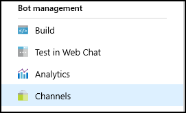

# Publishing Cortana skills

>[!NOTE]
> This article describes how to publish a Cortana skill. You should already have created a skill before proceeding.
>
> If you haven't created one yet, visit the [Create your first skill](./get-started.md) page.

Deploy your Cortana skill to each of the three deployment groups.
* [Default Settings](#default-settings)
* [Test Group Settings](#test-group-settings)
* [World Settings](#world-settings)

All deployment groups contain the same instance of your Cortana skill.
Two identifiers are assigned to your Cortana skill.
* `skillId`:  The identifier (ID) of your Cortana skill is unique per deployment group. If your skill checks the ID, then verify the IDs are different for each group. Use the ID of your Cortana skill if you want to turn on additional logging for the group environment.
* `skillProductId`: The product ID of your Cortana skill is unique across deployment groups.

Cortana passes these IDs in the channel information of the message.

## Cortana Configuration Fields

<!-- The following INCLUDE statements was causing trouble with builds, so I just copied the code from the
include file into this file. (DT)
[!INCLUDE [open-configure-cortana](../../includes/open-configure-cortana.md)]
 -->
Follow these instructions to access the Cortana Configuration page and update each of the parameters for your Cortana skill.

1. Sign into the [BotFramework](https://dev.botframework.com) portal and click on the `My bots` link.

1. On the *My bots* page, click the name of your bot.

    

1. On the *Microsoft Azure* portal, in your Web App Bot blade, under the *Bot Management* section, click on the **Channels** icon.

    

1. On the *Connect to channels* page, under the *Add a featured channel* section, click on the **Configure Cortana Channel** icon.

    

## Default Settings

After configuring the Cortana channel for your skill, it's automatically deployed to **Default Settings**. Deploying to **Default Settings** makes the skill available to you only, so you can thoroughly test it before deploying it to one of the other environments.

For more information about configuring the Cortana channel, visit the [Connect a bot to Cortana](https://docs.microsoft.com/azure/bot-service/bot-service-channel-connect-cortana?view=azure-bot-service-3.0) page.


1. On the *Configure Cortana* page, under the *Default Settings* section, enter the following information.

    Complete the required fields (marked with an asterisk).

    For more information about the bot configuration fields, visit the [Connect a bot to Cortana](https://docs.microsoft.com/azure/bot-service/bot-service-channel-connect-cortana) page.

    1. Skill information section

    

    * `Skill icon`: Click on the **Upload icon** button and select an icon for your Cortana skill.
    * `Display name`: The value is limited to 30 characters.
    * `Invocation name`: The name used to invoke your Cortana skill. This value must be unique across Cortana (all Cortana skills).

        For more information about invocation naming, visit the [Invocation Name Guidelines](./cortana-invocation-guidelines.md) page.

    2. Manage user identity through Connected Services
    

        `Cortana should manage my user's identity`: If you select this option, then you must complete the following fields.

        

    * `When should Cortana prompt for a user to sign in?`
        * `Sign in at invocation`: The user signs in once, and the authorization token will be passed as needed.
        * `Sign in when required`: The user will be asked to sign in whenever necessary.

    * `Account name`: The name of your Account.

    * `Client ID for third-party services`: The application ID of your bot.

        If you use a Microsoft service, the you get your application ID on the [Microsoft Application Registration Portal](https://apps.dev.microsoft.com/#/appList) page. Click the name of your BotFramework bot, listed under the My Applications section.

    * `Space-separated list of scopes`: The list of scopes, separated by spaces.
    * `Authorization URL`: The authorization URL of your OAuth 2.0 provider.

        If you use a Microsoft service, then the authorization URL is:

        ```url
        https://login.microsoftonline.com/common/oauth2/v2.0/authorize
        ```

    * `Token options`: Possible values are `GET` or `POST`. Unless you have specific reasons to use GET, you should use POST.
    * `Grant type`: Possible values are `Authorization code` or `Implicit`.
    * `Token URL`: The token URL of your OAuth 2.0 provider.

        If you are using a Microsoft service, then set to the following value.

        ```url
        https://login.microsoftonline.com/common/oauth2/v2.0/token
        ```

    * `Client secret/password for third party services`: Your bot's password.  If you're using Microsoft Identity Service, then the password is generated when you register your bot in the *Microsoft Application Registration* portal.

        >[!IMPORTANT]
        > The password (client secret) is displayed only once. When you create your bot, it's shown under the *Application Secrets* section of the [Microsoft Application Registration](https://apps.dev.microsoft.com/#/appList) portal.
        >
        > If you don't know the password, you'll need to create a new one by clicking on the **Generate New password** button.

    * `Client authorization scheme`: If you don't know your client authorization scheme, use  the default option (`HTTP Basic (Recommended)`).

    * `This skill's Connected Service requires intranet access to authenticate users (leave this unchecked if you are unsure).` Check this only if your app requires access to an intranet.

    3. Request user profile data

        

        Click on **Add a user profile request** and select the user profile information from the drop-down menu. Repeat to select additional user profile data.

        >[!IMPORTANT]
        > You are allowed to collect user profile data only to add to your skill's functionality. See section [2.5 Personal Information](./skill-review-guidelines.md#25-personal-information) in the [Cortana skills certification requirements page](./skill-review-guidelines.md).

        

        >[!TIP]
        > For more information about the bot configuration fields, visit the  [Connect a bot to Cortana](https://docs.microsoft.com/azure/bot-service/bot-service-channel-connect-cortana) page.

1. After all of the required fields are completed, you can click on the **Deploy on Cortana** button.

 <!--    

     -->

You can confirm that your Cortana skill is deployed on the Bot Framework portal or Azure portal page by logging in with the same Microsoft account (MSA) that you registered in the *Bot Framework* portal.

## Test Group Settings

Deploying to **Test Group** makes your Cortana skill available to a group of users that you specify, using individual MSA email addresses. Typically, you create a test group to have others test your Cortana skill and provide feedback. It's a really good idea to test and update your skill before making it generally available.

1. On the *Configure Cortana* page, under the *Test Group Settings* section, enter the following information.

    

    Complete the required fields that are marked with an asterisk (`*`).

    >[!NOTE]
    > For more information about the bot configuration fields, visit the [Connect a bot to Cortana](https://docs.microsoft.com/azure/bot-service/bot-service-channel-connect-cortana) page.

    1. Skill information section

        

        * `Skill icon`: Click on the **Upload icon** button and select an icon for your Cortana skill. Skill icons should be square (44x44 pixels), and in PNG format.
        * `Display name`: The length of the name is limited to 30 characters.
        * `Invocation name`: This field displays the name that the user speaks (or types) to invoke your skill.
            >[!WARNING]
            > The name shown was previously defined in the setup process, and can't be changed here.

    2. Request user profile data

        

        Click on **Add a user profile request** and select the user profile information from the drop-down menu. Repeat to select additional user profile data.

        >[!IMPORTANT]
        > You are allowed to collect user profile data only to add to your skill's functionality. See section [2.5 Personal Information](./skill-review-guidelines.md#25-personal-information) in the [Cortana skills certification requirements page](./skill-review-guidelines.md).

        

        >[!TIP]
        > For more information about the bot configuration fields, visit the  [Connect a bot to Cortana](https://docs.microsoft.com/azure/bot-service/bot-service-channel-connect-cortana) page.

    3. Group
        
        * `Member email`: Enter an MSA e-mail address and click Add. You can enter multiple MSA e-mail addresses by using semicolons to separate them.

            

2. When you're done, click on the **Create Group** button. The button is enabled only after all of the required fields are completed.

    

    

3. After your test group is created, the *Test Group Settings* section displays the group information.

    

    * `Member email`: Shows the list of member email addresses.

    * `Group Access URL`: The URL that your group members will use to access your skill.
        * >[!IMPORTANT]
            > You must manually send an email message to the designated MSA users listed in the `Member email` field. This email will be your user's only invitation to join the skill test group. The message must include the URL from the `Group Access URL` field.
            >
            > When an MSA user clicks on the **Group Access URL** in the message, they have the option to accept or decline joining the skill test group. If the user accepts, then access is granted to test your Cortana skill. If the user declines to join, then access is denied.

    * The **Reset Group** Button is added and the **Create Group** button is replaced by the **Save changes** button.

        

    * The **Test Group Setting** link is updated.

        

## World Settings

<!-- >[!IMPORTANT]
> You must complete the required fields before submitting your Cortana skill for review.
>  -->
>[!TIP]
> If you complete some of the required fields but need to continue later, click on the `Save and Close` button at the bottom of the page. This will save the data you've already entered, and allow you to resume later.

Deploying your Cortana skill to **World** will submit your skill for review. Once it has passed review, your skill will be published in all markets that you specified when you registered your bot.

For more information about the requirements for publishing to **World**, visit the [Cortana skills Kit Certification Requirements](./skill-review-guidelines.md) page.

1. On the *Configure Cortana* page, you'll need to enter the following information under the *World Settings* section.

    
    Complete the required fields that are marked with an asterisk (`*`).

    For more information about the bot configuration fields, visit the [Connect a bot to Cortana](https://docs.microsoft.com/azure/bot-service/bot-service-channel-connect-cortana) page.

    1. Skill information section

        

        * `Skill icon`: Click on the **Upload icon** button and select an icon for your Cortana skill.
        * `Display name`: This name is limited to 30 characters.
        * `Invocation name`:  This field displays the name that the user speaks (or types) to invoke your skill.
            >[!NOTE]
             > The name shown was previously defined in the setup process, and can't be changed here.
        * `Short description`
        * `Long description`
        * `Sample Invocation Phrase`: Enter an invocation phrase and click on the **Add sample invocation phrase** button.
        * `Primary category`: Click the drop-down menu to select a category that matches your Cortana skill.
        * `Secondary category (Optional)`: Click the drop-down menu to select a secondary category.

            > [!NOTE]
            > Categories can be used in searching, so select categories that will help users find your skill.

        * `Tags`: Enter a unique word and click on the Add button.

            You can create more tags by repeating this step. Tags are similar to categories in that they can be used in searches to help users discover your skill.

        * `Supported platforms`: Select the platform(s) your skill supports.

    2. `Does this Cortana skill collect users' personal information?`: If you set this switch to `Yes`, you'll see the *Request user profile data* section.

        

        

    3. Developer Account section

          

        `Developer Account Type`: Click on the radio button matching your type.

        - If you are an individual or student developer, then select `Developer`.

        - If you are part of a company, then select `Company`.

    4. Developer Information section: Note that all of the fields on this form are required.

        

    5. Support Contact section
        This is where you provide contact information for the Cortana team to reach you.

        

    6. Publisher Information section

        

    7. Privacy policy and terms of use section

        

    8. Validation and testing instructions section

        

1. Click on the **Save** button.

     The **Save** button is enabled only after all of the required fields are completed.

    

1. Click **Submit for review**.

    The **Submit for review** button is enabled only after all of the required fields are completed.

    

    

    >[!IMPORTANT]
    > After submission for review, you will not be able to edit the properties you entered, or delete your Cortana skill. See the [Withdraw Your Submission](#withdraw-your-submission) section.

1. After you submit the skill for review, the *World Settings* section displays the following changes.

    * The **Save** button and **Submit for Review** button are removed.

        

    * The **World Setting** link is updated.

        

        This message under the `World Setting` link shows the review status for your Cortana skill (`Submitted`, `Not accepted`, or `Accepted`). The Cortana Certification Team reviews all third-party skills before they can be released. If the team has any concerns or questions during the review process, you will receive an email message at the address you specified. If it's rejected, then the details and reasons for rejection are provided. If all requirements are met, then your Cortana skill is accepted and deployed.

    >[!TIP]
    > If you run into any technical issues, or otherwise need help, please email the **Cortana Skills Kit Support Team** at [skillsup@microsoft.com](mailto:skillsup@microsoft.com).

### Withdrawing Your Submission

Your Cortana skill is locked while the Certification Team is reviewing it. If you want to make changes to your skill, click on the **Withdraw your submission** button.

You may withdraw your Cortana skill only during the following stages.
- Prior to start of review
- During review
- After approval, but prior to publishing to the **World**

All the properties entered in **World Settings** are saved. You may update the publishing properties of your Cortana skill and resubmit for review and certification.

### Common Reasons for Review Failure

If you read and adhere to the [review requirements](./skill-review-guidelines.md), then your skill should pass the review.

Some common reasons why a Cortana skill fails the review are:

- The invocation name does not meet policy requirements.

- Your submission does not provide sample invocation phrases.  You must provide at least three sample invocation phrases that demonstrate your Cortana skill. Each of the samples should use a different phrase, such as `ask`, `open`, `tell`, etc.

- You provide sample phrases with one or more of the following issues.

    The phrase doesn't include a launch word (ask, tell, and so on) or an invocation name. For example, for a skill called **MyEvents**, these would be incorrect:

    + `MyEvents update` : Missing the launch word.
    + `Ask for an update` : Missing the invocation name.

- The samples do not work as expected or described. Before submitting your skill, you should ensure that the invocation phrases work as expected. Ideally, you should provide enough samples to demonstrate all key features.

- The skill does not provide support for help. Most first-time users will ask the skill for help (usually by saying "Help"). If a user asks for help, then your skill must tell the user how to use the skill.

    Your skill should also prompt the user for correct input if it cannot respond to what the user just entered.

    Example: If your skill involved checking stock prices, and the user failed to provide a stock name, your help could be "Please say the name of a stock. For example, say Contoso."

- Your skill infringes on the intellectual property (IP) of another company.

    The name and invocation name of your Cortana skill should not consist of any trademarked or copyrighted words unless you have permission from the owner. You must ensure that you have the right to share the content that your skill provides, and you must ensure that your skill doesn't make use of any unlicensed or pirated audio or visual content.

### Delete Channel

Deleting a Cortana skill involves deleting the channel inside the BotFramework portal.  To be able to delete the Cortana channel on a bot, the skill must not be currently published to **World**.

If you need to delete a Cortana skill that is published to **World**, then you must contact the Cortana Certification Team. If a skill is under review by the team, then you must first withdraw your submission before deleting the Cortana channel.

If your skill has not been published to **World**, you can delete the channel on the *Configure Cortana* page. At the bottom of all sections, click the **Delete Channel** button.


