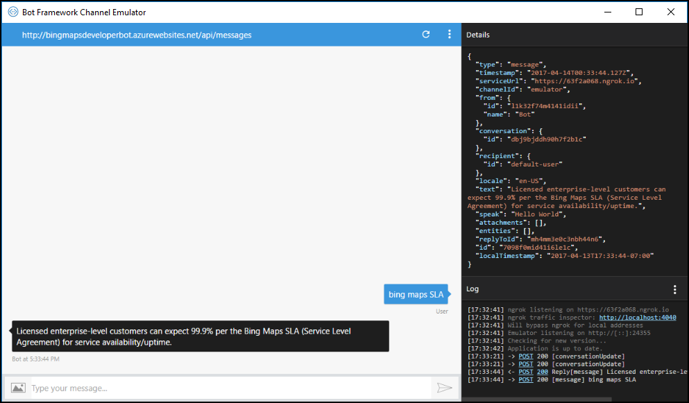

# Testing and debugging Cortana Skills

The following options are available to test and debug your Cortana Skill.

* Use the Bot Framework emulator to test and debug your skill while you are developing it. The emulator interacts with your bot, and displays the messages exchanged.  

Currently, the emulator does not support passing user profile and contextual information to you Cortana Skill. For more information about using the emulator, visit the [Debug with the emulator](https://docs.microsoft.com/azure/bot-service/bot-service-debug-emulator?view=azure-bot-service-3.0) page.  

* Use the debugger in Visual Studio Code to walk through your code as it runs in the console window.  

   For more information, visit the [Debug a Bot Service bot](https://docs.microsoft.com/azure/bot-service/bot-service-debug-bot?view=azure-bot-service-3.0) page.  

* Use the Chat window in the Bot Framework portal. Typically, you test after configuring your Cortana channel and deploying your service in order to confirm that your bot is running.

* Enable debug in Cortana to see the message exchange between Cortana and your Cortana Skill.

   For information about enabling debugging, visit the [Enable debugging in Cortana](#enable-debugging-in-cortana) section.

   For details about debugging your Cortana Skill in Azure [continuous publishing](https://docs.microsoft.com/azure/bot-service/bot-service-continuous-deployment?view=azure-bot-service-3.0#set-up-continuous-deployment) environment, visit the [Debug an Azure Bot Service bot](https://docs.microsoft.com/azure/bot-service/bot-service-debug-bot?view=azure-bot-service-3.0) page.

   >[!TIP]
   >Before you start debugging your Cortana Skill, visit the [Troubleshooting tips](#troubleshooting-tips) section and the [Known Issues](./known-issues.md) page.  

## Enable debugging in Cortana

If Cortana reports an error when running your skill, then follow the steps below to turn on debugging for Cortana. After you enable debugging, the Cortana Canvas displays all errors and message exchanges.  

1. Go to the Configure Cortana page for your Cortana Skill. Under the *Enable Cortana debug mode across all devices* section, click `Run Cortana in debug mode`  to enable.

1. Invoke Cortana to test your Cortana Skill. Make sure you're signed in using the same MSA that you used for the Bot Framework.

    For more information, visit the [Get started](get-started.md) page.

    a.  On the top-left menu, click on the `Home` icon. (This will update the Cortana skills information.)

    a.  On the bottom-right corner, click on the microphone icon.

    a.  Invoke your Cortana Skill by speaking. 

    a. The canvas displays a `debug` button.

    a.  Click to see the message exchange details.  

    

## Troubleshooting tips

The following provides suggestions for solving common problems.

| Issue                                                                                                                                |  
|:---                                                                                                                                     |  
| [I am not able to invoke my Cortana Skill](#i-am-not-able-to-invoke-my-cortana-skill)                                                                                    |  
| [Cortana is spelling my invocation name incorrectly when I say it](#cortana-is-spelling-my-invocation-name-incorrectly-when-i-say-it) | 
| [I am not able to create more than 20 Cortana Skills](#i-am-not-able-to-create-more-than-20-cortana-skills)                                                               |  
| [I get a `DownstreamDependencyFailed` error](#i-get-a-downstreamdependencyfailed-error)                                                 |  
| [I am able to invoke my Cortana-Skill, but no one else is able](#i-am-able-to-invoke-my-cortana-skill-but-no-one-else-is-able)                                                |  
| [I signed into Bot Framework but do not see my Cortana Skills](#i-signed-into-bot-framework-but-do-not-see-my-cortana-skills)       |  
| [SSML reads XML characters aloud](#ssml-reads-xml-characters-aloud)                                                                     |  
| [Cortana returns Forbidden error](#cortana-returns-forbidden-error)                                                                     |  

### I am not able to invoke my Cortana Skill  

Check the following

* If you just saved, then click on the **Home** icon on top-left menu to refresh the Cortana Skills information.  
* Verify that you enabled debugging.  

    >[!TIP]
    > For more information, visit the [Enable debugging in Cortana](#enable-debugging-in-cortana) section.  

* Verify that you signed into Cortana using the same MSA that you used to sign into Bot Framework.  
* Ensure that you are properly invoking your skill.  
* Verify that Cortana uses the correct name when invoked.  The Cortana Canvas types the name in the `Type here to search box` as you speak.  
* Ensure that your device is set to one of the allowed locales.  

    >[!TIP]
    > For more information, visit the [Supported Cortana locales](./supported-locales.md) page.  

* Ensure that your microphone is configured.  

    >[!TIP]
    > For more information, visit the [Get started](./get-started.md) page.  

### Cortana is spelling my invocation name incorrectly when I say it  

Check the following  
* If you just saved for the first time, then updates to Cortana may be delayed up to 10 minutes before recognizing the invocation name of your Cortana Skill.  
* If you just saved, then click on the **Home** icon on top-left menu to refresh the Cortana Skills information.  
* Your invocation name may be poorly designed, which makes it difficult for Cortana to recognize it.  

    >[!TIP]
    > For more information about well-designed invocation names, visit the [Invocation Guidelines](./cortana-invocation-guidelines.md) page.  

### I am not able to create more than 20 Cortana Skills  

You may associate a maximum of 20 skills to a Microsoft accounts (MSA). If you create more than 20 skills, then use an additional MSA.  
<!-- confirm this limit still exists -->  

### I get a `DownstreamDependencyFailed` error  

Get the error when the service endpoint you created fails to respond.

>[!TIP]
> * If your service takes too long to respond, Cortana cancels the request with a time-out.  
> * If the response message is not formatted correctly based on the Bot Framework schema.  
> * If your service returns an http status code other than 200.  

### I am able to invoke my Cortana Skill, but no one else is able  

Ensure that you deployed your skill.  
* If you want to make your skill available to a group of people, such as your family and friends, use the [Test Group settings](./publish-skill.md#test-group-settings) option.  
* If you want everyone to have access to your skill, use the [World settings](./publish-skill.md#world-settings) option.  

>[!NOTE]
> If your skill includes code that checks the skill ID in the request, then you must adjust the ID since the value is different between default, test group, and world versions of your Cortana Skill.  

### I signed into Bot Framework but do not see my Cortana Skills  

Ensure that you signed into Bot Framework with the same MSA that you used to configure the Cortana channel within the Azure portal.  

### SSML reads XML characters aloud   

If Cortana reads out the XML characters of your invocation, then the XML is likely not valid. Verify that all opening tags have closing tags and vice-versa. Consider using an XML library to verify that your XML is properly formatted.  

### Cortana returns Forbidden error  

Cortana tried to connect to your service, but received an https status code of 403 Forbidden. Verify that your service endpoint is configured to accept `POST` requests, not `GET` requests.  

## Additional resources

### Stack Overflow forums

* [Bot Framework](https://stackoverflow.com/questions/tagged/botframework)  
* [Cortana Skills Kit](https://stackoverflow.com/questions/tagged/cortana-skills-kit)  
* [LUIS](https://stackoverflow.com/questions/tagged/luis)  
* [Cognitive Services](https://stackoverflow.com/questions/tagged/microsoft-cognitive)  

### Azure debugging resources

#### Azure Web Apps

* [Remote debugging Azure Web Apps](https://docs.microsoft.com/azure/app-service-web/web-sites-dotnet-troubleshoot-visual-studio#a-nameremotedebugaremote-debugging-web-apps)  
  * After enabling remote debugging, simply invoke your Cortana Skill and Cortana stops at your breakpoint as you walk through your code. Cortana is likely to timeout on your request, but you are still able to step through your code and look for issues.  

* [Best practices and troubleshooting guide for node applications on Azure Web Apps](https://docs.microsoft.com/azure/app-service-web/app-service-web-nodejs-best-practices-and-troubleshoot-guide)  
* [Troubleshoot slow web app performance issues in Azure App Service](https://docs.microsoft.com/azure/app-service-web/app-service-web-troubleshoot-performance-degradation)  
* [Best Practices for Azure App Service](https://docs.microsoft.com/azure/app-service-web/app-service-best-practices)  

#### Azure Functions  

* [How to code and test Azure functions locally](https://docs.microsoft.com/azure/azure-functions/functions-run-local)  
* [Running Azure Functions Locally with the CLI and VS Code](https://blogs.msdn.microsoft.com/appserviceteam/2016/12/01/running-azure-functions-locally-with-the-cli)  
* [Tips for improving the performance and reliability of Azure Functions](https://docs.microsoft.com/azure/azure-functions/functions-best-practices)  

### Bot Framework troubleshooting guides  

* [Bot Framework troubleshooting guide](https://aka.ms/hsjcm9)  
* [Troubleshooting Bot Framework authentication](https://aka.ms/aei8qy)  

<!--

**Not all Bot Framework Cards are supported in Cortana**

Currently Cortana supports the following Bot Framework cards: Hero Card, Thumbnail Card, Receipt Card.
-->

<!-- //TODO: AIT
## Custom Skills imported from Alexa

*Third-party trademarks used herein are the property of their respective owners.  Use of such marks does not imply any affiliation, sponsorship, or endorsement.*

If you are importing a skill from Alexa, it should be safe to assume that your skill was working on Alexa. The following are some tips on testing and debugging issues with Alexa import skills.

**I can trigger my Alexa imported skill but it is not working**

* Make sure to either disable the Alexa application ID verification in the Alexa code as Cortana will pass a different application ID (skill ID) or update your service to accept the skill id of your Cortana skill. If your code is a Node.js function, check to see if there is an **APP_ID** property in it. If it is present, add an if statement to check that the request contains either your Alexa skill application ID or your Cortana skill ID.

**Which image URL is Cortana using?**

Cortana will use the small image URL if it is available. If it isn't, it will then fall back to the large image URL if it is available and will scale the image as needed. The Cortana card scales images to 100% of the width of Cortana's canvas and then scales the height such that it maintains the original image aspect ratio.
-->
