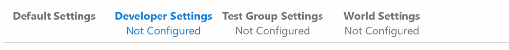
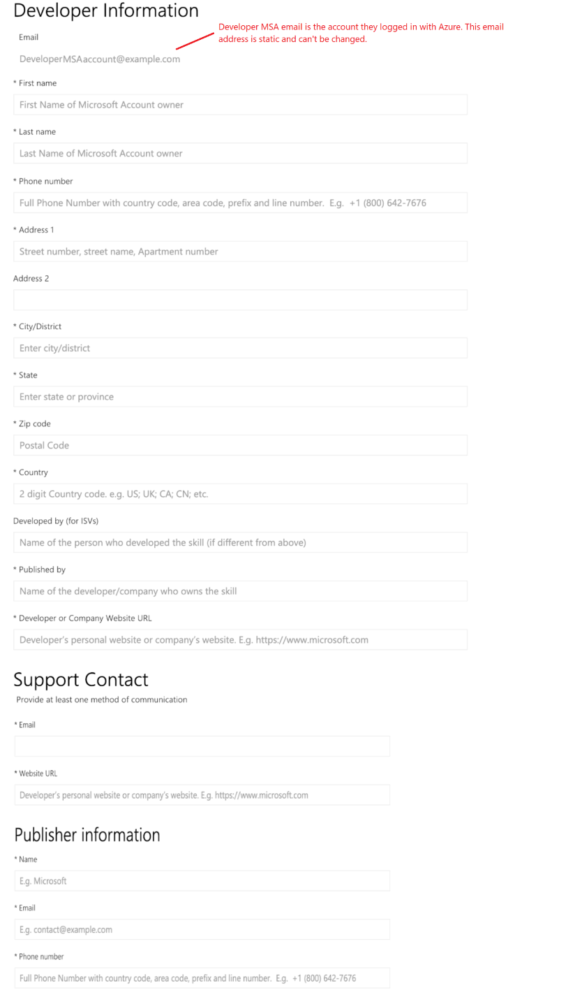
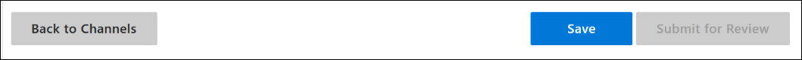

# Reviewing Cortana consumer skill developers

## Developer settings

As a developer, you can create and test skills without filling in the Developer Settings page. The intent is to allow you to test your skills on your own before submitting them for approval. However, all developers need to be reviewed before they can configure a skill for group or world, both of which allow other people to use it. Developers must go through Microsoft's internal review process before they can access the group or world configuration pages. Once you're approved, the Group and World tabs are enabled, and the Developer Settings tab displays an approval message.

All developer and publisher information is entered on a tab called `Developer Settings`, which appears on the Cortana Configuration page. The Microsoft Certification team will pass the data to the review team. The review results will be visible only to the Certification Team and the developer.

## Reviewing approval

Once you've filled in the developer settings and submitted the page, they can be changed, but every time you do, it will trigger a new review. The `Save` and `Submit` buttons are disabled unless you fill enter new data in the form. The Group and World tabs remain disabled until the developer data is successfully processed and the developer is approved.

>[!NOTE]
>No notification will be sent to the developer when the process is complete. You have to check the `Developer settings` page for the status message.

Once you're approved, the Group and World tabs are enabled, and the Developer Settings tab displays an approval message. 

`Congratulations! Your developer setting have been reviewed and approved.`

The `Save` and `Submit` buttons on the Developer Setting page remain disabled unless you enter new data into one or more of the fields.

Developers only need to be reviewed once, unless you make changes to your information (see [Editing developer settings for an approved developer](#editing-developer-settings-for-an-approved-developer)). Once approved, your developer's settings are carried over to all skills developed with your Microsoft Account (MSA) email address.

## Developer not approved

If you are not approved, then this notification will be displayed at the top of the settings page:

`Unfortunately, your developer settings have not been approved. Please contact skillpub@microsoft.com.`

If you feel this is a mistake, or that you should be approved, you can resubmit your data on the same page, or contact the Certification Team at skillspub@microsoft.com.

It's also possible that you'll see a message like this:

`Something went wrong while processing your developer settings. Please contact skillpub@microsoft.com.  Status: <status code>.`

When you contact us for this kind of message, please make sure to include your MSA identifier and the status code from the message.

## Editing developer settings for an approved developer

A developer who has already been reviewed and approved can edit all of the developer settings except for developer email. (A new email address will be considered as a new developer.) Making changes will cause the settings page to display an `Under Review` message while the new data is reviewed. If you already have skills in production, or deployed for testing, those skills will remain unchanged and continue functioning as before.

If the changes to your data cause you to be rejected, then your current skills may be reviewed again. They will continue to function unless and until they're reviewed, at which time they may or may not be re-approved.

## The developer/publisher data

Most of the fields collected on the Developer tab are self-explanatory. Fields with an asterisk (*) are required. Other information follows the screenshot.

**Developer information**

- Email **[Maybe this should say 'Account ID' or something like that?]** - This field is not editable. It's retrieved from the developer object created when the skill was registered with Cortana.
- Developed by (for ISVs) - If the person who owns the MSA used to register the skill didn't develop it, fill this in with the name of whoever did develop the skill. **[How is this differnet from the ISV fields below?]**
- Developer or Company Website URL

**Support Contact** - Remember, we must have a way to contact you in case your skill has a problems. This email (or URL) is the contact that we'll use first.

- Email
- Website URL **[Do we really need two URLs? One in Developer Information (above), and the other one here?]**

**Publisher information**

- Name **[Seems like this should only be entered if it's different from the developer info above, no?]**
- Email
- Phone number

<!--Hopefully, portions of this data can be pre-populated using data gleaned from the MSA Azure account -->

Pressing `Back to Channels` will return you to the channels page, without saving anything you've entered. Pressing `Save` will save the current data, without submitting. `Submit for Review` will submit the data for approval by the Certification Team.

Once you press `Submit for Review`, the data on the page is locked, and the reviewing process is started.