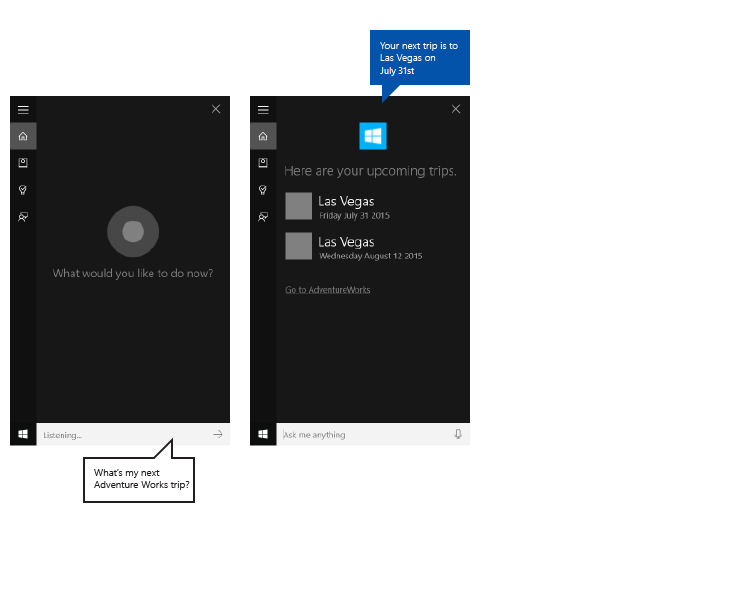

# Activate a background app in Cortana using voice commands  

In addition to using voice commands within **Cortana** to access system features, you may also extend **Cortana** with features and functionality from your app (as a background task) using voice commands that specify an action or command to run. When an app handles a voice command in the background, it does not take focus. Instead, it returns all feedback and results through the **Cortana** canvas and the **Cortana** voice.  

**Important APIs**  

*   [**Windows.ApplicationModel.VoiceCommands**](https://msdn.microsoft.com/library/windows/apps/dn706594)  
*   [**VCD elements and attributes v1.2**](https://msdn.microsoft.com/library/windows/apps/dn706593)  

Apps may be activated to the foreground (the app takes focus) or activated in the background (**Cortana** retains focus), depending on the complexity of the interaction. For example, voice commands that require additional context or user input (such as sending a message to a specific contact) are best handled in a foreground app, while basic commands (such as listing upcoming trips) may be handled in **Cortana** through a background app.  

If you want to activate an app to the foreground using voice commands, see [Activate a foreground app with voice commands through Cortana](./launch-a-foreground-app-with-voice-commands-in-cortana.md).  

>[!NOTE]
> A voice command is a single utterance with a specific intent, defined in a Voice Command Definition (VCD) file, and directed at an installed app through **Cortana**.  
>
> A VCD file defines one or more voice commands, each with a unique intent.  
>
> A voice command definition may vary in complexity. A voice definition may support anything from a single, constrained utterance to a collection of more flexible, natural language utterances, all denoting the same intent.  

To demonstrate background app features, use a trip planning and management app named **Adventure Works** from the [Cortana voice command sample](https://go.microsoft.com/fwlink/p/?LinkID=619899).  

Example: An overview of the **Adventure Works** app integrated with the **Cortana** canvas.  

  

To view an **Adventure Works** trip without **Cortana**, a user would launch the app and navigate to the **Upcoming trips** page.  

Using voice commands through **Cortana** to launch your app in the background, the user may instead just say, `Adventure Works, when is my trip to Las Vegas?`. Your app handles the command and **Cortana** displays results along with your app icon and other app info, if provided.  

Example: A basic trip query and **Cortana** result screen that displays the text and speaks `Your next trip to Las Vegas is on Friday July 31st, 2015`.  

  

The following basic steps add voice-command functionality and extend **Cortana** with background functionality from your app using speech or keyboard input.  
1.   Create an app service (see [**Windows.ApplicationModel.AppService**](https://msdn.microsoft.com/library/windows/apps/dn921731)) that **Cortana** invokes in the background.  
2.   Create a VCD file. The VCD file is an XML document that defines all the spoken commands that the user may say to initiate actions or invoke commands when activating your app. See [**VCD elements and attributes v1.2**](https://msdn.microsoft.com/library/windows/apps/dn706593).  
3.   Register the command sets in the VCD file when the app is launched.  
4.   Handle the background activation of the app service and the running of the voice command.  
5.   Display and speak the appropriate feedback to the voice command within **Cortana**.  

**Prerequisites**  

If you are new to developing Universal Windows Platform (UWP) apps, have a look through these topics to get familiar with the technologies discussed here.  
*   [Create your first app](https://msdn.microsoft.com/library/windows/apps/bg124288)  
*   Learn about events with [Events and routed events overview](https://msdn.microsoft.com/library/windows/apps/mt185584)  

**User experience guidelines**  

See [Cortana design guidelines](https://msdn.microsoft.com/library/windows/apps/dn974233) for info about how to integrate your app with **Cortana** and [Speech design guidelines](https://msdn.microsoft.com/library/windows/apps/dn596121) for helpful tips on designing a useful and engaging speech-enabled app.  

<!-- ## <span id="Create_a_new_solution_with_a_primary_project_in_Visual_Studio"></span><span id="create_a_new_solution_with_a_primary_project_in_visual_studio"></span><span id="CREATE_A_NEW_SOLUTION_WITH_A_PRIMARY_PROJECT_IN_VISUAL_STUDIO"></span> -->

## Create a New Solution with a Primary Project in Visual Studio  

1.  Launch Microsoft Visual Studio 2015.  
    The Visual Studio 2015 Start page appears.  

2.  On the **File** menu, select **New** > **Project**.  
    The **New Project** dialog appears. The left pane of the dialog lets you select the type of templates to display.  

3.  In the left pane, expand **Installed > Templates > Visual C\# > Windows**, then pick the **Universal** template group. The center pane of the dialog displays a list of project templates for Universal Windows Platform (UWP) apps.  
4.  In the center pane, select the **Blank App (Universal Windows)** template.  
    The **Blank App** template creates a minimal UWP app that compiles and runs. The **Blank App** template includes no user-interface controls or data. You add controls to the app using this page as a guide.  

5.  In the **Name** text box, type your project name. Example: Use `AdventureWorks`.  
6.  Click on the **OK** button to create the project.  
    Microsoft Visual Studio creates your project and displays it in the **Solution Explorer**.  

<!-- ## <span id="Add_image_assets_to_primary_project_and_specify_them_in_the_app_manifest"></span><span id="add_image_assets_to_primary_project_and_specify_them_in_the_app_manifest"></span><span id="ADD_IMAGE_ASSETS_TO_PRIMARY_PROJECT_AND_SPECIFY_THEM_IN_THE_APP_MANIFEST"></span>Add image assets to primary project and specify them in the app manifest  -->

## Add Image Assets to Primary Project and Specify them in the App Manifest  
      
UWP apps should automatically select the most appropriate images. The selection is based upon specific settings and device capabilities (high contrast, effective pixels, locale, and so on). You must provide the images and ensure that you use the appropriate naming convention and folder organization within your app project for the different resource versions.  
If you do not provide the recommended resource versions, then the user experience may suffer in the following ways.  
*   Accessibility  
*   Localization  
*   Image quality  
The resource versions are used to adapt the following changes in the user experience.  
*   User preferences  
*   Abilities  
*   Device type  
*   Location  

For more detail about image resources for high contrast and scale factors, visit the Guidelines for tile and icon assets page located at [msdn.microsoft.com/windows/uwp/controls-and-patterns/tiles-and-notifications-app-assets](https://msdn.microsoft.com/windows/uwp/controls-and-patterns/tiles-and-notifications-app-assets).  

You must name resources using qualifiers. Resource qualifiers are folder and filename modifiers that identify the context in which a particular version of a resource should be used.  

The standard naming convention is `foldername/qualifiername-value[_qualifiername-value]/filename.qualifiername-value[_qualifiername-value].ext`.  
Example: `images/logo.scale-100_contrast-white.png`, which may refer to code using just the root folder and the filename: `images/logo.png`.  
For more information, visit the How to name resources using qualifiers page located at [msdn.microsoft.com/library/windows/apps/xaml/hh965324.aspx](https://msdn.microsoft.com/library/windows/apps/xaml/hh965324.aspx).  

Microsoft recommends that you mark the default language on string resource files (such as `en-US\resources.resw`) and the default scale factor on images (such as `logo.scale-100.png`), even if you do not currently plan to provide localized or multiple resolution resources. However, at a minimum, Microsoft recommends that you provide assets for 100, 200, and 400 scale factors.  

>[!IMPORTANT]
> The app icon used in the title area of the **Cortana** canvas is the Square44x44Logo icon specified in the `Package.appxmanifest` file.  
> You may also specify an icon for each entry in the content area of the **Cortana** canvas. Valid image sizes for the results icons are:  
> *   68w x 68h  
> *   68w x 92h  
> *   280w x 140h  

The content tile is not validated until a [**VoiceCommandResponse**](https://msdn.microsoft.com/library/windows/apps/dn974182) object is passed to the [**VoiceCommandServiceConnection**](https://msdn.microsoft.com/library/windows/apps/dn974204) class. If you pass a [**VoiceCommandResponse**](https://msdn.microsoft.com/library/windows/apps/dn974182) object to **Cortana** that includes a content tile with an image that does not adhere to these size ratios, then an exception may occur.  

Example: The **Adventure Works** app (`VoiceCommandService\\AdventureWorksVoiceCommandService.cs`) specifies a simple, grey square (`GreyTile.png`) on the [**VoiceCommandContentTile**](https://msdn.microsoft.com/library/windows/apps/dn974168) class using the [**TitleWith68x68IconAndText**](https://msdn.microsoft.com/library/windows/apps/dn974169) tile template. The logo variants are located in `VoiceCommandService\\Images`, and are retrieved using the [**GetFileFromApplicationUriAsync**](https://msdn.microsoft.com/library/windows/apps/hh701741) method. 

```csharp
var destinationTile = new VoiceCommandContentTile();  

destinationTile.ContentTileType = VoiceCommandContentTileType.TitleWith68x68IconAndText;
destinationTile.Image = await StorageFile.GetFileFromApplicationUriAsync(
    new Uri("ms-appx:///AdventureWorks.VoiceCommands/Images/GreyTile.png")
);  
```

<!-- ## <span id="Create_an_app_service_project"></span><span id="create_an_app_service_project"></span><span id="CREATE_AN_APP_SERVICE_PROJECT"></span>Create an app service project -->

## Create an App Service Project

1.  Right-click on your Solution name, select **New > Project**.  
2.  Under **Installed > Templates > Visual C\# > Windows > Universal**, select **Windows Runtime Component**. The **Windows Runtime Component** is the component that implements the app service ([**Windows.ApplicationModel.AppService**](https://msdn.microsoft.com/library/windows/apps/dn921731)).  
3.  Type a name for the project and click on the **OK** button.  
    Example: `VoiceCommandService`.  
4.  In **Solution Explorer**, select the `VoiceCommandService` project and rename the `Class1.cs` file generated by Visual Studio. 
    Example: The **Adventure Works** uses `AdventureWorksVoiceCommandService.cs`.  
5.  Click on the **Yes** button; when asked if you want to rename all occurrences of `Class1.cs`.  
6.  In the `AdventureWorksVoiceCommandService.cs` file:
    1.  Add the following using directive.  
        `using Windows.ApplicationModel.Background;`  
    2.  When you create a new project, the project name is used as the default root namespace in all files. Rename the namespace to nest the app service code under the primary project. 
        Example: `namespace AdventureWorks.VoiceCommands`.  
    3.  Right-click on the app service project name in Solution Explorer and select **Properties**.  
    4.  On the **Library** tab, update the **Default namespace** field with this same value.  
        Example: `AdventureWorks.VoiceCommands`).  
    5.  Create a new class that implements the [**IBackgroundTask**](https://msdn.microsoft.com/library/windows/apps/br224794) interface. This class requires a [**Run**](https://msdn.microsoft.com/library/windows/apps/br224811) method, which is the entry point when Cortana recognizes the voice command.  

    Example: A basic background task class from the **Adventure Works** app.  
    
    >[!NOTE]   
    > The background task class itself, as well as all classes in the background task project, must be sealed public classes.  

    ```csharp
    namespace AdventureWorks.VoiceCommands
    {
        ...
        
        /// <summary>
        /// The VoiceCommandService implements the entry point for all voice commands.
        /// The individual commands supported are described in the VCD xml file. 
        /// The service entry point is defined in the appxmanifest.
        /// </summary>
        public sealed class AdventureWorksVoiceCommandService : IBackgroundTask
        {
            ...

            /// <summary>
            /// The background task entrypoint. 
            /// 
            /// Background tasks must respond to activation by Cortana within 0.5 second, and must 
            /// report progress to Cortana every 5 seconds (unless Cortana is waiting for user
            /// input). There is no running time limit on the background task managed by Cortana,
            /// but developers should use plmdebug (https://msdn.microsoft.com/library/windows/hardware/jj680085%28v=vs.85%29.aspx)
            /// on the Cortana app package in order to prevent Cortana timing out the task during
            /// debugging.
            /// 
            /// The Cortana UI is dismissed if Cortana loses focus. 
            /// The background task is also dismissed even if being debugged. 
            /// Use of Remote Debugging is recommended in order to debug background task behaviors. 
            /// Open the project properties for the app package (not the background task project), 
            /// and enable Debug -> "Do not launch, but debug my code when it starts". 
            /// Alternatively, add a long initial progress screen, and attach to the background task process while it runs.
            /// </summary>
            /// <param name="taskInstance">Connection to the hosting background service process.</param>
            public void Run(IBackgroundTaskInstance taskInstance)
            {
              //
              // TODO: Insert code 
              //
              //
        }
      }
    }
    ```  
    
7.  Declare your background task as an **AppService** in the app manifest.  
    1.  In **Solution Explorer**, right-click on the `Package.appxmanifest` file and select **View Code**.  
    2.  Find the [`Application`](https://msdn.microsoft.com/library/windows/apps/dn934738) element.  
    3.  Add an [`Extensions`](https://msdn.microsoft.com/library/windows/apps/dn934720) element to the [`Application`](https://msdn.microsoft.com/library/windows/apps/dn934738) element.  
    4.  Add a [`uap:Extension`](https://msdn.microsoft.com/library/windows/apps/dn986788) element to the [`Extensions`](https://msdn.microsoft.com/library/windows/apps/dn934720) element.  
    5.  Add a `Category` attribute to the `uap:Extension` element and set the value of the `Category` attribute to `windows.appService`.  
    6.  Add an `EntryPoint` attribute to the `uap: Extension` element and set the value of the `EntryPoint` attribute to the name of the class that implements [`IBackgroundTask`](https://msdn.microsoft.com/library/windows/apps/br224794).  
        Example: `AdventureWorks.VoiceCommands.AdventureWorksVoiceCommandService`.  
    7.  Add a [`uap:AppService`](https://msdn.microsoft.com/library/windows/apps/dn934779) element to the `uap:Extension` element.  
    8.  Add a `Name` attribute to the [`uap:AppService`](https://msdn.microsoft.com/library/windows/apps/dn934779) element and set the value of the `Name` attribute to a name for the app service, in this case `AdventureWorksVoiceCommandService`.  
    9.  Add a second [`uap:Extension`](https://msdn.microsoft.com/library/windows/apps/dn986788) element to the [`Extensions`](https://msdn.microsoft.com/library/windows/apps/dn934720) element.  
    10. Add a `Category` attribute to this [`uap:Extension`](https://msdn.microsoft.com/library/windows/apps/dn986788) element and set the value of the `Category` attribute to `windows.personalAssistantLaunch`.  

    Example: A manifest from the Adventure Works app.
    
    ```xml
    <Package>
        <Applications>
            <Application>
            
                <Extensions>
                    <uap:Extension Category="windows.appService" EntryPoint="CortanaBack1.VoiceCommands.AdventureWorksVoiceCommandService">
                        <uap:AppService Name="AdventureWorksVoiceCommandService"/>
                    </uap:Extension>
                    <uap:Extension Category="windows.personalAssistantLaunch"/>
                </Extensions>
                
            <Application>
        <Applications>
    </Package>
    ```  
    
8.  Add this app service project as a reference in the primary project.  
    1.  Right-click on the **References**.  
    2.  Select **Add Reference...**.  
    3.  In the **Reference Manager** dialog, expand **Projects** and select the app service project.  
    4.  Click on the **OK** button.  

<!-- ## <span id="Create_a_VCD_file"></span><span id="create_a_vcd_file"></span><span id="CREATE_A_VCD_FILE"></span>Create a VCD file -->

## Create a VCD File

1.  In Visual Studio, right-click on your primary project name, select **Add > New Item**. Add an **XML File**.  
2.  Type a name for the [**VCD**](https://msdn.microsoft.com/library/windows/apps/dn706593) file.  
    Example: `AdventureWorksCommands.xml`.
3.  Click on the **Add** button.  
4.  In **Solution Explorer**, select the [**VCD**](https://msdn.microsoft.com/library/windows/apps/dn706593) file.  
5.  In the **Properties** window, set **Build action** to **Content**, and then set **Copy to output directory** to **Copy if newer**.  

<!-- ## <span id="Edit_the_VCD_file"></span><span id="edit_the_vcd_file"></span><span id="EDIT_THE_VCD_FILE"></span>Edit the VCD file -->

## Edit the VCD File  

1.  Add a `VoiceCommands` element with an `xmlns` attribute pointing to `https://schemas.microsoft.com/voicecommands/1.2`.  
2.  For each language supported by your app, create a [`CommandSet`](https://msdn.microsoft.com/library/windows/apps/dn722331) element that includes the voice commands supported by your app.  
    You are able to declare multiple [`CommandSet`](https://msdn.microsoft.com/library/windows/apps/dn722331) elements, each with a different [`xml:lang`](https://msdn.microsoft.com/library/windows/apps/dn722331) attribute so your app to be used in different markets. For example, an app for the United States might have a [`CommandSet`](https://msdn.microsoft.com/library/windows/apps/dn722331) for English and a [`CommandSet`](https://msdn.microsoft.com/library/windows/apps/dn722331) for Spanish.  

	  >[!IMPORTANT]
	  > To activate an app and initiate an action using a voice command, the app must register a VCD file that includes a [`CommandSet`](https://msdn.microsoft.com/library/windows/apps/dn722331) element with a language that matches the speech language indicated in the device of the user. The speech language is located in **Settings > System > Speech > Speech Language**.  
    
3.  Add a `Command` element for each command you want to support.  
    Each `Command` declared in a [**VCD**](https://msdn.microsoft.com/library/windows/apps/dn706593) file must include this information:  
    *   A `Name` attribute that your application uses to identify the voice command at runtime.  
    *   An `Example` element that includes a phrase describing how a user invokes the command. **Cortana** shows the example when the user says `What can I say?`, `Help`, or taps **See more**.  
    *   A `ListenFor` element that includes the words or phrases that your app recognizes as a command. Each `ListenFor` element may contain references to one or more `PhraseList` elements that contain specific words relevant to the command.  
    
       >[!NOTE]
       > `ListenFor` elements must not be programmatically modified. However, `PhraseList` elements associated with `ListenFor` elements may be programmatically modified. Applications should modify the content of the `PhraseList` element at runtime based on the data set generated as the user uses the app. 
       >
       > For more information, visit the [Dynamically modify Voice Command Definition (VCD) phrase lists](./dynamically-modify-voice-command-definition-vcd-phrase-lists.md) page.  
    
    *   A `Feedback` element that includes the text for **Cortana** to display and speak as the application is launched.  

A `Navigate` element indicates that the voice command activates the app to the foreground. In this example, the ```showTripToDestination``` command is a foreground task.  

A `VoiceCommandService` element indicates that the voice command activates the app in the background. The value of the `Target` attribute of this element should match the value of the `Name` attribute of the [`uap:AppService`](https://msdn.microsoft.com/library/windows/apps/dn934779) element in the package.appxmanifest file. In this example, the `whenIsTripToDestination` and `cancelTripToDestination` commands are background tasks that specify the name of the app service as `AdventureWorksVoiceCommandService`.  

For more detail, see the [**VCD elements and attributes v1.2**](https://msdn.microsoft.com/library/windows/apps/dn706593) reference.  

Example: A portion of the [**VCD**](https://msdn.microsoft.com/library/windows/apps/dn706593) file that defines the `en-us` voice commands for the **Adventure Works** app.  

```xml
<?xml version="1.0" encoding="utf-8" ?>
<VoiceCommands xmlns="https://schemas.microsoft.com/voicecommands/1.2">
<CommandSet xml:lang="en-us" Name="AdventureWorksCommandSet_en-us">
    <AppName> Adventure Works </AppName>
    <Example> Show trip to London </Example>
    
    <Command Name="showTripToDestination">
        <Example> Show trip to London </Example>
        <ListenFor RequireAppName="BeforeOrAfterPhrase"> show [my] trip to {destination} </ListenFor>
        <ListenFor RequireAppName="ExplicitlySpecified"> show [my] {builtin:AppName} trip to {destination} </ListenFor>
        <Feedback> Showing trip to {destination} </Feedback>
        <Navigate />
    </Command>
      
    <Command Name="whenIsTripToDestination">
        <Example> When is my trip to Las Vegas?</Example>
        <ListenFor RequireAppName="BeforeOrAfterPhrase"> when is [my] trip to {destination}</ListenFor>
        <ListenFor RequireAppName="ExplicitlySpecified"> when is [my] {builtin:AppName} trip to {destination} </ListenFor>
        <Feedback> Looking for trip to {destination}</Feedback>
        <VoiceCommandService Target="AdventureWorksVoiceCommandService"/>
    </Command>
    
    <Command Name="cancelTripToDestination">
        <Example> Cancel my trip to Las Vegas </Example>
        <ListenFor RequireAppName="BeforeOrAfterPhrase"> cancel [my] trip to {destination}</ListenFor>
        <ListenFor RequireAppName="ExplicitlySpecified"> cancel [my] {builtin:AppName} trip to {destination} </ListenFor>
        <Feedback> Cancelling trip to {destination}</Feedback>
        <VoiceCommandService Target="AdventureWorksVoiceCommandService"/>
    </Command>

    <PhraseList Label="destination">
        <Item>London</Item>
        <Item>Las Vegas</Item>
        <Item>Melbourne</Item>
        <Item>Yosemite National Park</Item>
    </PhraseList>
</CommandSet>
```  

<!-- ## <span id="Install_the_VCD_commands"></span><span id="install_the_vcd_commands"></span><span id="INSTALL_THE_VCD_COMMANDS"></span>Install the VCD commands -->

## Install the VCD Commands  

Your app must run once to install the VCD.  

>[!NOTE]
> Voice command data is not preserved across app installations. To ensure the voice command data for your app remains intact, consider initializing your VCD file each time your app is launched or activated, or maintain a setting that indicates if the VCD is currently installed.  

In the `app.xaml.cs` file:  
1.  Add the following using directive:  
    
	  ```csharp
	  using Windows.Storage;
	  ```

2.  Mark the `OnLaunched` method with the async modifier.  
	  
    ```csharp
    protected async override void OnLaunched(LaunchActivatedEventArgs e)
	  ```  

3.  Call the [`InstallCommandDefinitionsFromStorageFileAsync`](https://msdn.microsoft.com/library/windows/apps/dn708205) method in the [`OnLaunched`](https://msdn.microsoft.com/library/windows/apps/br242335) handler to register the voice commands that should be recognized.  
    Example: The Adventure Works app defines a [`StorageFile`](https://msdn.microsoft.com/library/windows/apps/br227171) object.  
    Example: Call the [`GetFileAsync`](https://msdn.microsoft.com/library/windows/apps/br227272) method to initialize the [`StorageFile`](https://msdn.microsoft.com/library/windows/apps/br227171) object with the `AdventureWorksCommands.xml` file.  
    The [`StorageFile`](https://msdn.microsoft.com/library/windows/apps/br227171) object is then passed to [`InstallCommandDefinitionsFromStorageFileAsync`](https://msdn.microsoft.com/library/windows/apps/dn708205) method.  
	  
    ```csharp
	  try {
  	    // Install the main VCD. 
        StorageFile vcdStorageFile = await Package.Current.InstalledLocation.GetFileAsync(
            @"AdventureWorksCommands.xml"
        );
	         
  	    await Windows.ApplicationModel.VoiceCommands.VoiceCommandDefinitionManager.InstallCommandDefinitionsFromStorageFileAsync(vcdStorageFile);
	      
        // Update phrase list.
        ViewModel.ViewModelLocator locator = App.Current.Resources["ViewModelLocator"] as ViewModel.ViewModelLocator;
        if(locator != null) {
            await locator.TripViewModel.UpdateDestinationPhraseList();
  	    }
	  }
	  catch (Exception ex) {
	      System.Diagnostics.Debug.WriteLine("Installing Voice Commands Failed: " + ex.ToString());
	  }
	  ```  

<!-- ## <span id="Handle_activation_and_execute_voice_commands"></span><span id="handle_activation_and_execute_voice_commands"></span><span id="HANDLE_ACTIVATION_AND_EXECUTE_VOICE_COMMANDS"></span>Handle activation -->

## Handle Activation  

Specify how your app responds to subsequent voice command activations. 

>[!NOTE]
> You must launch your app at least once after the voice command sets have been installed.  

1.  Confirm that your app was activated by a voice command.  

    Override the [`Application.OnActivated`](https://msdn.microsoft.com/library/windows/apps/br242330) event and check whether [**IActivatedEventArgs**](https://msdn.microsoft.com/library/windows/apps/br224727).[**Kind**](https://msdn.microsoft.com/library/windows/apps/br224728) is [**VoiceCommand**](https://msdn.microsoft.com/library/windows/apps/br224693).  

2.  Determine the name of the command and what was spoken.  

    Get a reference to a [`VoiceCommandActivatedEventArgs`](https://msdn.microsoft.com/library/windows/apps/dn609755) object from the [**IActivatedEventArgs**](https://msdn.microsoft.com/library/windows/apps/br224727) and query the [`Result`](https://msdn.microsoft.com/library/windows/apps/dn609758) property for a [`SpeechRecognitionResult`](https://msdn.microsoft.com/library/windows/apps/dn631432) object.  

    To determine what the user said, check the value of [**Text**](https://msdn.microsoft.com/library/windows/apps/dn631441) or the semantic properties of the recognized phrase in the [`SpeechRecognitionSemanticInterpretation`](https://msdn.microsoft.com/library/windows/apps/dn631443) dictionary.  

3.  Take the appropriate action in your app, such as navigating to the desired page.  

    >[!NOTE]
    > If you need to refer to your VCD, visit the [Edit the VCD File](#edit-the-vcd-file) section.    

    After receiving the speech-recognition result for the voice command, you get the command name from the first value in the [`RulePath`](https://msdn.microsoft.com/library/windows/apps/dn631438) array. Since the VCD file defines more than one possible voice command, you must verify that the value matches the command names in the VCD and take the appropriate action.  

    The most common action for an application is to navigate to a page with content relevant to the context of the voice command.  
    Example: Open the **TripPage** page and pass in the value of the voice command, how the command was input, and the recognized destination phrase (if applicable). Alternatively, the app may send a navigation parameter to the [**SpeechRecognitionResult**](https://msdn.microsoft.com/library/windows/apps/dn631432) when navigating to the **TripPage** page.  

    You are able to find out whether the voice command that launched your app was actually spoken, or whether it was typed in as text, from the [`SpeechRecognitionSemanticInterpretation.Properties`](https://msdn.microsoft.com/library/windows/apps/dn631445) dictionary using the **commandMode** key. The value of that key will be either `voice` or `text`. If the value of the key is `voice`, consider using speech synthesis ([**Windows.Media.SpeechSynthesis**](https://msdn.microsoft.com/library/windows/apps/dn278951)) in your app to provide the user with spoken feedback.  

    Use the [**SpeechRecognitionSemanticInterpretation.Properties**](https://msdn.microsoft.com/library/windows/apps/dn631445) to find out the content spoken in the `PhraseList` or `PhraseTopic` constraints of a `ListenFor` element. The dictionary key is the value of the `Label` attribute of the `PhraseList` or `PhraseTopic` element. 
    Example: The following code for How to access the value of **{destination}** phrase.  

    ```csharp
    /// <summary>
    /// Entry point for an application activated by some means other than normal launching. 
    /// This includes voice commands, URI, share target from another app, and so on. 
    /// 
    /// NOTE:
    /// A previous version of the VCD file might remain in place 
    /// if you modify it and update the app through the store. 
    /// Activations might include commands from older versions of your VCD. 
    /// Try to handle these commands gracefully.
    /// </summary>
    /// <param name="args">Details about the activation method.</param>
    protected override void OnActivated(IActivatedEventArgs args) {
        base.OnActivated(args);
        
        Type navigationToPageType;
        ViewModel.TripVoiceCommand? navigationCommand = null;
        
        // Voice command activation.
        if (args.Kind == ActivationKind.VoiceCommand) {
            // Event args may represent many different activation types. 
            // Cast the args so that you only get useful parameters out.
            var commandArgs = args as VoiceCommandActivatedEventArgs;
            
            Windows.Media.SpeechRecognition.SpeechRecognitionResult speechRecognitionResult = commandArgs.Result;
            
            // Get the name of the voice command and the text spoken.
            // See VoiceCommands.xml for supported voice commands.
            string voiceCommandName = speechRecognitionResult.RulePath[0];
            string textSpoken = speechRecognitionResult.Text;
            
            // commandMode indicates whether the command was entered using speech or text.
            // Apps should respect text mode by providing silent (text) feedback.
            string commandMode = this.SemanticInterpretation("commandMode", speechRecognitionResult);
            
            switch (voiceCommandName) {
                case "showTripToDestination":
                    // Access the value of {destination} in the voice command.
                    string destination = this.SemanticInterpretation("destination", speechRecognitionResult);
                    
                    // Create a navigation command object to pass to the page.
                    navigationCommand = new ViewModel.TripVoiceCommand(
                        voiceCommandName,
                        commandMode,
                        textSpoken,
                        destination
                    );
              
                    // Set the page to navigate to for this voice command.
                    navigationToPageType = typeof(View.TripDetails);
                    break;
                default:
                    // If not able to determine what page to launch, then go to the default entry point.
                    navigationToPageType = typeof(View.TripListView);
                    break;
            }
        }
        // Protocol activation occurs when a card is selected within Cortana (using a background task).
        else if (args.Kind == ActivationKind.Protocol) {
            // Extract the launch context. In this case, use the destination from the phrase set (passed
            // along in the background task inside Cortana), which makes no attempt to be unique. A unique id or 
            // identifier is ideal for more complex scenarios. The destination page is left to check if the 
            // destination trip still exists, and navigate back to the trip list if it does not.
            var commandArgs = args as ProtocolActivatedEventArgs;
            Windows.Foundation.WwwFormUrlDecoder decoder = new Windows.Foundation.WwwFormUrlDecoder(commandArgs.Uri.Query);
            var destination = decoder.GetFirstValueByName("LaunchContext");
            
            navigationCommand = new ViewModel.TripVoiceCommand(
                "protocolLaunch",
                "text",
                "destination",
                destination
            );
            
            navigationToPageType = typeof(View.TripDetails);
        }
        else {
            // If launched using any other mechanism, fall back to the main page view.
            // Otherwise, the app will freeze at a splash screen.
            navigationToPageType = typeof(View.TripListView);
        }
        
        // Repeat the same basic initialization as OnLaunched() above, taking into account whether
        // or not the app is already active.
        Frame rootFrame = Window.Current.Content as Frame;
        
        // Do not repeat app initialization when the Window already has content,
        // just ensure that the window is active.
        if (rootFrame == null) {
            // Create a frame to act as the navigation context and navigate to the first page.
            rootFrame = new Frame();
            App.NavigationService = new NavigationService(rootFrame);
            
            rootFrame.NavigationFailed += OnNavigationFailed;
            
            // Place the frame in the current window.
            Window.Current.Content = rootFrame;
        }
        
        // Since the expectation is to always show a details page, navigate even if 
        // a content frame is in place (unlike OnLaunched).
        // Navigate to either the main trip list page, or if a valid voice command
        // was provided, to the details page for that trip.
        rootFrame.Navigate(navigationToPageType, navigationCommand);
        
        // Ensure the current window is active
        Window.Current.Activate();
    }

    /// <summary>
    /// Returns the semantic interpretation of a speech result. 
    /// Returns null if there is no interpretation for that key.
    /// </summary>
    /// <param name="interpretationKey">The interpretation key.</param>
    /// <param name="speechRecognitionResult">The speech recognition result to get the semantic interpretation from.</param>
    /// <returns></returns>
    private string SemanticInterpretation(string interpretationKey, SpeechRecognitionResult speechRecognitionResult) {
        return speechRecognitionResult.SemanticInterpretation.Properties[interpretationKey].FirstOrDefault();
    }
    ```  

<!-- ## <span id="Handle_the_voice_command_in_the_app_service"></span><span id="handle_the_voice_command_in_the_app_service"></span><span id="HANDLE_THE_VOICE_COMMAND_IN_THE_APP_SERVICE"></span>Handle the voice command in the app service -->

## Handle the Voice Command in the App Service  

Process the voice command in the app service.  

1.  Add the following using directives to your voice command service file.  
    Example: `AdventureWorksVoiceCommandService.cs`.  

	  ```csharp
	  using Windows.ApplicationModel.VoiceCommands;
	  using Windows.ApplicationModel.Resources.Core;
	  using Windows.ApplicationModel.AppService;
	  ```  

2.  Take a service deferral so your app service is not terminated while handling the voice command.  
3.  Confirm that your background task is running as an app service activated by a voice command.  
    1.  Cast the [**IBackgroundTaskInstance.TriggerDetails**](https://msdn.microsoft.com/library/windows/apps/br224802) to [**Windows.ApplicationModel.AppService.AppServiceTriggerDetails**](https://msdn.microsoft.com/library/windows/apps/dn921727).  
    2.  Check that [**IBackgroundTaskInstance.TriggerDetails.Name**](https://msdn.microsoft.com/library/windows/apps/br224807) is the name of the app service in the `Package.appxmanifest` file.  
4.  Use [**IBackgroundTaskInstance.TriggerDetails**](https://msdn.microsoft.com/library/windows/apps/br224802) to create a [**VoiceCommandServiceConnection**](https://msdn.microsoft.com/library/windows/apps/dn974204) to **Cortana** to retrieve the voice command.
5.  Register an event handler for [**VoiceCommandServiceConnection**](https://msdn.microsoft.com/library/windows/apps/dn974204).  [**VoiceCommandCompleted**](https://msdn.microsoft.com/library/windows/apps/dn706584) to receive notification when the app service is closed due to a user cancellation.  
6.  Register an event handler for the [**IBackgroundTaskInstance.Canceled**](https://msdn.microsoft.com/library/windows/apps/br224798) to receive notification when the app service is closed due to an unexpected failure.  
7.  Determine the name of the command and what was spoken.  
    1.  Use the [**VoiceCommand**](https://msdn.microsoft.com/library/windows/apps/dn974162).[**CommandName**](https://msdn.microsoft.com/library/windows/apps/dn706589) property to determine the name of the voice command.  
    2.  To determine what the user said, check the value of [**Text**](https://msdn.microsoft.com/library/windows/apps/dn631441) or the semantic properties of the recognized phrase in the [`SpeechRecognitionSemanticInterpretation`](https://msdn.microsoft.com/library/windows/apps/dn631443) dictionary.  
7.  Take the appropriate action in your app service.  
8.  Display and speak the feedback to the voice command using **Cortana**.  
    1.  Determine the strings that you want **Cortana** to display and speak to the user in response to the voice command and create a [`VoiceCommandResponse`](https://msdn.microsoft.com/library/windows/apps/dn974182) object. For guidance on how to select the feedback strings that **Cortana** shows and speaks, see [Cortana design guidelines](https://msdn.microsoft.com/library/windows/apps/dn974233).  
    2.  Use the [**VoiceCommandServiceConnection**](https://msdn.microsoft.com/library/windows/apps/dn974204) instance to report progress or completion to **Cortana** by calling [**ReportProgressAsync**](https://msdn.microsoft.com/library/windows/apps/dn706579) or [**ReportSuccessAsync**](https://msdn.microsoft.com/library/windows/apps/dn706580) with the `VoiceCommandServiceConnection` object.  

    >[!NOTE]
    > If you need to refer to your VCD, visit the [Edit the VCD File](#edit-the-vcd-file) section.  

    ```csharp
    public sealed class VoiceCommandService : IBackgroundTask {
        private BackgroundTaskDeferral serviceDeferral;
        VoiceCommandServiceConnection voiceServiceConnection;
        
        public async void Run(IBackgroundTaskInstance taskInstance) {
            //Take a service deferral so the service isn&#39;t terminated.
            this.serviceDeferral = taskInstance.GetDeferral();
            
            taskInstance.Canceled += OnTaskCanceled;
            
            var triggerDetails = taskInstance.TriggerDetails as AppServiceTriggerDetails;
    
            if (triggerDetails != null &amp;&amp; 
                triggerDetails.Name == "AdventureWorksVoiceServiceEndpoint") {
                try {
                    voiceServiceConnection = 
                    VoiceCommandServiceConnection.FromAppServiceTriggerDetails(
                        triggerDetails);
                    voiceServiceConnection.VoiceCommandCompleted += 
                    VoiceCommandCompleted;
                    
                    VoiceCommand voiceCommand = await 
                    voiceServiceConnection.GetVoiceCommandAsync();
                    
                    switch (voiceCommand.CommandName) {
                        case "whenIsTripToDestination":
                            {
                                var destination = 
                                voiceCommand.Properties["destination"][0];
                                SendCompletionMessageForDestination(destination);
                                break;
                            }
                            
                            // As a last resort, launch the app in the foreground.
                        default:
                            LaunchAppInForeground();
                            break;
                    }
                }
                finally {
                    if (this.serviceDeferral != null) {
                        // Complete the service deferral.
                        this.serviceDeferral.Complete();
                    }
                }
            }
        }
        
        private void VoiceCommandCompleted(VoiceCommandServiceConnection sender,
            VoiceCommandCompletedEventArgs args) {
            if (this.serviceDeferral != null) {
                // Insert your code here.
                // Complete the service deferral.
                this.serviceDeferral.Complete();
            }
        }
        
        private async void SendCompletionMessageForDestination(
            string destination) {
            // Take action and determine when the next trip to destination
            // Insert code here.
            
            // Replace the hardcoded strings used here with strings 
            // appropriate for your application.
            
            // First, create the VoiceCommandUserMessage with the strings 
            // that Cortana will show and speak.
            var userMessage = new VoiceCommandUserMessage();
            userMessage.DisplayMessage = "Here's your trip.";
            userMessage.SpokenMessage = "Your trip to Vegas is on August 3rd.";
            
            // Optionally, present visual information about the answer.
            // For this example, create a VoiceCommandContentTile with an 
            // icon and a string.
            var destinationsContentTiles = new List<VoiceCommandContentTile>();
            
            var destinationTile = new VoiceCommandContentTile();
            destinationTile.ContentTileType = 
                VoiceCommandContentTileType.TitleWith68x68IconAndText;
            // The user taps on the visual content to launch the app. 
            // Pass in a launch argument to enable the app to deep link to a 
            // page relevant to the item displayed on the content tile.
            destinationTile.AppLaunchArgument = 
                string.Format("destination={0}", "Las Vegas");
            destinationTile.Title = "Las Vegas";
            destinationTile.TextLine1 = "August 3rd 2015";
            destinationsContentTiles.Add(destinationTile);
            
            // Create the VoiceCommandResponse from the userMessage and list    
            // of content tiles.
            var response = VoiceCommandResponse.CreateResponse(
                userMessage, destinationsContentTiles);
            
            // Cortana displays a "Go to app_name" link that the user 
            // taps to launch the app. 
            // Pass in a launch to enable the app to deep link to a page 
            // relevant to the voice command.
            response.AppLaunchArgument = string.Format(
                "destination={0}", "Las Vegas");
            
            // Ask Cortana to display the user message and content tile and 
            // also speak the user message.
            await voiceServiceConnection.ReportSuccessAsync(response);
        }
        
        private async void LaunchAppInForeground() {
            var userMessage = new VoiceCommandUserMessage();
            userMessage.SpokenMessage = "Launching Adventure Works";
            
            var response = VoiceCommandResponse.CreateResponse(userMessage);
            
            // When launching the app in the foreground, pass an app 
            // specific launch parameter to indicate what page to show.
            response.AppLaunchArgument = "showAllTrips=true";
            
            await voiceServiceConnection.RequestAppLaunchAsync(response);
        }
    }
    ```  

Once activated, the app service has 0.5 second to call [**ReportSuccessAsync**](https://msdn.microsoft.com/library/windows/apps/dn706580). **Cortana** shows and says a feedback string.  

>[!NOTE] 
> You are able to declare a **Feedback** string in the VCD file. The string does not affect the UI text displayed on the Cortana canvas, it only affects the text spoken by **Cortana**.  

If the app takes longer than 0.5 second to make the call, **Cortana** inserts a hand-off screen, as shown here. **Cortana** displays the hand-off screen until the application calls **ReportSuccessAsync**, or for up to 5 seconds. If the app service does not call **ReportSuccessAsync**, or any of the [`VoiceCommandServiceConnection`](https://msdn.microsoft.com/library/windows/apps/dn974204) methods that provide **Cortana** with information, the user receives an error message and the app service is canceled.  

  

<!-- ## <span id="related_topics"></span>Related Articles  -->

## Related Articles 

### Developers  
*   [Voice Commands](./vcd.md)  
*   [Interact with a Background App in Cortana](./interact-with-a-background-app-in-cortana.md)  
*   [VCD elements and attributes v1.2](https://msdn.microsoft.com/library/windows/apps/dn706593)  
*   [Quickstart: Using file or image resources](https://msdn.microsoft.com/library/windows/apps/xaml/hh965325)  
*   [How to name resources using qualifiers](https://msdn.microsoft.com/library/windows/apps/xaml/hh965324)  

### Designers  
*   [Cortana design guidelines](https://msdn.microsoft.com/library/windows/apps/dn974233)  
*   [Speech design guidelines](https://msdn.microsoft.com/library/windows/apps/dn596121)  
*   [Responsive design 101 for UWP apps](https://msdn.microsoft.com/library/windows/apps/dn958435)  
*   [Guidelines for tile and icon assets](https://msdn.microsoft.com/library/windows/apps/mt412102)  

### Samples  
*   [Cortana voice command sample](https://go.microsoft.com/fwlink/p/?LinkID=619899)  
